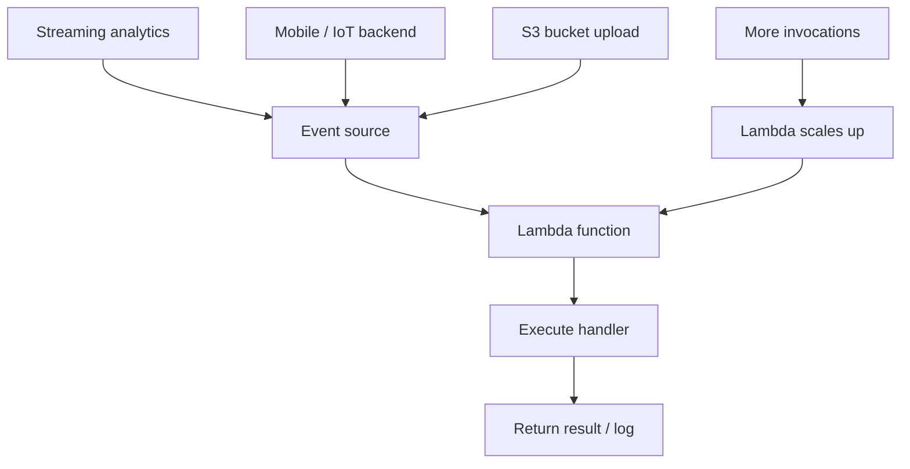

# 216. Lambda Hands-On

## 🎯 Giới thiệu
- Bài học này thực hành **Lambda** qua console để hiểu cách function hoạt động end-to-end.
- Lambda có thể viết bằng nhiều ngôn ngữ như **.NET, Java, Node.js, Python, Ruby** hoặc **custom runtime**.
- Điểm chính của Lambda:
  - Chạy theo **event**
  - **Scale seamlessly**
  - Không cần tự quản lý server
- Lambda có thể nhận event từ nhiều nguồn như:
  - **streaming analytics**
  - mobile / **IoT backend**
  - ảnh được đưa vào **S3 bucket**
  - các nguồn trigger khác trong console

## 1. Thử Lambda trong console
- Vào Lambda console, nếu gặp màn hình khác thì có thể dùng URL dạng `/<something>/begin` để mở UI giới thiệu.
- Chọn một runtime như **Node.js** rồi bấm **Run**.
- Kết quả mẫu:
  - Lambda trả về: **"Hello from Lambda."**
- Mục đích của bước này:
  - Cho thấy Lambda function được thực thi ngay trong console
  - Giúp nhìn trực quan cách Lambda phản ứng với input / event

## 2. Lambda Responds to Events và khả năng scale
- Khi bấm **Lambda Responds to Events**, console cho thấy:
  - Lambda nhận dữ liệu từ các **event triggers**
  - Lambda phản hồi theo thời gian thực
- Khi tăng số lượng sự kiện:
  - Lambda sẽ **scale up**
  - Số lượng “cogs” hiển thị tăng lên
- Ý nghĩa ôn thi:
  - Lambda hỗ trợ **scalability** mà không cần quản lý server
  - Đây là mô hình **event-driven**
- Transcript nhấn mạnh:
  - Lambda có thể nhận dữ liệu từ **streaming analytics**
  - có thể dùng làm backend cho **mobile** hoặc **IoT**
  - có thể phản ứng khi có ảnh được đưa vào **S3 bucket**

## 3. Tạo, test, monitor và cấu hình Lambda
- Tạo function mới bằng **blueprint** `hello world`
- Chọn runtime **Python**
- Đặt tên function là **HelloWorld**
- Lambda cần **execution role**
  - Tương tự role của **EC2 instance**, nhưng áp dụng cho Lambda
  - Tạo role mới với **basic Lambda permissions**
- Khi function được tạo:
  - Có sẵn code và **handler**
  - **handler** là phần được gọi khi event được truyền vào
- Test function:
  - Input JSON mẫu có các key như `key1`, `key2`, `key3`
  - Function trả về `value1`
- Nếu xóa key mà code đang dùng:
  - Test sẽ fail
  - Vì code không biết xử lý exception đó
- Có thể lưu **test event** để test lại nhiều lần
- Monitoring:
  - Metrics được lấy từ **CloudWatch**
  - Có thể xem **CloudWatch Logs**
  - Log stream cho thấy cả lần chạy thành công và lần lỗi
- General configuration:
  - **memory**
  - **ephemeral storage**
  - **timeout**
  - **execution role**
- Trong permissions:
  - Role hiện tại cho phép ghi vào **CloudWatch Logs**
  - Nếu muốn Lambda làm việc với **Amazon S3** thì cần thêm permissions vào **IAM role**
- Triggers:
  - Có thể add trigger từ nhiều nguồn event
  - Có cả **AWS** và **partner events**
  - Một use case chính là **Amazon S3**
  - Với S3 cần chọn **bucket** và **event types**

## 📊 Bảng tóm tắt
| Tiêu chí | Mô tả |
|----------|------|
| Mục tiêu bài học | Thực hành Lambda end-to-end trong console |
| Runtime đã dùng | **Node.js**, **Python** |
| Tính chất chính | **Event-driven**, **scale up** linh hoạt |
| Execution role | IAM role cho Lambda, giống vai trò quyền trên EC2 nhưng dành cho function |
| Test | Dùng sample JSON, có thể lưu test event để chạy lại |
| Monitoring | Xem metrics và **CloudWatch Logs** |
| Cấu hình chính | memory, ephemeral storage, timeout, execution role |
| Trigger | Nhiều nguồn event, nổi bật là **Amazon S3** |
| Chi phí | Có **free tier**, nhưng số invocations tăng thì chi phí tích lũy tăng |

## 💡 Mẹo ghi nhớ cho kỳ thi AWS
- Nhớ rằng Lambda là dịch vụ **serverless**, tự scale theo số lượng event.
- **Execution role** của Lambda là điểm rất hay bị hỏi:
  - Dùng để cấp quyền truy cập, ví dụ ghi **CloudWatch Logs**
- **Handler** là phần được gọi khi Lambda nhận event.
- Muốn Lambda truy cập **S3** hoặc dịch vụ khác thì phải thêm quyền vào **IAM role**.
- **CloudWatch Logs** là nơi xem log để debug Lambda.
- Lambda thường được dùng với nguồn trigger như **S3**, **mobile**, **IoT**, **streaming analytics**.
- Khi số invocations tăng, chi phí có thể tăng theo, nên cần ước lượng workload.

## ✅ Kết luận
- Bài học cho thấy Lambda hoạt động theo mô hình **event-driven** và có thể **scale** rất linh hoạt.
- Quy trình chính gồm:
  - tạo function
  - gán **execution role**
  - test với event
  - monitor bằng **CloudWatch**
  - thêm trigger khi cần
- Đây là nền tảng quan trọng để ôn thi AWS vì nó gắn trực tiếp với **IAM role**, **CloudWatch**, **S3 trigger**, và cách Lambda xử lý event trong thực tế.
