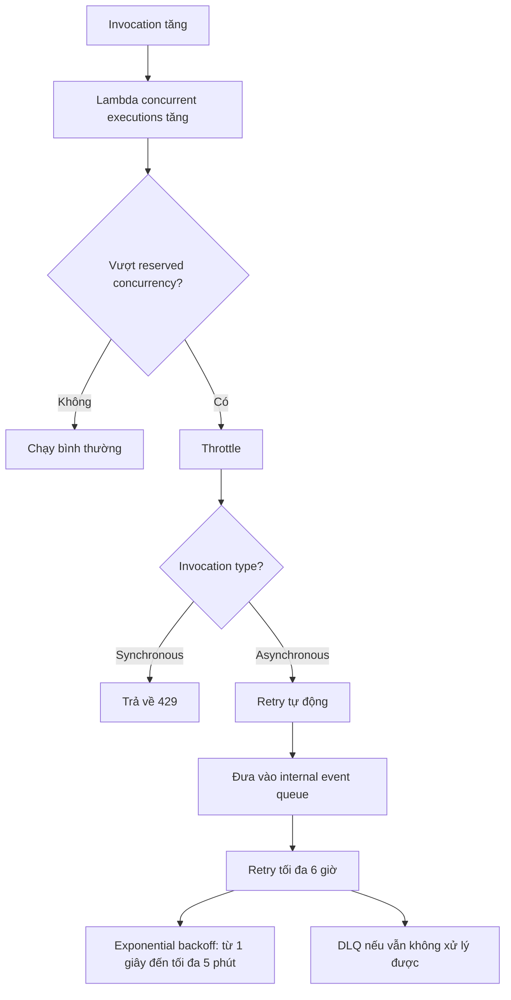

# 218. Lambda Concurrency

## 🎯 Giới thiệu
- **Lambda concurrency** là số lượng **Lambda function executions** chạy song song tại cùng một thời điểm.
- Lambda có thể scale rất nhanh, nên khi số lượng invocation tăng, số lượng concurrent executions cũng tăng theo.
- Một điểm cần nhớ cho kỳ thi: nếu không kiểm soát concurrency cẩn thận, một function có thể “chiếm” hết tài nguyên concurrency của **account**, làm các function khác bị **throttled**.

## 1. 🔥 Lambda Concurrency và Throttling
- Khi số lượng invoke tăng:
  - Quy mô thấp: có thể chỉ có vài concurrent executions.
  - Quy mô cao: có thể lên tới khoảng **1000 concurrent executions**.
- Có thể giới hạn concurrency bằng **reserved concurrency**:
  - Cấu hình ở **function level**.
  - Ví dụ: chỉ cho một Lambda function tối đa **50 concurrent executions**.
- Khi vượt giới hạn concurrency:
  - Sẽ xảy ra **throttle**.
  - Với **synchronous invocation**:
    - Trả về lỗi **429**.
  - Với **asynchronous invocation**:
    - Lambda tự retry.
    - Sau đó có thể chuyển sang **DLQ**.

## 2. 🧩 Ảnh hưởng của Concurrency trên toàn Account
- **Concurrency limit** áp dụng cho **tất cả functions trong account**.
- Nếu một function bị traffic lớn và dùng hết concurrency:
  - Các function khác trong account có thể bị **throttled**.
- Tình huống được nhắc trong transcript:
  - **Application Load Balancer** invoke Lambda rất nhiều.
  - **API Gateway** cũng invoke một Lambda khác.
  - **SDK/CLI** invoke thêm một Lambda nữa.
  - Khi một ứng dụng bị tăng tải mạnh, nó có thể chiếm hết concurrency, khiến các luồng còn lại bị ảnh hưởng.
- Nếu cần vượt mức **1000 concurrent executions**:
  - Có thể mở **support ticket** để xin tăng limit.

## 3. ⏳ Cold Start và Provisioned Concurrency
- **Cold start** xảy ra khi tạo một Lambda function instance mới:
  - Code phải được load.
  - Phần code ngoài handler phải chạy.
  - Đây là phần **initialization**.
- Nếu initialization lớn:
  - Nhiều dependencies.
  - Nhiều kết nối database.
  - Tạo nhiều SDK client.
  - Thì request đầu tiên sẽ có **higher latency**.
- Giải pháp:
  - Dùng **provisioned concurrency**:
    - Allocate concurrency trước khi function được invoke.
    - Giúp giảm hoặc tránh **cold start**.
    - Làm cho invocation có **lower latency** hơn.
- Việc quản lý **provisioned concurrency** có thể dùng **Application Auto Scaling**:
  - Ví dụ theo **schedule** hoặc **target position** để luôn có đủ Lambda functions sẵn sàng.
- Transcript cũng nhắc:
  - Trước đây Lambda chạy trong **VPC** có cold start rất chậm.
  - AWS đã công bố cải tiến vào **October/November 2019** để giảm mạnh cold starts trong VPC.

## 📊 Bảng tóm tắt
| Tiêu chí | Mô tả |
|----------|------|
| Lambda concurrency | Số lượng Lambda executions chạy song song |
| reserved concurrency | Giới hạn concurrency ở mức function |
| Throttling | Xảy ra khi vượt giới hạn concurrency |
| Synchronous invocation | Bị throttle sẽ trả về lỗi **429** |
| Asynchronous invocation | Tự retry, rồi có thể vào **DLQ** |
| Account-level effect | Một function có thể làm các function khác bị throttle |
| Cold start | Instance mới phải load code và chạy initialization |
| Provisioned concurrency | Allocate concurrency trước để giảm cold start |
| Retry async | Retry trong internal event queue tới **6 giờ**, backoff từ **1 giây** đến tối đa **5 phút** |

## 💡 Mẹo ghi nhớ cho kỳ thi AWS
- Nhớ câu: **“reserved concurrency = giới hạn tại function level”**.
- Nếu thấy **429** thì nghĩ ngay đến **throttling** ở **synchronous invocation**.
- **Asynchronous invocation** không trả lỗi ngay như sync, mà sẽ **retry** và có thể đi vào **DLQ**.
- Một function dùng quá nhiều concurrency có thể ảnh hưởng đến **các function khác trong account**.
- **Cold start** liên quan đến lần chạy đầu tiên của instance mới.
- **Provisioned concurrency** là cách chuẩn để giảm cold start và giảm latency.

## ✅ Kết luận
- Lambda có thể scale rất nhanh, nhưng **concurrency** cần được kiểm soát để tránh **throttling**.
- **reserved concurrency** giúp bảo vệ function, còn **provisioned concurrency** giúp giảm **cold start**.
- Với AWS exam, hãy nhớ rõ sự khác nhau giữa **synchronous** và **asynchronous invocation**, đặc biệt là hành vi khi bị throttle.
