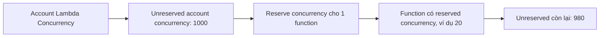
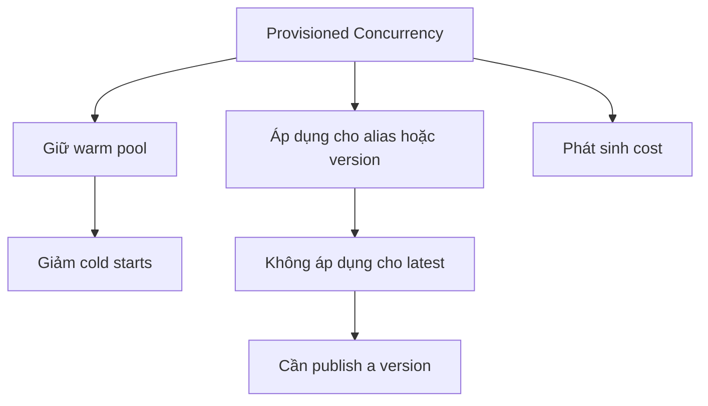

# 219. Lambda Concurrency - Hands On

## 🎯 Giới thiệu
Bài này tập trung vào **concurrency settings** trong **AWS Lambda** để hiểu cách Lambda xử lý số lượng invocation đồng thời, cách **throttle** khi vượt giới hạn, và cách dùng **Provisioned Concurrency** để giảm **cold starts**.

## 1. Lambda Concurrency và giới hạn tài khoản
- Trong tab **Concurrency** của Lambda, có thể xem và chỉnh cấu hình concurrency.
- **Unreserved account concurrency** là concurrency chưa được giữ riêng cho function nào.
- Trong transcript, tài khoản có **1000 unreserved account concurrency**.
- Concurrency này được **share across all Lambda functions** trong account.
- Có thể đặt **reserve concurrency** cho một Lambda function, ví dụ **20**.
- Khi reserve 20 cho một function:
  - Function đó có **20 reserved concurrency**
  - Phần còn lại của account còn **980 unreserved account concurrency** cho các function khác

## 2. Test throttle bằng Reserved Concurrency = 0
- Một cách test hữu ích là đặt **reserved concurrency = 0**.
- Khi đó function sẽ luôn bị **throttled**.
- Nếu bấm **Test** hoặc invoke function:
  - sẽ gặp lỗi kiểu **calling the invoke API action failed**
  - do đã **exceeded the rate**
- Đây là cách mô phỏng tình huống ứng dụng bị vượt concurrency limit.
- Muốn sửa:
  - quay lại cấu hình **Concurrency**
  - dùng **unreserved account concurrency**
  - hoặc đặt **reserve concurrency** phù hợp cho function

## 3. Provisioned Concurrency để giảm cold starts
- Lambda cũng có thể dùng **Provisioned Concurrency** để giảm **cold starts**.
- **Cold starts** là lúc application mới khởi động, cần thời gian initialize.
- **Provisioned Concurrency** giữ sẵn một **warm pool** để giảm độ trễ khởi tạo.
- Cấu hình này có thể áp dụng cho:
  - **alias**
  - **version**
- Trong transcript:
  - hiện tại **không có alias**
  - không thể áp dụng cho **latest**
  - cần **publish a version** trước
- Khi đặt ví dụ **5 provisioned concurrency**:
  - sẽ phát sinh **cost**
  - nên chọn số lượng phù hợp, vì **không free**

## 📊 Bảng tóm tắt
| Tiêu chí | Mô tả |
|----------|------|
| Unreserved account concurrency | Concurrency dùng chung cho tất cả Lambda functions trong account |
| Reserve concurrency | Giữ riêng một mức concurrency cho 1 function |
| Ví dụ trong transcript | Account có 1000 unreserved, reserve 20 thì còn 980 cho phần còn lại |
| Throttle | Đặt reserved concurrency = 0 sẽ làm function luôn bị throttled |
| Lỗi khi vượt giới hạn | Invoke có thể fail với thông báo đã vượt rate |
| Provisioned Concurrency | Dùng warm pool để giảm cold starts |
| Điều kiện áp dụng | Áp dụng cho alias hoặc version, không phải latest |
| Chi phí | Provisioned Concurrency có cost |

## 💡 Mẹo ghi nhớ cho kỳ thi AWS
- **Reserved concurrency** = giữ chỗ riêng cho 1 Lambda function.
- **Unreserved concurrency** = phần còn lại của account, dùng chung cho các function khác.
- **0 reserved concurrency** = test nhanh tình huống **throttling**.
- **Provisioned Concurrency** = giảm **cold starts**, nhưng **tốn chi phí**.
- Muốn dùng Provisioned Concurrency thì nhớ: **alias/version**, không phải **latest**.

## ✅ Kết luận
- Lambda có thể kiểm soát concurrency bằng **reserved concurrency** và **unreserved account concurrency**.
- Đặt concurrency phù hợp giúp tránh throttling hoặc chủ động test lỗi.
- Nếu cần giảm **cold starts**, dùng **Provisioned Concurrency**, nhưng phải cân nhắc chi phí và điều kiện áp dụng.
