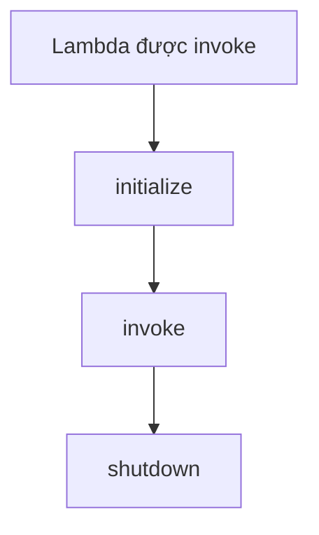
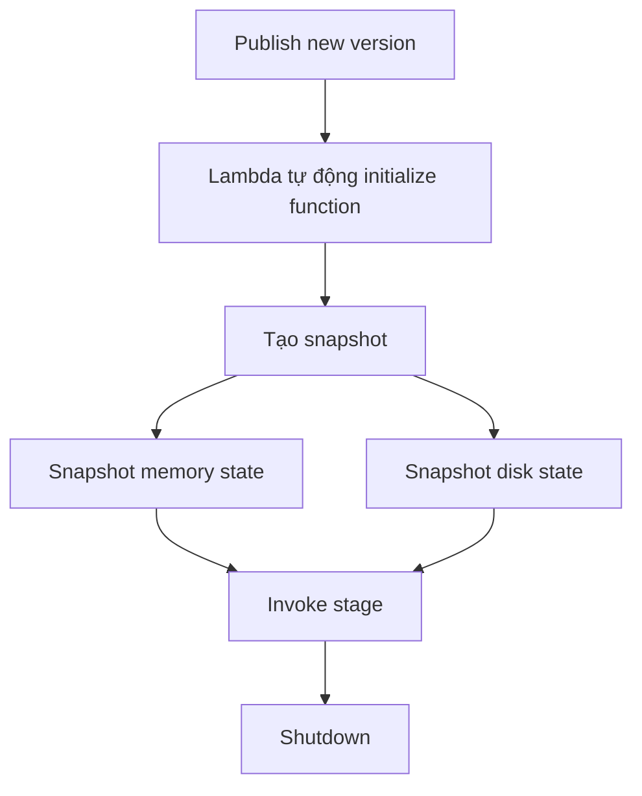

# 220. Lambda SnapStart

## 🎯 Giới thiệu
- **Lambda SnapStart** là một feature giúp cải thiện hiệu năng của **Lambda function** lên tới **10x**.
- Điểm đáng chú ý: **không phát sinh thêm chi phí**.
- Feature này áp dụng cho **Java, Python, và .NET**.
- Mục tiêu chính: làm cho Lambda chạy **nhanh hơn**, đặc biệt khi phần **initialize** tốn nhiều thời gian.

## 1. Lambda lifecycle khi **SnapStart disabled**
- Khi Lambda được invoke, function sẽ đi qua 3 giai đoạn:
  - **initialize**
  - **invoke**
  - **shutdown**
- Trong đó, **initialize phase** có thể mất nhiều thời gian.
- Ví dụ được nhắc trong transcript: với **Java**, việc khởi tạo toàn bộ environment có thể chậm.

## 2. Cách hoạt động của **Lambda SnapStart**
- Khi dùng **SnapStart**, Lambda sẽ **preinitialized** function trước.
- Khi bạn **publish a new version** của Lambda function:
  - Lambda tự động **initialize** function
  - Sau đó tạo **snapshot** của:
    - **memory state**
    - **disk state**
- Snapshot này sẽ được dùng để truy cập nhanh hơn, giúp function đi thẳng vào **invoke stage** với **low latency**.

## 3. Ý nghĩa thực tế cho ôn thi AWS
- **SnapStart** là một optimization dành cho Lambda.
- Cốt lõi cần nhớ:
  - giảm thời gian khởi tạo
  - tăng tốc độ phản hồi
  - dùng snapshot để bỏ qua phần khởi tạo khi invoke
- Đây là một điểm rất dễ gặp trong câu hỏi về:
  - **performance optimization**
  - **Lambda cold start-related behavior**
  - **publish version and snapshot flow**

## 📊 Bảng tóm tắt
| Tiêu chí | Mô tả |
|----------|------|
| Tên feature | Lambda SnapStart |
| Mục đích | Tăng performance cho Lambda, đặc biệt ở giai đoạn initialize |
| Mức cải thiện | Lên tới 10x |
| Chi phí | Không thêm chi phí |
| Ngôn ngữ hỗ trợ | Java, Python, .NET |
| Cách hoạt động | Preinitialized function và tạo snapshot memory/disk state |
| Điểm kích hoạt | Khi publish a new version của Lambda function |
| Lợi ích chính | Directly go into invoke stage với low latency |

## 💡 Mẹo ghi nhớ cho kỳ thi AWS
- Nhớ cụm từ: **“preinitialized + snapshot + low latency invoke”**.
- Nếu đề bài nhắc:
  - Lambda chạy chậm vì **initialize**
  - cần tăng tốc khi dùng **Java**
  - và muốn tối ưu **không thêm cost**
  thì hãy nghĩ ngay đến **Lambda SnapStart**.
- Từ khóa cần giữ nguyên:
  - **initialize**
  - **invoke**
  - **shutdown**
  - **snapshot**
  - **publish new version**
  - **low latency**

## ✅ Kết luận
- **Lambda SnapStart** là feature tối ưu hiệu năng cho Lambda bằng cách **preinitialize** function và dùng **snapshot** của **memory** và **disk state**.
- Nó giúp Lambda đi nhanh hơn vào **invoke stage**, đặc biệt hữu ích khi **initialize phase** tốn thời gian.
- Đây là keyword quan trọng cần nhớ cho phần thi AWS về **Lambda performance optimization**.
