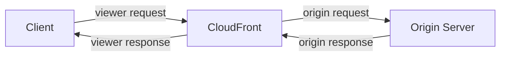

# 221. Lambda@Edge and CloudFront Functions

## 🎯 Giới thiệu
- **Customization At The Edge** là việc chạy logic ngay tại **Edge locations** của **CloudFront** trước khi request đến application/origin.
- Mục tiêu chính:
  - Giảm **latency** bằng cách chạy gần user hơn.
  - Tùy biến nội dung CDN từ **CloudFront**.
  - Dùng mô hình **fully serverless**, không phải quản lý server.
  - Chỉ trả tiền theo mức sử dụng.
- CloudFront có 2 loại Edge Functions:
  - **CloudFront Functions**
  - **Lambda@Edge**

## 1. Luồng request trong CloudFront
- Flow cơ bản của request qua CloudFront:
  - Client gửi **viewer request** đến CloudFront.
  - CloudFront gửi **origin request** đến **origin server**.
  - Origin trả về **origin response** cho CloudFront.
  - CloudFront trả **viewer response** về client.
- Edge Functions có thể can thiệp vào các bước này tùy loại function.

## 2. CloudFront Functions
- Là function nhẹ, viết bằng **JavaScript**.
- Chỉ tác động vào:
  - **viewer request**
  - **viewer response**
- Dùng cho **high-scale**, **latency-sensitive** CDN customizations.
- Đặc điểm nổi bật:
  - **Sub-millisecond startup times**
  - Scale đến **millions of requests per second**
  - Là native feature của **CloudFront**
  - Code được quản lý trực tiếp trong **CloudFront**
- Use cases tiêu biểu:
  - **cache key normalization**
  - **header manipulation**: insert, modify, delete HTTP headers
  - **URL rewrites or redirects**
  - **authorization**: tạo và validate **JWT tokens** để allow/deny request
- Phù hợp khi cần logic rất nhanh và đơn giản.

## 3. Lambda@Edge
- Là function viết bằng **NodeJS** hoặc **Python**.
- Có thể tác động vào cả 4 điểm:
  - **viewer request**
  - **origin request**
  - **origin response**
  - **viewer response**
- Function được author ở **us-east-1**, sau đó CloudFront replicate đến toàn bộ locations.
- Đặc điểm nổi bật:
  - Scale đến **thousands of requests per second**
  - Execution time dài hơn, khoảng **5 đến 10 seconds**
  - Có thể dùng **adjustable CPU and memory**
  - Có thể dùng **third party libraries**
  - Có **network access to external services**
  - Có **file system access** và access đến body của HTTP request
- Phù hợp khi cần logic phức tạp hơn, tích hợp sâu hơn.

## 4. So sánh CloudFront Functions và Lambda@Edge
| Tiêu chí | CloudFront Functions | Lambda@Edge |
|----------|----------------------|-------------|
| Runtime | **JavaScript only** | **NodeJS**, **Python** |
| Scale | **Millions of requests per second** | **Thousands of requests per second** |
| Trigger | Chỉ **viewer request/response** | **viewer** và **origin** |
| Execution time | **Less than 1 ms** | Khoảng **5-10 seconds** |
| Mức độ phức tạp | Nhẹ, đơn giản | Phức tạp hơn, linh hoạt hơn |
| Use case | Cache key normalization, header manipulation, URL rewrites/redirects, JWT authorization | Logic dài hơn, dùng libraries, gọi external services, xử lý body request |
| Deployment | Native trong CloudFront | Author ở **us-east-1**, rồi replicate toàn cầu |

## 📊 Bảng tóm tắt
| Tiêu chí | Mô tả |
|----------|------|
| Mục tiêu | Chạy logic tại **Edge** để giảm **latency** và tùy biến nội dung |
| Loại dịch vụ | **CloudFront Functions** và **Lambda@Edge** |
| Mô hình triển khai | **Fully serverless**, global deployment |
| CloudFront Functions | JavaScript, cực nhanh, chỉ xử lý viewer request/response |
| Lambda@Edge | NodeJS/Python, xử lý cả viewer và origin, logic phức tạp hơn |
| Use cases | Security, privacy, SEO, intelligent routing, bot mitigation, image transformation, A/B testing, authentication/authorization, analytics |

## 💡 Mẹo ghi nhớ cho kỳ thi AWS
- **CloudFront Functions = nhanh nhất, đơn giản nhất, chỉ viewer side**.
- **Lambda@Edge = mạnh hơn, linh hoạt hơn, cả viewer lẫn origin**.
- Nhớ mốc:
  - **CloudFront Functions**: **JavaScript only**, **< 1 ms**
  - **Lambda@Edge**: **NodeJS/Python**, **5-10 seconds**
- Nếu đề bài nói về:
  - **cache key normalization**, **header manipulation**, **URL rewrite/redirect** -> nghĩ tới **CloudFront Functions**
  - cần **libraries**, **external services**, **body access**, hoặc logic phức tạp hơn -> nghĩ tới **Lambda@Edge**
- **us-east-1** là nơi author **Lambda@Edge** function trong transcript.

## ✅ Kết luận
- **Edge Functions** cho phép chạy logic gần user để giảm latency và tùy biến **CloudFront**.
- **CloudFront Functions** phù hợp cho xử lý cực nhanh, đơn giản, chỉ ở **viewer request/response**.
- **Lambda@Edge** phù hợp cho xử lý phức tạp hơn, có thể can thiệp cả **viewer** lẫn **origin**.
- Khi ôn thi AWS, hãy nhớ phân biệt rõ theo **runtime**, **trigger**, **execution time**, và **use case**.
