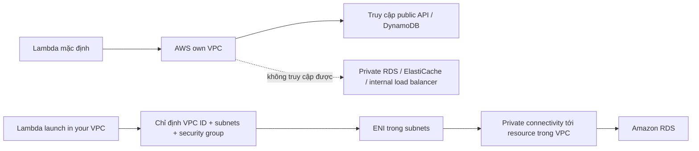

# 222. Lambda in VPC

## 🎯 Giới thiệu
- Mặc định, `Lambda` được launch **outside of your own VPC**, thực tế là trong **AWS own VPC**.
- Vì vậy, `Lambda` mặc định **không truy cập được** các resource nằm trong VPC riêng của bạn, ví dụ:
  - `RDS` private database
  - `ElastiCache`
  - `internal load balancer`
- Ngược lại, `Lambda` mặc định vẫn hoạt động tốt khi:
  - Gọi public API trên Internet
  - Truy cập `DynamoDB` vì đây là public resource trên AWS cloud

## 1. Lambda in VPC hoạt động như thế nào
- Nếu cần truy cập resource private trong VPC, bạn phải launch `Lambda` **in your VPC**.
- Khi cấu hình, cần chỉ định:
  - `VPC ID`
  - `subnets`
  - `security group`
- Khi đó, `Lambda` sẽ có một `elastic network interface (ENI)` trong các subnet của bạn.
- Nhờ vậy, `Lambda` có thể truy cập private resource trong VPC, օրինակ như `Amazon RDS`.

## 2. Use case quan trọng: Lambda + RDS Proxy
- Một use case lớn của `Lambda in a VPC` là kết hợp với `RDS proxy`.
- Lý do:
  - Nếu `Lambda` kết nối trực tiếp vào `RDS`, khi số lượng function tăng/giảm liên tục, sẽ dễ tạo ra **quá nhiều open connections**
  - Dưới high load, điều này có thể gây `timeouts` và vấn đề kết nối cho `RDS`
- Giải pháp:
  - `Lambda` kết nối vào `RDS proxy`
  - `RDS proxy` kết nối vào `RDS database instance`
- Cách này giúp giải quyết vấn đề kiến trúc do quản lý connection tốt hơn

## 3. Lợi ích của RDS Proxy
- `RDS proxy` mang lại 3 lợi ích chính:
  - **Scalability**: pooling và sharing database connections
  - **Availability**: trong trường hợp failover, giảm thời gian failover tới **66%** và preserve connections
  - **IAM authentication**: có thể enforce ở mức `RDS proxy`, và lưu thông tin trong `Secrets Manager`
- Điểm cần nhớ:
  - `RDS proxy` **never publicly accessible**
  - Vì vậy, để `Lambda` kết nối được tới `RDS proxy`, `Lambda` **phải được launch trong VPC**
  - Nếu `Lambda` chạy public, sẽ **không có network connectivity** tới `RDS proxy`

## 📊 Bảng tóm tắt
| Tiêu chí | Mô tả |
|----------|------|
| Default Lambda | Chạy ngoài VPC của bạn, trong AWS own VPC |
| Truy cập được | Public API trên Internet, `DynamoDB` |
| Không truy cập được mặc định | `RDS` private, `ElastiCache`, internal load balancer |
| Lambda in VPC | Cần `VPC ID`, `subnets`, `security group` |
| Cơ chế mạng | Có `ENI` trong subnet để tạo private connectivity |
| Use case quan trọng | `Lambda` + `RDS proxy` |
| Lợi ích `RDS proxy` | Tăng scalability, cải thiện availability, hỗ trợ `IAM authentication` |
| Điểm thi cần nhớ | `RDS proxy` không public, nên `Lambda` phải nằm trong VPC |

## 💡 Mẹo ghi nhớ cho kỳ thi AWS
- `Lambda default` = **public-friendly**, không vào được private VPC resources.
- Muốn chạm `private RDS` thì nhớ: **Lambda in VPC + ENI + subnets + security group**.
- `RDS proxy` là từ khóa rất dễ ra đề:
  - Nhiều connection từ `Lambda` có thể làm `RDS` quá tải
  - `RDS proxy` giúp pooling connections
  - `RDS proxy` cũng hỗ trợ failover tốt hơn và `IAM authentication`
- Nếu đề bài nói `Lambda` cần kết nối tới một service **never publicly accessible**, đáp án thường sẽ liên quan đến **launch Lambda in VPC**.

## ✅ Kết luận
- Mặc định `Lambda` không nằm trong VPC riêng của bạn nên chỉ phù hợp với tài nguyên public.
- Khi cần truy cập private resources như `RDS`, bạn phải cấu hình `Lambda in VPC`.
- Trong kiến trúc với `RDS proxy`, `Lambda` cũng phải ở trong VPC vì proxy không public.
- Đây là chủ đề rất quan trọng cho câu hỏi exam về networking và database connectivity trong AWS.
