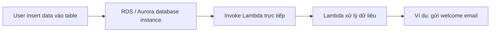
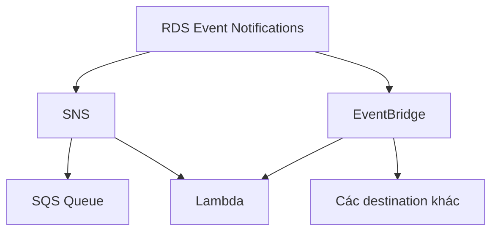

# 223. RDS - Invoking Lambda & Event Notifications

## 🎯 Giới thiệu
- RDS và Aurora có thể tích hợp trực tiếp với `Lambda` trong một số trường hợp.
- Có **2 cơ chế khác nhau** cần phân biệt rõ khi ôn thi AWS:
  - `RDS`/`Aurora` **invoke Lambda từ trong database**
  - `RDS Event Notifications` để nhận thông báo về **trạng thái/tài nguyên của database**, không phải dữ liệu trong bảng

## 1. `RDS` / `Aurora` Invoking `Lambda`
- Có thể gọi `Lambda` trực tiếp từ bên trong database instance để xử lý `data events`.
- Ví dụ:
  - User insert một bản ghi vào table `registration`
  - `RDS` trực tiếp invoke `Lambda`
  - `Lambda` có thể gửi welcome email cho user
- Cơ chế này được hỗ trợ, ví dụ, bởi:
  - `RDS for PostgreSQL`
  - `Aurora MySQL`
- Việc cấu hình phải thực hiện **từ داخل database bằng cách connect vào DB**, không phải setup từ AWS Console.

### Điều kiện quan trọng
- `RDS instance` là bên gọi `Lambda`, nên cần:
  - `network connectivity` từ database đến `Lambda`
  - quyền phù hợp để invoke `Lambda`
- Có thể cần cho phép kết nối qua:
  - public access
  - `NAT Gateway`
  - `VPC Endpoints`
  - hoặc cách kết nối network phù hợp khác
- Đồng thời, database instance phải có `IAM policy` phù hợp để được phép invoke `Lambda`.

## 2. `RDS Event Notifications`
- Đây là cơ chế **khác hoàn toàn** với việc DB invoke `Lambda`.
- `Event Notifications` chỉ cung cấp thông tin về **database instance** và các tài nguyên liên quan trong AWS.
- Không cung cấp thông tin về **data events** bên trong database.

### Các loại event có thể subscribe
- `database instance`
- `database snapshots`
- `parameter group`
- `security group`
- `proxy`
- `custom engine version`

### Đặc điểm
- Gần real-time, với độ trễ delivery **tối đa khoảng 5 phút**
- Có thể gửi notification đến:
  - `SNS`
  - `EventBridge`

### Hướng đi từ notification
- Từ `SNS`, có thể tiếp tục gửi đến:
  - `SQS Queue`
  - `Lambda`
- Từ `EventBridge`, có nhiều destination khác nhau, bao gồm `Lambda`

## 3. Phân biệt dễ nhầm trong kỳ thi
- `Invoke Lambda from RDS/Aurora`
  - liên quan đến **data events trong database**
  - database instance là bên trực tiếp gọi `Lambda`
- `RDS Event Notifications`
  - liên quan đến **events của hạ tầng/database resource**
  - không cho biết dữ liệu trong table đang thay đổi như thế nào

## 📊 Bảng tóm tắt
| Tiêu chí | Mô tả |
|----------|------|
| Mục đích | Phân biệt `Lambda invocation` từ DB và `RDS Event Notifications` |
| `Invoke Lambda` | `RDS`/`Aurora` gọi trực tiếp `Lambda` từ trong database |
| Loại sự kiện | `Data events` trong database |
| Hỗ trợ nêu trong transcript | `RDS for PostgreSQL`, `Aurora MySQL` |
| Cấu hình | Thực hiện từ داخل database, không phải từ AWS Console |
| Yêu cầu | `Network connectivity` + `IAM policy` để invoke `Lambda` |
| `Event Notifications` | Thông báo về database instance và các resource liên quan |
| Không bao gồm | Không có thông tin về dữ liệu trong database |
| Đích nhận | `SNS` hoặc `EventBridge` |
| Độ trễ | Gần real-time, tối đa khoảng 5 phút |
| SNS downstream | Có thể chuyển tiếp đến `SQS Queue` hoặc `Lambda` |

## 💡 Mẹo ghi nhớ cho kỳ thi AWS
- `Lambda invocation` = nhớ ngay đến **data event** bên trong DB.
- `Event Notifications` = nhớ ngay đến **instance/resource events**, không phải dữ liệu.
- Câu hỏi bẫy thường là:
  - “Có nhận được event về dữ liệu trong table không?” -> **Không**, nếu là `RDS Event Notifications`
  - “DB có thể invoke `Lambda` trực tiếp không?” -> **Có**, nhưng cần `network connectivity` và `IAM policy`
- Từ khóa nên nhớ:
  - `RDS for PostgreSQL`
  - `Aurora MySQL`
  - `SNS`
  - `EventBridge`
  - `IAM policy`
  - `VPC Endpoints`
  - `NAT Gateway`

## ✅ Kết luận
- `RDS`/`Aurora` có thể trực tiếp invoke `Lambda` để xử lý `data events` trong database.
- `RDS Event Notifications` chỉ dùng để theo dõi các event của database resource, được gửi qua `SNS` hoặc `EventBridge`.
- Điểm mấu chốt khi ôn thi: **đừng nhầm giữa dữ liệu trong DB và event của hạ tầng DB**.
