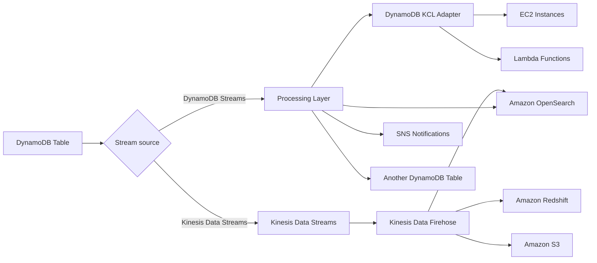

# 226. Amazon DynamoDB - Advanced Features

## 🎯 Giới thiệu
- Bài này tổng hợp các **advanced features** của **Amazon DynamoDB** thường có thể xuất hiện trong kỳ thi AWS.
- Trọng tâm gồm:
  - **DynamoDB Accelerator (DAX)**
  - **DynamoDB Streams** và tích hợp với **Kinesis**
  - **Global Tables**, **TTL**, **Backup/Recovery**, và tích hợp với **Amazon S3**

## 1. DynamoDB Accelerator (DAX) ⚡
- **DAX** là một **fully-managed**, **highly available**, **in-memory cache** cho **DynamoDB**.
- Mục đích chính:
  - Giảm **read congestion** khi bảng có nhiều lượt đọc.
  - Tăng tốc truy vấn với độ trễ mức **microseconds** cho dữ liệu đã được cache.
- Đặc điểm quan trọng cho thi:
  - **Không cần thay đổi application logic**.
  - **Compatible** với các **existing DynamoDB APIs**.
  - DAX cluster gồm vài **cache nodes** và nằm **trước DynamoDB**.
- Cache có **default TTL = 5 minutes**, nhưng có thể thay đổi.
- Phân biệt với **ElastiCache**:
  - **DAX** phù hợp để cache **individual objects**, **queries**, và **scanned queries** trên DynamoDB.
  - **ElastiCache** phù hợp hơn nếu muốn lưu **aggregation results** hoặc kết quả tính toán lớn.
  - Hai dịch vụ này là **complementary**, không phải thay thế trực tiếp cho nhau.

## 2. DynamoDB Streams và Stream Processing 🔄
- **DynamoDB Streams** ghi lại các thay đổi trên table:
  - **create**
  - **update**
  - **delete**
- Use cases:
  - Gửi **welcome email** khi có user mới.
  - **Real-time usage analytics**.
  - Đổ dữ liệu sang **derivative table**.
  - **Cross-region replication**.
  - Kích hoạt **Lambda** khi có thay đổi.

### Hai hướng stream processing
- **DynamoDB Streams**
  - **Retention: 24 hours**
  - Số lượng consumer bị giới hạn
  - Hay dùng với **Lambda triggers**
  - Có thể đọc bằng **DynamoDB Stream Kinesis Adapter**
- **Kinesis Data Streams**
  - **Retention: up to 1 year**
  - Nhiều consumers hơn
  - Nhiều cách xử lý hơn như:
    - **Kinesis Data Analytics**
    - **Kinesis Data Firehose**
    - **Glue Streaming ETLs**
    - và các kiểu xử lý khác

### Luồng xử lý điển hình

- Với **DynamoDB Streams**:
  - Có thể dùng **DynamoDB KCL Adapter**
  - Chạy trên **EC2 instances** hoặc **Lambda functions**
  - Từ đó:
    - gửi notification qua **SNS**
    - filter/transform sang **another DynamoDB table**
    - hoặc đẩy sang **Amazon OpenSearch**
- Với **Kinesis Data Streams**:
  - Có thể đi qua **Kinesis Data Firehose**
  - Sau đó đưa dữ liệu vào:
    - **Amazon Redshift** để analytics
    - **Amazon S3** để archive
    - **Amazon OpenSearch** để indexing/search

## 3. Global Tables, TTL, Backup và S3 Integration 🌍
### Global Tables
- **Global table** là DynamoDB table được **replicated across multiple regions**.
- Đặc điểm:
  - **Two-way replication**
  - **Active-Active replication**
  - Ứng dụng có thể **read/write** ở bất kỳ region nào
  - Mục tiêu là cung cấp **low latency** ở nhiều region
- Điều kiện để enable:
  - Phải bật **DynamoDB Streams** trước, vì đây là hạ tầng nền để replicate giữa các region

### TTL (Time To Live)
- **TTL** dùng để **automatically delete items** sau một **expiry timestamp**.
- Cách hoạt động:
  - Bảng có một attribute như `ExpTime`
  - Khi thời gian hiện tại vượt quá giá trị TTL, item sẽ **expire** và bị xóa theo process xóa tự động
- Use cases:
  - Chỉ giữ **most current items**
  - Đáp ứng **regulatory obligations** như xóa dữ liệu sau 2 năm
  - **Web session handling**
    - Lưu session tập trung trong DynamoDB
    - Session có thể hết hạn sau một khoảng thời gian, ví dụ 2 giờ

### Backup và Recovery
- Có 2 kiểu backup chính:
  - **Continuous backups with Point-in-Time Recovery (PITR)**
    - **Optionally enabled**
    - Giữ trong **35 days**
    - Có thể recover về bất kỳ thời điểm nào trong backup window
    - Khi recover sẽ tạo ra **new table**
  - **On-demand backups**
    - Lưu cho đến khi xóa thủ công
- Backup kiểu này **không ảnh hưởng performance hoặc latency** của DynamoDB.
- Có thể dùng **AWS Backup Service** để:
  - quản lý backup tốt hơn
  - áp dụng **lifecycle policies**
  - copy backup **across regions**
- Nếu restore backup thì cũng sẽ tạo ra **new table**

### Tích hợp với Amazon S3
- Có thể **export DynamoDB table to S3**.
- Điều kiện:
  - Cần bật **PITR**
- Lợi ích:
  - Export tại bất kỳ thời điểm nào trong **last 35 days**
  - **Không ảnh hưởng read capacity** hoặc performance của table
  - Dùng cho:
    - phân tích dữ liệu qua **Amazon Athena**
    - giữ snapshot cho auditing
    - làm **ETL/transformation** trước khi import lại vào DynamoDB
- Format export:
  - **DynamoDB JSON**
  - **ION**
- Có thể **import từ S3** vào một **new DynamoDB table**
  - Hỗ trợ **CSV**, **JSON**, hoặc **ION**
  - **Không consume write capacity**
  - Nếu có lỗi import, lỗi sẽ được ghi trong **CloudWatch Logs**

## 📊 Bảng tóm tắt
| Tiêu chí | Mô tả |
|----------|------|
| DAX | In-memory cache cho DynamoDB, latency mức microseconds, không cần đổi application logic |
| DAX vs ElastiCache | DAX cho cache query/object trên DynamoDB, ElastiCache phù hợp cho aggregation results |
| DynamoDB Streams | Ghi nhận create/update/delete, retention 24 hours, hay dùng với Lambda |
| Kinesis Data Streams | Retention đến 1 year, nhiều consumers và nhiều kiểu xử lý hơn |
| Global Tables | Replication đa region, Active-Active, cần bật DynamoDB Streams |
| TTL | Tự động xóa item theo expiry timestamp, thường dùng cho session hoặc dữ liệu chỉ cần giữ tạm thời |
| PITR | Continuous backups, giữ 35 days, restore tạo new table |
| On-demand backup | Giữ đến khi xóa thủ công, không ảnh hưởng performance |
| AWS Backup | Hỗ trợ lifecycle policies và copy backup cross-region |
| S3 integration | Export/import dữ liệu để analytics, archive, ETL; restore/import tạo new table |

## 💡 Mẹo ghi nhớ cho kỳ thi AWS
- **DAX = cache cho read-heavy DynamoDB**, nhớ từ khóa **microseconds latency** và **no code change**.
- **DynamoDB Streams = 24 hours**, hay đi với **Lambda triggers**.
- **Kinesis Data Streams = retention dài hơn, nhiều consumers hơn**.
- **Global Tables = Active-Active + multi-region + cần DynamoDB Streams**.
- **TTL = tự xóa item theo thời gian**, rất hay gặp trong bài toán **session handling**.
- **PITR = 35 days**, restore sẽ tạo **new table**.
- **Export/Import S3**:
  - Export cần **PITR**
  - Import **không consume write capacity**
  - Import lỗi sẽ vào **CloudWatch Logs**

## ✅ Kết luận
- **DynamoDB advanced features** tập trung vào tối ưu hiệu năng, xử lý sự kiện, đa vùng, lifecycle dữ liệu và backup.
- Khi ôn thi, hãy nhớ các keyword chính:
  - **DAX**
  - **DynamoDB Streams**
  - **Kinesis Data Streams**
  - **Global Tables**
  - **TTL**
  - **PITR**
  - **AWS Backup**
  - **S3 export/import**
