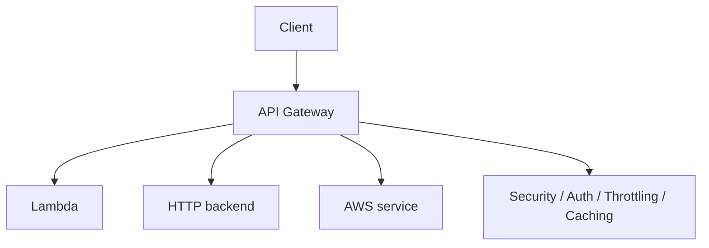

# 227. API Gateway Overview

## 🎯 Giới thiệu
- **API Gateway** là dịch vụ **serverless** của AWS, dùng để tạo **REST APIs** public cho client.
- Client không gọi trực tiếp vào backend nữa, mà gửi request đến **API Gateway**; sau đó API Gateway sẽ **proxy** request đến **Lambda**, HTTP backend, hoặc các **AWS service** khác.
- Đây là lớp trung gian hữu ích vì ngoài HTTP endpoint, API Gateway còn cung cấp nhiều tính năng quan trọng cho ôn thi AWS như:
  - **Authentication** và **authorization**
  - **Usage plans**
  - **API keys**
  - **Request throttling**
  - **Development stages**
  - **API versioning**
  - **Transform/validate request and response**
  - **Generate SDK**
  - **Cache API responses**

## 1. Vai trò của API Gateway trong serverless
- Kết hợp **API Gateway + Lambda + DynamoDB** tạo thành một **full serverless application**.
- So với việc client gọi trực tiếp Lambda:
  - Client không cần trực tiếp có **IAM permissions** để invoke Lambda.
  - API được public một cách chuẩn hóa hơn.
- So với **Application Load Balancer**:
  - API Gateway cung cấp nhiều tính năng chuyên sâu hơn, không chỉ là HTTP endpoint.

## 2. Các kiểu tích hợp chính
- **Lambda integration**
  - Cách phổ biến nhất.
  - Dùng để expose REST API backed by Lambda.
- **HTTP integration**
  - API Gateway có thể proxy đến bất kỳ HTTP endpoint nào.
  - Ví dụ trong transcript:
    - HTTP API on premises
    - Application Load Balancer trên cloud
  - Lý do dùng: tận dụng **rate limiting**, **caching**, **user authentication**, **API keys**.
- **AWS service integration**
  - Có thể expose AWS API thông qua API Gateway.
  - Ví dụ trong transcript:
    - Start a **Step Functions** workflow
    - Post message tới **SQS**
    - Gửi dữ liệu vào **Kinesis Data Streams**
  - Trường hợp use case: public API nhưng không muốn cấp **AWS credentials** trực tiếp cho client.

## 3. Endpoint types, bảo mật và domain
- **Endpoint types** của API Gateway:
  - **Edge-Optimized**
    - Default.
    - Dành cho client global.
    - Request đi qua **CloudFront Edge locations** để giảm latency.
    - API Gateway vẫn nằm trong một region, nhưng được truy cập hiệu quả từ nhiều nơi.
  - **Regional**
    - Không dùng CloudFront Edge locations.
    - Phù hợp khi người dùng chủ yếu ở cùng region với API Gateway.
  - **Private API Gateway**
    - Không public.
    - Chỉ truy cập từ trong **VPC**.
    - Dùng **interface VPC endpoints** cho **ENIs**.
    - Access được định nghĩa bằng **resource policy**.
- Cách xác thực người dùng:
  - **IAM roles**: phù hợp cho internal applications, ví dụ app chạy trên **EC2**.
  - **Amazon Cognito**: phù hợp cho external users như mobile/web app.
  - **Custom authorizer**: tự viết logic bằng **Lambda function**.
- Custom domain name:
  - Dùng **AWS Certificate Manager (ACM)** cho HTTPS.
  - Với **Edge-Optimized endpoint**, certificate phải ở **us-east-1**.
  - Với **regional endpoint**, certificate có thể ở cùng region với API Gateway stage.
  - Cần cấu hình **CNAME** hoặc **A-alias record** trong **Route 53**.

## 📊 Bảng tóm tắt
| Tiêu chí | Mô tả |
|----------|------|
| Bản chất | **Serverless** service để tạo **REST APIs** public |
| Luồng request | Client -> **API Gateway** -> **Lambda / HTTP backend / AWS service** |
| Điểm mạnh | **Authentication**, **usage plans**, **API keys**, **throttling**, **caching**, **stages** |
| Tích hợp phổ biến | **Lambda**, **HTTP endpoint**, **AWS service** |
| Endpoint types | **Edge-Optimized**, **Regional**, **Private** |
| Bảo mật | **IAM roles**, **Amazon Cognito**, **Custom authorizer**, **Resource policy** |
| Custom domain | Dùng **ACM** + **Route 53** |

## 💡 Mẹo ghi nhớ cho kỳ thi AWS
- Nếu đề bài nói **public API + serverless backend**, nghĩ ngay đến **API Gateway + Lambda**.
- Nếu cần **client không có AWS credentials** nhưng vẫn gọi được AWS service, dùng **API Gateway** làm lớp trung gian.
- Nhớ phân biệt:
  - **Edge-Optimized** = global + **CloudFront Edge locations**
  - **Regional** = chỉ trong region
  - **Private** = chỉ trong **VPC**
- Nếu câu hỏi nhấn mạnh:
  - **API keys**
  - **Throttling**
  - **Caching**
  - **Usage plans**
  thì đây là điểm mạnh của **API Gateway**, không phải chỉ là một load balancer.
- Khi dùng custom domain với **Edge-Optimized**, nhớ certificate ở **us-east-1**.

## ✅ Kết luận
- **API Gateway** là lớp trung gian rất quan trọng trong kiến trúc serverless AWS.
- Nó giúp public API, proxy request đến **Lambda** hoặc **AWS service**, đồng thời bổ sung các tính năng như **security**, **throttling**, **caching**, và **versioning**.
- Trong ôn thi AWS, cần nắm chắc **integration types**, **endpoint types**, và các lựa chọn **authentication/authorization** của API Gateway.
