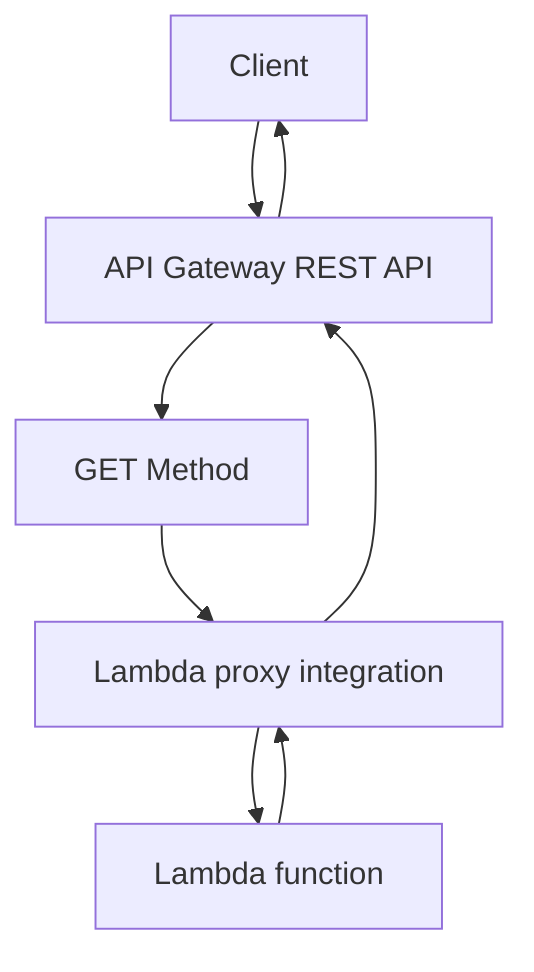

# 228. API Gateway Basics Hands-On

## 🎯 Giới thiệu
- Bài học này hướng dẫn tạo một **REST API** trong **API Gateway** và tích hợp với **Lambda**.
- Transcript chỉ tập trung vào **REST API**; các loại khác được nhắc qua gồm **HTTP APIs** và **WebSocket API**.
- Mục tiêu chính:
  - Tạo API mới
  - Gắn **GET method**
  - Dùng **Lambda function** làm backend
  - Test trực tiếp trong console và qua **invoke URL**
  - Quan sát **CloudWatch logs** để debug

## 1. Tạo REST API và chọn endpoint type
- Trong **API Gateway console**, chọn **REST API** và tạo API mới tên `MyFirstAPI`.
- Có các cách tạo API:
  - Tạo mới
  - Import từ file **OpenAPI definition**
  - Clone API có sẵn
  - Start từ **example API**
- Các kiểu **API endpoint type**:
  - **Regional**: triển khai trong một region
  - **Edge-optimized**: triển khai qua nhiều vùng ở edge, nhưng API vẫn sống ở một region
  - **Private**: không public ra web
- Trong bài này chọn **Regional** để đơn giản.

## 2. Tạo method và tích hợp với Lambda
- Tạo **GET method** cho API.
- **Integration type** có các lựa chọn:
  - **Lambda function**
  - **HTTP**
  - **Mock**
  - **AWS service**
  - **VPC link**
- Bài học dùng **Lambda function** và bật **Lambda proxy integration** để API Gateway truyền đầy đủ request sang Lambda và nhận response trở lại.

### Mermaid: luồng request cơ bản


### Điểm quan trọng về Lambda
- Tạo Lambda function đầu tiên tên `api-gateway-route-gets`.
- Runtime dùng **Python 3.11**.
- Code trả về:
  - `statusCode = 200`
  - `body = "hello from Lambda"`
  - `Content-Type: application/json`
- Sau khi **Deploy**, test Lambda riêng trong console cho kết quả `hello from Lambda`.

### Security flow
- Khi tạo integration, **API Gateway** tự động được cấp quyền gọi Lambda.
- Trong **Lambda permissions**, có **resource-based policy statement** cho phép API Gateway invoke Lambda nếu source API đúng với API Gateway đã tạo.
- Đây là phần security “behind the scenes” mà AWS tự cấu hình.

### Timeout cần nhớ
- Dù Lambda có thể chạy lâu hơn, **API Gateway timeout mặc định là 29 seconds**.
- Có thể cấu hình thấp hơn 29 giây, nhưng mặc định vẫn là **29 seconds**.

## 3. Tạo resource, deploy stage và test qua browser
- Tạo thêm resource `/houses`.
- Gắn **GET method** khác cho `/houses` và liên kết với một Lambda function khác.
- Lambda này trả về:
  - `hello from my pretty house`
- Test trong console:
  - `/` hoặc root GET -> `hello from Lambda`
  - `/houses` -> `hello from my pretty house`

### Deploy API
- Chọn **Deploy API**
- Tạo stage mới tên `dev`
- Sau khi deploy, API có **invoke URL**

### Hành vi khi truy cập thực tế
- Truy cập:
  - `.../dev` -> `hello from Lambda`
  - `.../houses` -> `hello from my pretty house`
- Gõ sai path, ví dụ `/wrong`:
  - nhận lỗi như **missing authentication token**

### Debug bằng CloudWatch
- Thêm `print event` trong Lambda để xem dữ liệu request từ API Gateway.
- Trong **CloudWatch logs**, thấy event chứa:
  - `resource`
  - `path`
  - `method` là `GET`
  - `headers`
  - `query string parameters`
- Lambda nhận nhiều thông tin từ API Gateway để tạo response trả lại.

### Mermaid: flow triển khai và test
```mermaid
flowchart LR
    A[Create REST API] --> B[Create GET Method]
    B --> C[Integrate Lambda proxy]
    C --> D[Deploy to stage dev]
    D --> E[Invoke URL]
    E --> F[/dev -> hello from Lambda]
    E --> G[/houses -> hello from my pretty house]
    E --> H[/wrong -> missing authentication token]
```

## 📊 Bảng tóm tắt
| Tiêu chí | Mô tả |
|----------|------|
| API type | Chọn **REST API** |
| Endpoint type | **Regional**, **Edge-optimized**, **Private** |
| Method dùng trong bài | **GET** |
| Integration type | **Lambda function** |
| Tùy chọn quan trọng | **Lambda proxy integration** |
| Timeout mặc định | **29 seconds** cho API Gateway |
| Security | API Gateway được cấp quyền invoke Lambda qua **resource-based policy** |
| Deploy | Deploy vào stage `dev` |
| Debug | Dùng **CloudWatch logs** để xem event từ API Gateway |

## 💡 Mẹo ghi nhớ cho kỳ thi AWS
- **REST API** trong API Gateway có thể gắn với **Lambda** để tạo backend serverless.
- Nhớ phân biệt:
  - **Regional**: một region
  - **Edge-optimized**: qua edge nhiều vùng
  - **Private**: không public web
- **Lambda proxy integration** giúp truyền request đầy đủ sang Lambda.
- **API Gateway timeout = 29 seconds** là điểm rất dễ thi.
- Nếu path sai khi gọi API đã deploy, có thể gặp lỗi kiểu **missing authentication token**.
- **CloudWatch logs** là nơi xem `event` từ API Gateway để debug request flow.

## ✅ Kết luận
- Bài này xây dựng một **REST API** đơn giản với **API Gateway + Lambda**.
- Bạn đã học được cách:
  - tạo API
  - tạo resource và GET method
  - gắn Lambda bằng **proxy integration**
  - deploy lên stage `dev`
  - gọi qua browser bằng **invoke URL**
  - kiểm tra request trong **CloudWatch logs**
- Đây là nền tảng rất quan trọng để ôn thi và hiểu luồng hoạt động cơ bản của **API Gateway**.
