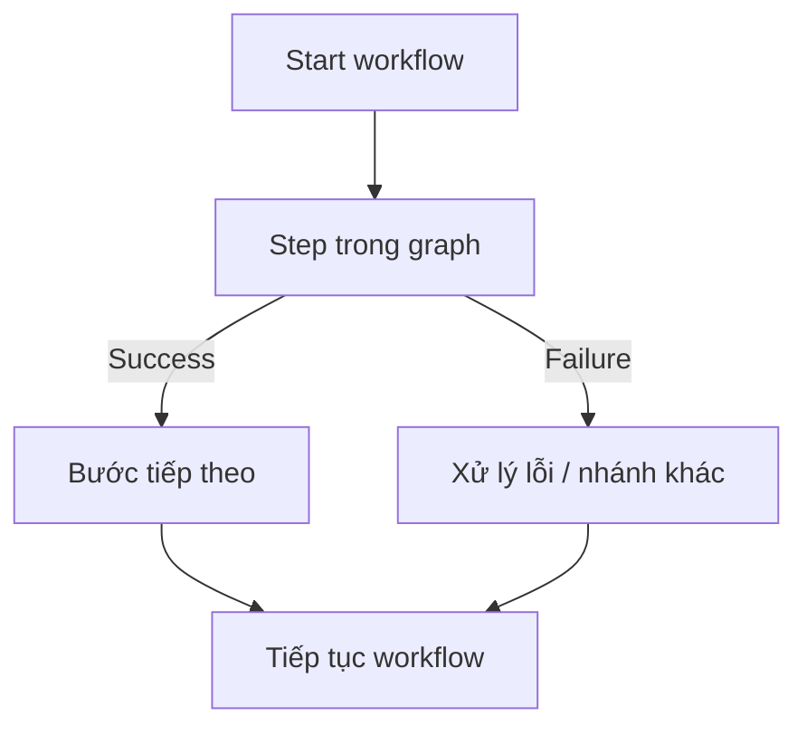

# 229. Step Functions

## 🎯 Giới thiệu
- **AWS Step Functions** là cách để xây dựng một **serverless visual workflow** nhằm thực hiện **orchestration**.
- Nó thường được dùng để điều phối các **Lambda functions**, nhưng không chỉ giới hạn ở Lambda.
- Bạn thiết kế một **graph** và xác định ở mỗi bước:
  - Nếu **success** thì đi tiếp thế nào
  - Nếu **failure** thì xử lý ra sao
- Đây là công cụ rất hữu ích khi cần xây dựng các **workflow phức tạp** trong AWS.

## 1. 🧩 Tính năng chính của Step Functions
- Có các khả năng nội bộ như:
  - **Sequencing**
  - **Parallel functions**
  - **Conditions**
  - **Timeouts**
  - **Error handling**
- Mục tiêu là giúp bạn điều phối luồng xử lý rõ ràng theo từng bước.

## 2. 🔗 Tích hợp với nhiều dịch vụ AWS
- Step Functions không chỉ làm việc với Lambda.
- Nó có thể tích hợp với:
  - **EC2 instances**
  - **ECS tasks**
  - **On-premises servers**
  - **API Gateway**
  - **SQS queues**
  - **DynamoDB**
  - Và nhiều **AWS services** khác
- Điều này giúp Step Functions phù hợp với nhiều kiểu kiến trúc và luồng xử lý khác nhau.

## 3. 👤 Human approval trong workflow
- Trong workflow của Step Functions, có thể triển khai **human approval feature**.
- Cách hoạt động:
  - Workflow đi đến một điểm nào đó
  - Con người xem kết quả
  - Nếu chọn **Yes** thì tiếp tục
  - Nếu chọn **No** thì fail
- Đây là một điểm rất hữu ích khi cần bước kiểm duyệt thủ công trong quy trình tự động.

## 📊 Bảng tóm tắt
| Tiêu chí | Mô tả |
|----------|------|
| Mục đích | Xây dựng **serverless visual workflow** để **orchestration** |
| Cách làm việc | Thiết kế **graph** với các nhánh theo **success / failure** |
| Tính năng | **Sequencing, parallel functions, conditions, timeouts, error handling** |
| Tích hợp | **Lambda, EC2, ECS, On-premises servers, API Gateway, SQS, DynamoDB** |
| Use case | **Order fulfillment, data processing, web applications, workflow phức tạp** |
| Điểm nổi bật | Có thể thêm **human approval** vào workflow |

## 💡 Mẹo ghi nhớ cho kỳ thi AWS
- Nhớ rằng **Step Functions = orchestration + visual workflow + serverless**.
- Nếu đề bài nói đến:
  - quy trình nhiều bước
  - rẽ nhánh theo success/failure
  - cần **parallel**, **condition**, **timeout**, **error handling**
  - hoặc có **human approval**
  thì rất dễ đang nói đến **Step Functions**.
- Khi cần điều phối nhiều dịch vụ AWS trong một workflow, hãy nghĩ đến **Step Functions** trước tiên.

## ✅ Kết luận
- **AWS Step Functions** là công cụ để xây dựng và điều phối **serverless workflow** theo dạng **graph**.
- Nó hỗ trợ nhiều kiểu xử lý như **sequencing**, **parallel**, **conditions**, **timeouts**, và **error handling**.
- Ngoài Lambda, Step Functions còn tích hợp với nhiều dịch vụ AWS khác và có thể dùng cho cả **human approval** trong workflow.
- Đây là dịch vụ rất phù hợp cho các bài toán **workflow phức tạp** trong AWS.
