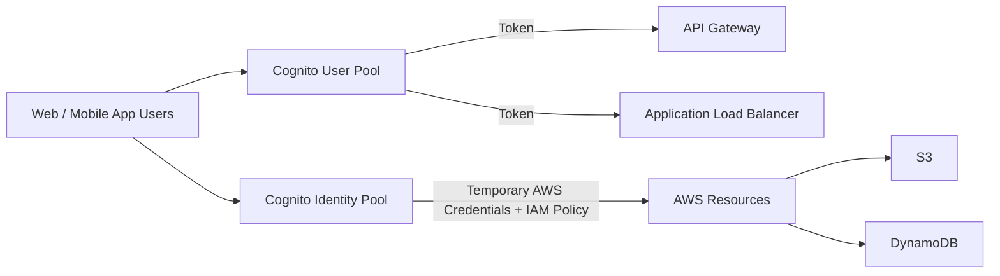
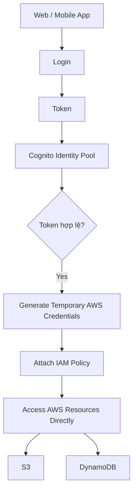

# 230. Amazon Cognito Overview

## 🎯 Giới thiệu
Amazon Cognito là dịch vụ dùng để cấp **identity** cho người dùng của ứng dụng **web** và **mobile**.

- Đối tượng chính là người dùng nằm **bên ngoài AWS account**
- Dùng khi cần **authentication** cho app users, không phải user trong IAM
- Có 2 phần chính:
  - **Cognito User Pool**
  - **Cognito Identity Pool** (trước đây gọi là **Federated Identity**)

## 1. Cognito User Pool
**Cognito User Pool** là một **serverless database of users** cho ứng dụng web và mobile.

- Cung cấp **sign-in functionality**
- Hỗ trợ:
  - **username/email + password**
  - **password reset**
  - **email và phone number verification**
  - **multi-factor authentication**
  - tích hợp đăng nhập qua **Facebook**, **Google**, và các cơ chế khác như **SAML**
- Tích hợp tốt với:
  - **API Gateway**
  - **Application Load Balancer**

### Luồng hoạt động với API Gateway
- User đăng nhập vào **Cognito User Pool**
- Nhận **token**
- Gửi token tới **API Gateway**
- **API Gateway** verify token
- Nếu hợp lệ, API Gateway chuyển thành **user identity**
- Identity này được chuyển cho **Lambda backend**

### Luồng hoạt động với ALB
- Ứng dụng xác thực qua **Cognito User Pool**
- Gửi request qua **Application Load Balancer**
- ALB kiểm tra login
- Nếu đúng, ALB redirect request về backend
- Đồng thời thêm các **headers** chứa identity của user

## 2. Cognito Identity Pool
**Cognito Identity Pool** dùng để cấp **temporary AWS credentials** cho user để họ có thể truy cập trực tiếp vào AWS resources.

- User source có thể đến từ:
  - **Cognito User Pools**
  - third-party login
  - **SAML**
  - **OpenID Connect**
- Dùng khi user cần truy cập trực tiếp vào:
  - **S3**
  - **DynamoDB**
- **IAM policies** của credentials được định nghĩa trong **Cognito Identity Pool**
- Có thể customize theo **user ID** để kiểm soát chi tiết
- Có thể thiết lập **default IAM role** cho:
  - guest users
  - authenticated users không có role riêng

### Luồng hoạt động
- Web/mobile app đăng nhập và nhận **token**
- Token được gửi tới **Cognito Identity Pool**
- Identity Pool:
  - kiểm tra token hợp lệ
  - tạo **IAM policy** riêng cho user
  - đổi token thành **temporary AWS credentials**
- Credentials này dùng để truy cập AWS trực tiếp, không cần qua **API Gateway** hoặc **ALB**

## 3. Điểm cần nhớ cho kỳ thi
- **Cognito User Pool**: dùng cho **sign-in** của user ứng dụng
- **Cognito Identity Pool**: dùng để cấp **temporary AWS credentials**
- **User Pool** thường đi với:
  - **API Gateway**
  - **Application Load Balancer**
- **Identity Pool** cho phép user truy cập trực tiếp **S3**, **DynamoDB**, hoặc các AWS services khác
- Có thể dùng **Identity Pool** để làm **row level security** trong **DynamoDB**
- Ý tưởng row level security:
  - policy có điều kiện
  - **leading key** trong DynamoDB phải bằng **Cognito identity user ID**
  - user chỉ được đọc/ghi các item liên quan tới chính họ

## 📊 Bảng tóm tắt
| Tiêu chí | Mô tả |
|----------|------|
| Mục đích chính | Cấp identity cho user web/mobile ngoài AWS account |
| Cognito User Pool | Serverless user database, hỗ trợ sign-in, token, MFA, social login |
| Cognito Identity Pool | Cấp temporary AWS credentials để truy cập AWS trực tiếp |
| Tích hợp chính | User Pool với API Gateway, Application Load Balancer |
| Truy cập AWS trực tiếp | Qua Identity Pool, không cần API Gateway/ALB |
| Kiểm soát truy cập | IAM policy có thể customize theo user ID |
| Use case nổi bật | Row level security trong DynamoDB |

## 💡 Mẹo ghi nhớ cho kỳ thi AWS
- Nhớ nhanh:
  - **User Pool = đăng nhập**
  - **Identity Pool = cấp quyền truy cập AWS**
- Nếu đề bài nói:
  - user app bên ngoài AWS
  - login qua email/password, Google, Facebook, SAML
  - cần token để xác thực
  - hãy nghĩ tới **Cognito User Pool**
- Nếu đề bài nói:
  - user cần truy cập trực tiếp **S3** hoặc **DynamoDB**
  - cần **temporary AWS credentials**
  - hãy nghĩ tới **Cognito Identity Pool**
- Nếu đề bài nhắc đến **row level security** trong DynamoDB, hãy liên hệ với **Cognito Identity Pool** và **IAM policy condition**

## ✅ Kết luận
Amazon Cognito dùng để quản lý identity cho user của ứng dụng **web** và **mobile** nằm ngoài AWS account.

- **Cognito User Pool** xử lý **authentication** và phát **token**
- **Cognito Identity Pool** đổi token thành **temporary AWS credentials**
- Dịch vụ này đặc biệt hữu ích khi cần tích hợp với **API Gateway**, **Application Load Balancer**, hoặc cấp quyền truy cập trực tiếp vào **S3** và **DynamoDB**
