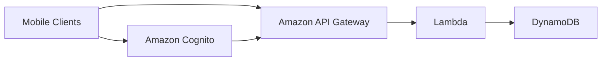
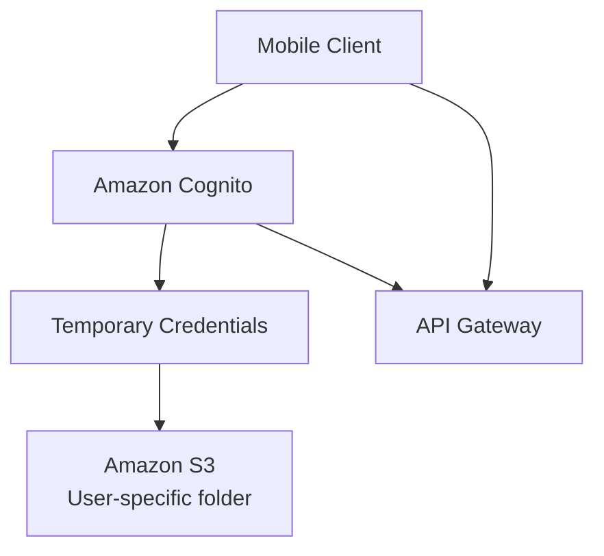

# 231. Mobile Application- MyTodoList

## 🎯 Giới thiệu
Bài này mô tả một **serverless architecture** cho mobile app **MyTodoList** theo hướng học thi AWS.

Mục tiêu chính của kiến trúc:
- Cung cấp **REST API** qua **HTTPS endpoints**
- Dùng **serverless services** để giảm quản trị
- Cho phép user truy cập trực tiếp vào **S3** theo **own folder**
- Xác thực bằng một **managed serverless service**
- Tối ưu cho trường hợp **read-heavy** vì to-dos chủ yếu được đọc
- Database phải **scale** tốt và có **high read throughput**

## 1. Kiến trúc serverless cốt lõi 🏗️
Kiến trúc cơ bản của app:
- **Mobile clients** gọi **Amazon API Gateway**
- **API Gateway** invoke **Lambda**
- **Lambda** đọc/ghi dữ liệu vào **DynamoDB**
- **Amazon Cognito** xử lý authentication
- Đây là mô hình **classic serverless REST API architecture**

Ý nghĩa từng thành phần:
- **API Gateway**: điểm vào của REST HTTPS API
- **Lambda**: xử lý business logic
- **DynamoDB**: backend database serverless, scale tốt
- **Cognito**: authentication layer được managed bởi AWS

## 2. Xác thực và truy cập S3 bằng temporary credentials 🔐
Bài giảng nhấn mạnh một pattern quan trọng:
- Mobile client authenticate vào **Amazon Cognito**
- **Cognito** có thể tạo **temporary credentials**
- Các credentials này được trả về cho mobile client
- User dùng credentials đó để truy cập **Amazon S3**
- Mục tiêu là cho phép mỗi user quản lý dữ liệu trong **own little space in S3**

Điểm cần nhớ:
- **Sai** nếu lưu **AWS user credentials** trực tiếp trong mobile client
- Cách đúng là dùng **Cognito** để cấp **temporary credentials**
- Truy cập S3 phải đi kèm **restricted policy**

## 3. Tối ưu read throughput bằng DAX và API Gateway Cache ⚡
Khi app scale và lượng user tăng:
- Quan sát thấy **high read throughput**
- **To-dos** ít thay đổi, chủ yếu là **read**
- Mục tiêu là tăng performance và giảm cost

Cách tối ưu:
- Thêm **DynamoDB DAX** làm **caching layer** trước **DynamoDB**
- Các lần đọc sẽ được cache trong **DAX**
- Giảm nhu cầu dùng nhiều **RCUs**
- Có thể giảm **cost overall** vì đọc nhiều lần từ cache thay vì từ DynamoDB

Ngoài DAX, còn một cách cache khác:
- Cache response ngay ở **Amazon API Gateway**
- Hữu ích khi response **rất static**
- Có thể cache theo từng **API routes**

Lợi ích tổng thể:
- Tăng hiệu năng
- Giảm tải cho DynamoDB
- Giảm chi phí
- Vẫn giữ mô hình serverless

## 📊 Bảng tóm tắt
| Tiêu chí | Mô tả |
|----------|------|
| API layer | **Amazon API Gateway** cung cấp **REST HTTPS endpoints** |
| Compute layer | **Lambda** xử lý logic serverless |
| Database | **DynamoDB** làm backend serverless, scale tốt |
| Authentication | **Amazon Cognito** xác thực user và tích hợp với API Gateway |
| S3 access | **Cognito** cấp **temporary credentials** để truy cập **S3** |
| Performance | **DAX** cache đọc cho **DynamoDB** |
| API caching | Cache response tại **API Gateway** khi dữ liệu rất static |
| Mô hình vận hành | **Pay per usage**, ít phải quản lý hạ tầng |

## 💡 Mẹo ghi nhớ cho kỳ thi AWS
- **API Gateway + Lambda + DynamoDB** là bộ ba kinh điển của **serverless REST API**
- Muốn mobile app truy cập **S3** an toàn thì nghĩ ngay đến **Cognito + temporary credentials**
- **Không lưu AWS credentials trong mobile client**
- Khi workload **read-heavy**, cân nhắc **DAX**
- Nếu response ít thay đổi, có thể cache ngay tại **API Gateway**
- **Cognito** không chỉ dùng cho login mà còn có thể tích hợp với **API Gateway**
- Câu hỏi thi thường xoay quanh việc chọn dịch vụ nào để:
  - giảm quản trị
  - tăng read performance
  - cấp quyền truy cập S3 an toàn

## ✅ Kết luận
Bài học này xây dựng một kiến trúc **serverless** hoàn chỉnh cho **MyTodoList**:
- **API Gateway** cho REST HTTPS
- **Lambda** xử lý request
- **DynamoDB** lưu dữ liệu
- **Cognito** lo authentication và temporary credentials cho **S3**
- **DAX** và **API Gateway cache** giúp tối ưu read-heavy workload

Đây là một pattern rất quan trọng để ôn thi AWS vì nó gom nhiều dịch vụ serverless cốt lõi vào cùng một kiến trúc thực tế.
