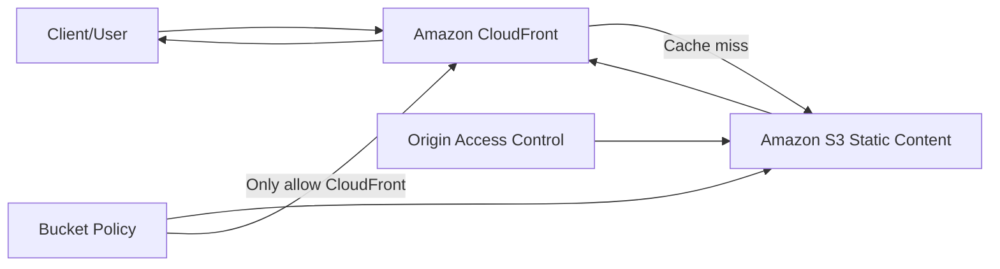
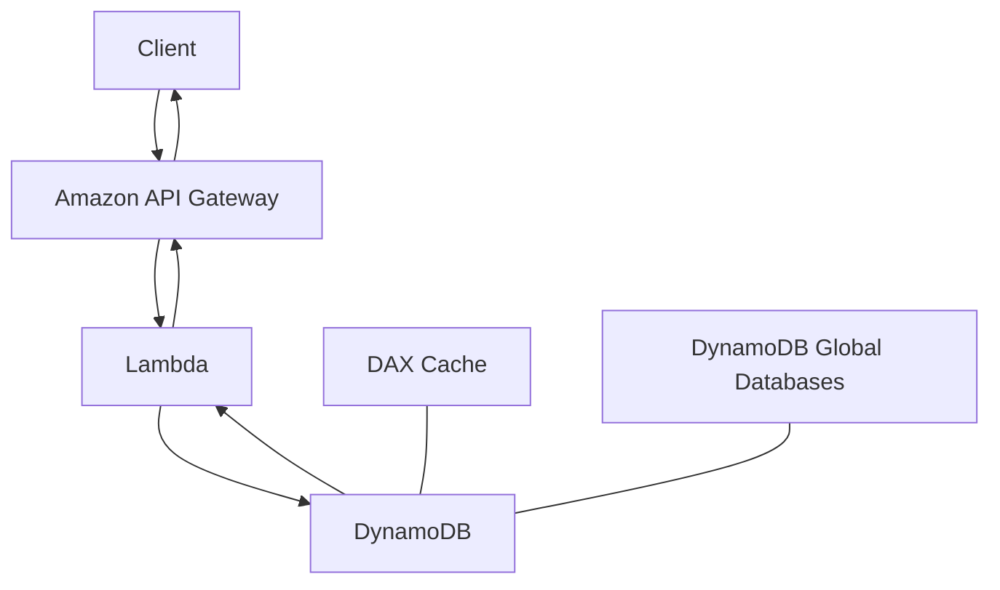
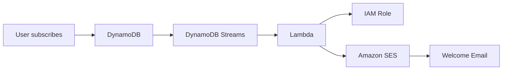
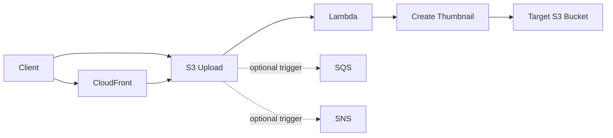

# 232. Serverless Website- MyBlog.com

## 🎯 Giới thiệu
Bài giảng mô tả kiến trúc cho một website serverless kiểu **MyBlog.com** với các yêu cầu chính:
- Website phải **scale globally**
- Phần lớn nội dung là **static files**
- Có một phần nhỏ là **dynamic REST API**
- Tối ưu **cache** để giảm **cost** và **latency**
- Có **warm welcome email** khi user subscribe
- Tự động tạo **thumbnail** khi upload ảnh
- Tất cả đều theo hướng **serverless**

## 1. Static Website toàn cầu với S3 + CloudFront 🌍
Nội dung blog chủ yếu là static, được lưu trong **Amazon S3** và phân phối toàn cầu bằng **Amazon CloudFront**.

- **S3** là nơi lưu static content, nhưng bucket nằm trong một **specific region**
- **CloudFront** là **global distribution CDN**
- Client tương tác với **edge locations** của CloudFront
- CloudFront cache dữ liệu lấy từ S3 để:
  - giảm latency
  - tiết kiệm chi phí
  - cải thiện trải nghiệm người dùng

### Bảo mật truy cập S3
Để tránh người dùng truy cập trực tiếp vào S3 bucket:
- Dùng **Origin Access Control (OAC)**
- Thêm **bucket policy** chỉ cho phép **CloudFront distribution**
- Kết quả: user chỉ truy cập qua CloudFront, không truy cập trực tiếp được vào S3

## 2. Public Serverless REST API với API Gateway, Lambda, DynamoDB ⚙️
Phần dynamic của website được triển khai bằng kiến trúc serverless:

- **REST HTTPS** gọi vào **Amazon API Gateway**
- API Gateway invoke **Lambda**
- Lambda đọc/ghi dữ liệu từ **DynamoDB**
- Vì có nhiều reads, có thể dùng **DAX** làm caching layer
- Nếu triển khai toàn cầu, có thể dùng **DynamoDB Global Databases** để giảm latency ở nhiều khu vực

### Ý chính cần nhớ
- **API Gateway** là cổng vào cho public REST API
- **Lambda** xử lý logic
- **DynamoDB** lưu dữ liệu
- **DAX** hỗ trợ cache khi workload có nhiều read
- **DynamoDB Global Databases** giúp phân phối dữ liệu toàn cầu

## 3. Event-driven Flow: Welcome Email và Thumbnail Generation 📩🖼️
Bài giảng đưa ra 2 flow serverless theo sự kiện:

### 3.1 User Welcome Email flow
Khi user subscribe:
- **DynamoDB Streams** ghi nhận thay đổi
- Stream invoke **Lambda**
- Lambda có **IAM role**
- IAM role cho phép Lambda dùng **Amazon SES (Simple Email Service)**
- Lambda dùng **AWS SDK** để gửi email

Điểm mấu chốt:
- Đây là flow hoàn toàn serverless
- Không cần quản lý infrastructure
- Scale tốt

### 3.2 Thumbnail generation flow
Khi user upload ảnh:
- Client có thể upload:
  - trực tiếp lên **S3**
  - hoặc qua **CloudFront** và forward về S3
- Cách qua CloudFront được gọi là **S3 Transfer Acceleration**
- Khi file được thêm vào **S3**, nó có thể trigger **Lambda**
- Lambda tạo **thumbnail**
- Thumbnail được lưu vào một **S3 bucket** khác, nếu cần

Ngoài Lambda, **Amazon S3** còn có thể trigger:
- **SQS**
- **SNS**

Ý nghĩa:
- AWS cho phép thiết kế solution rất linh hoạt
- Có thể chọn flow phù hợp với nhu cầu architecture

## 📊 Bảng tóm tắt
| Tiêu chí | Mô tả |
|----------|------|
| Static content | Lưu trong **Amazon S3** và phân phối bằng **CloudFront** |
| Global delivery | **CloudFront edge locations** giúp phục vụ nội dung toàn cầu |
| Security | Dùng **OAC** và **bucket policy** để chỉ cho phép CloudFront truy cập S3 |
| REST API | **API Gateway** → **Lambda** → **DynamoDB** |
| Caching | Có thể dùng **DAX** cho workload nhiều read |
| Global data | Có thể dùng **DynamoDB Global Databases** |
| Welcome email | **DynamoDB Streams** → **Lambda** → **SES** |
| Thumbnail flow | **S3** trigger **Lambda** để tạo thumbnail |
| Event flexibility | **S3** có thể trigger **Lambda**, **SQS**, **SNS** |

## 💡 Mẹo ghi nhớ cho kỳ thi AWS
- **S3 + CloudFront** = pattern kinh điển cho static website global
- Muốn bảo vệ S3 khỏi truy cập trực tiếp thì nhớ **OAC + bucket policy**
- **API Gateway + Lambda + DynamoDB** là bộ ba thường gặp cho public serverless REST API
- Có nhiều read thì nghĩ tới **DAX**
- Muốn multi-region, nhớ **DynamoDB Global Databases**
- **DynamoDB Streams** thường dùng để kích hoạt xử lý bất đồng bộ
- **Lambda** có thể dùng **IAM role** để gọi **SES**
- **S3 event** có thể đi tới **Lambda**, **SQS**, hoặc **SNS**

## ✅ Kết luận
Kiến trúc **MyBlog.com** trong bài giảng là một ví dụ hoàn chỉnh về hệ thống **serverless**:
- static content được phân phối toàn cầu bằng **S3 + CloudFront**
- dynamic API chạy qua **API Gateway + Lambda + DynamoDB**
- automation cho email và thumbnail dựa trên **events**
- mọi thành phần đều hướng tới **scale globally**, giảm vận hành và tối ưu trải nghiệm người dùng
