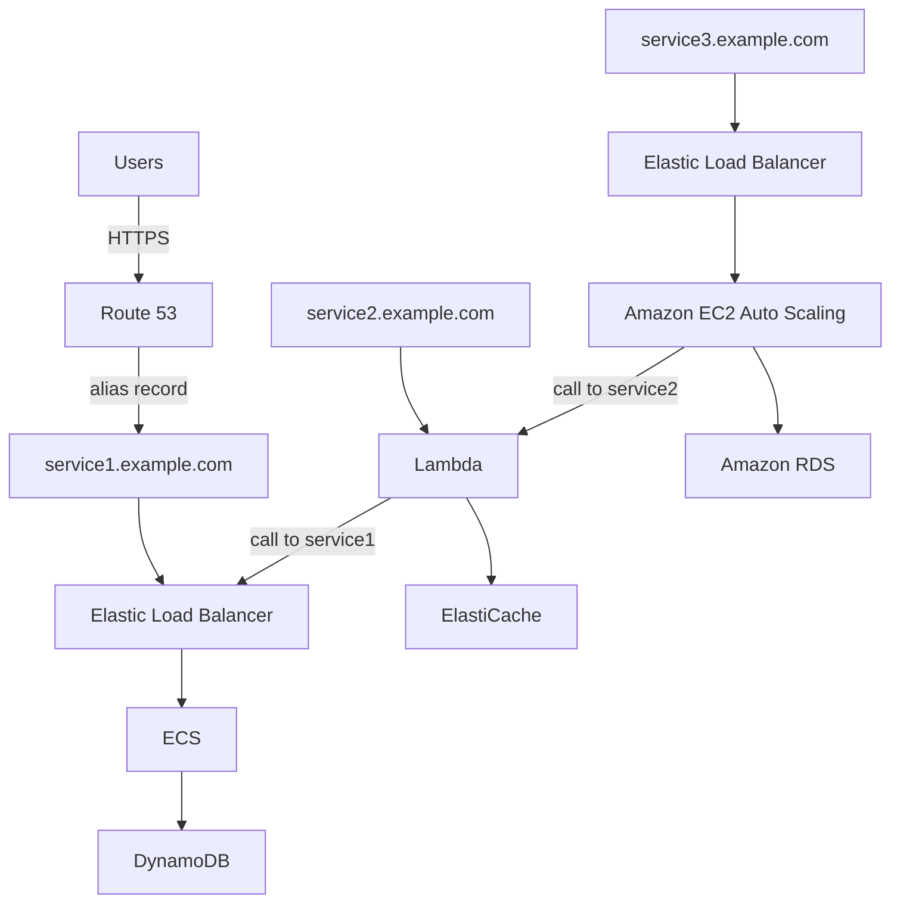

# 233. MicroServices Architecture

## 🎯 Giới thiệu
MicroServices Architecture là một kiểu thiết kế hệ thống, trong đó mỗi service có thể được xây dựng theo cách riêng, không nhất thiết phải giống nhau về kiến trúc.

Mục tiêu chính trong transcript:
- Tách hệ thống thành nhiều micro service
- Các service giao tiếp với nhau qua `REST API`
- Mỗi service có thể:
  - scale độc lập
  - có repository riêng
  - có vòng đời phát triển gọn hơn

## 1. Kiến trúc nhiều micro service
Trong ví dụ của bài giảng, có 3 service với cách triển khai khác nhau:

- `service1.example.com`
  - User truy cập qua `HTTPS`
  - `DNS Query` tới `Route 53`
  - nhận `alias record`
  - đi qua `Elastic Load Balancer`
  - vào `ECS`
  - lưu dữ liệu ở `DynamoDB`

- `service2.example.com`
  - dùng kiến trúc serverless
  - `Lambda` kết hợp với `ElastiCache`
  - `Lambda` có thể gọi sang `service1` để lấy dữ liệu trước khi phản hồi

- `service3.example.com`
  - dùng `Elastic Load Balancer`
  - chạy trên `Amazon EC2 Auto Scaling`
  - dùng `Amazon RDS`
  - `EC2 instance` có thể gọi `service2` trước khi ra quyết định

## 2. Mô hình giao tiếp giữa các service
Transcript nhấn mạnh 2 pattern chính:

### 🔹 Synchronous pattern
- Gọi trực tiếp từ service này sang service khác
- Thường dùng:
  - `API Gateway`
  - `Load Balancer`
- Phù hợp cho các `HTTPS calls` giữa micro service

### 🔹 Asynchronous pattern
- Không chờ phản hồi ngay
- Dùng các thành phần như:
  - `SQS`
  - `Kinesis`
  - `SNS`
  - `Lambda triggers`
  - `S3`
- Ý tưởng là:
  - gửi message
  - không cần biết ngay khi nào có response
  - một xử lý khác sẽ diễn ra sau đó

## 3. Lợi ích và thách thức
### ✅ Lợi ích
- Mỗi service có thể scale độc lập
- Phát triển từng service nhẹ hơn
- Có thể chọn kiến trúc phù hợp cho từng service
- `serverless patterns` giúp:
  - scale tự động
  - trả phí theo usage
  - không cần lo nhiều về server utilization
- `API Gateway` giúp:
  - clone APIs
  - reproduce environments dễ hơn
  - generate client SDK qua `Swagger integration`

### ⚠️ Thách thức
- Tốn overhead khi tạo mới từng micro service
- Có thể gặp vấn đề tối ưu `server density` hoặc `utilization`
- Khó quản lý nhiều version của cùng một service
- Có thể làm tăng yêu cầu `client-side code` để tích hợp với nhiều service riêng biệt

## 📊 Bảng tóm tắt
| Tiêu chí | Mô tả |
|----------|------|
| Mục tiêu | Chia hệ thống thành nhiều micro service độc lập |
| Giao tiếp | Chủ yếu qua `REST API` / `HTTPS` |
| Scaling | Mỗi service scale độc lập |
| Ví dụ service 1 | `ELB` + `ECS` + `DynamoDB` |
| Ví dụ service 2 | `Lambda` + `ElastiCache` |
| Ví dụ service 3 | `ELB` + `EC2 Auto Scaling` + `RDS` |
| Pattern đồng bộ | `API Gateway`, `Load Balancer` |
| Pattern bất đồng bộ | `SQS`, `Kinesis`, `SNS`, `Lambda triggers`, `S3` |
| Lợi ích của serverless | Auto scaling, pay-per-use, giảm lo về utilization |
| Thách thức | Overhead, versioning, client-side complexity |

## 💡 Mẹo ghi nhớ cho kỳ thi AWS
- Nhớ rằng `MicroServices Architecture` là về **thiết kế**, không bắt buộc mọi service phải giống nhau.
- `Synchronous` = gọi trực tiếp, thường qua `API Gateway` hoặc `Load Balancer`.
- `Asynchronous` = gửi message rồi xử lý sau, nhớ các dịch vụ: `SQS`, `Kinesis`, `SNS`, `Lambda triggers`, `S3`.
- Khi thấy `serverless`, hãy liên hệ ngay đến:
  - auto scaling
  - pay for usage
  - giảm vấn đề server utilization
- `Route 53` có thể trả về `alias record` để người dùng truy cập vào service qua DNS name / URL.

## ✅ Kết luận
MicroServices Architecture cho phép xây dựng từng service theo cách riêng, giao tiếp qua `REST API`, và scale độc lập. Transcript cũng nhấn mạnh rằng mô hình này có cả lợi ích lẫn thách thức, và `serverless patterns` như `API Gateway` và `Lambda` có thể giúp giảm bớt một số vấn đề vận hành.
