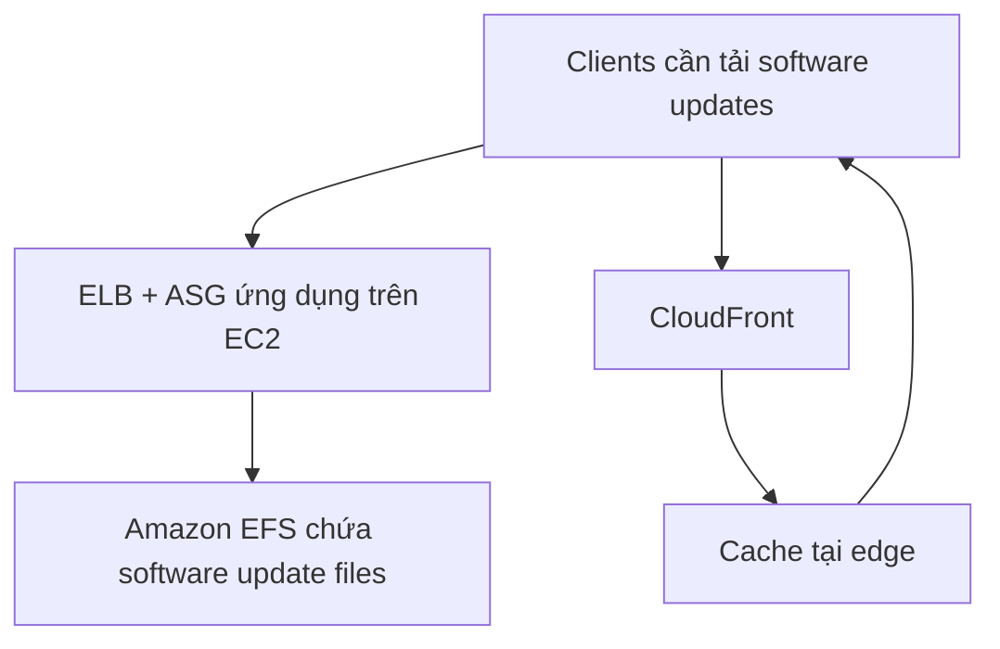

# 234. Software updates distribution

## 🎯 Giới thiệu
Bài này nói về bài toán **software updates distribution** cho một ứng dụng chạy trên **EC2**. Khi có **software update** mới, rất nhiều client cùng tải bản vá, làm tăng mạnh traffic, tiêu tốn **network cost**, **EC2 cost**, và **CPU utilization**.

Mục tiêu là:
- Không phải re-architect ứng dụng
- Tối ưu chi phí
- Giảm tải cho EC2 và hệ thống hiện tại

## 1. 🚨 Hiện trạng và vấn đề
Ứng dụng hiện tại có dạng **classic ELB + ASG** triển khai **multi-AZ**.

Các điểm chính:
- Các instance **M5** đang phân phối software updates
- File update được đặt trong **Amazon EFS**
- Khi có update mới, số lượng request tăng mạnh vì nhiều máy cùng tải patch
- Kết quả là:
  - Tăng tải mạng
  - Tăng chi phí
  - Tăng CPU usage trên EC2
  - ASG có thể phải scale nhiều hơn

### Mermaid: request path hiện tại và hướng tối ưu

## 2. ⚡ Giải pháp: đặt CloudFront phía trước
Cách xử lý rất đơn giản: **put CloudFront on top of it**.

Ý tưởng chính:
- **CloudFront** cache các file software update ở **edge**
- Các file update này là **static**, không thay đổi thường xuyên
- Vì vậy, CloudFront có thể phục vụ phần lớn request mà không cần đẩy hết về EC2
- Kiến trúc hiện tại không cần thay đổi lớn

Kết quả:
- **ASG** sẽ không scale nhiều như trước
- **EC2** giảm tải đáng kể
- Giảm chi phí cho:
  - **EC2 class**
  - **network class**
  - **EFS class**
- Cải thiện cả **availability**

## 3. 🧠 Ý nghĩa quan trọng cho AWS exam
Đây là ví dụ điển hình của việc dùng **CloudFront** để:
- Làm ứng dụng hiện có **scalable** hơn
- Làm hệ thống **cheaper**
- Đặc biệt hiệu quả khi nội dung là **mostly static content**
- Tận dụng **caching at the edge** thay vì để origin xử lý mọi request

Điểm mấu chốt:
- Không cần thay đổi lớn trong ứng dụng
- Chỉ cần thêm lớp caching hợp lý
- Đây thường là giải pháp “đơn giản nhưng hiệu quả”

## 📊 Bảng tóm tắt
| Tiêu chí | Mô tả |
|----------|------|
| Bài toán | Phân phối software updates khi có nhiều client cùng tải |
| Kiến trúc ban đầu | **ELB + ASG** trên **EC2**, file update nằm trong **Amazon EFS** |
| Vấn đề | Traffic tăng mạnh, tốn mạng, tăng CPU, tăng chi phí |
| Giải pháp | Đặt **CloudFront** phía trước để cache file ở edge |
| Loại nội dung phù hợp | **Static** software update files |
| Lợi ích | Giảm scale của **ASG**, giảm **EC2 cost**, giảm **network cost**, giảm **EFS cost**, tăng availability |

## 💡 Mẹo ghi nhớ cho kỳ thi AWS
- Thấy bài toán **nhiều người cùng tải file giống nhau** thì nghĩ ngay đến **CloudFront**
- Nếu nội dung là **static** và ít thay đổi, **cache at the edge** là lựa chọn mạnh
- Nếu muốn **không đổi architecture nhiều** nhưng vẫn giảm chi phí, CloudFront là đáp án rất hay
- Từ khóa cần nhớ: **CloudFront**, **static content**, **cache at the edge**, **EC2**, **ASG**, **EFS**

## ✅ Kết luận
Bài học chính là: với hệ thống phân phối **software updates** từ **EC2/EFS**, chỉ cần thêm **CloudFront** để cache file ở edge là có thể giảm tải đáng kể, giảm chi phí và tăng khả năng mở rộng mà không cần thiết kế lại ứng dụng.
