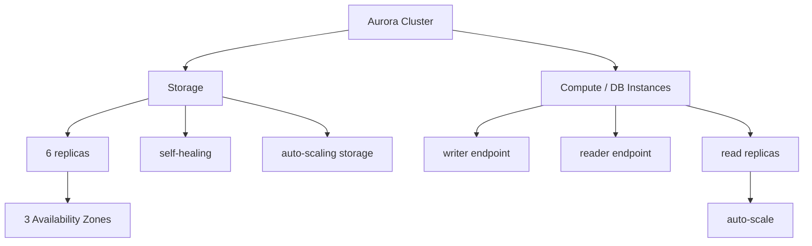

# 237. Aurora

## 🎯 Giới thiệu
Aurora là một database service **compatible API** cho 2 engine: **PostgreSQL** và **MySQL**.

Điểm quan trọng nhất của Aurora là:
- **Storage** và **compute** được tách rời
- Aurora có tính **high availability** cao nhờ storage mặc định được sao chép
- Có nhiều tính năng bổ sung rất quan trọng cho kỳ thi AWS

## 1. Kiến trúc cốt lõi của Aurora
Aurora hoạt động theo mô hình **cluster** với 2 phần chính:

- **Storage**
  - Dữ liệu được lưu thành **6 replicas**
  - Phân bố trên **3 Availability Zones** theo mặc định
  - Bạn **không thể thay đổi** cấu hình này
  - Có cơ chế **self-healing** nếu storage gặp vấn đề
  - Có **auto-scaling** storage out of the box

- **Compute**
  - Là các **database instances**
  - Các instance này được tổ chức theo **cluster**
  - Có thể nằm trên nhiều **Availability Zones**
  - Nếu có **read replicas**, có thể **auto-scale** để tăng capacity khi load tăng

### Mermaid: Aurora architecture

## 2. Endpoint và khả năng vận hành
Vì Aurora có một cluster các database instances, nên cần **custom endpoints** để biết nơi nào dùng để:
- **write**: dùng **writer endpoint**
- **read**: dùng **reader endpoint**

Aurora cũng có:
- Cùng các tính năng **security**, **monitoring**, và **maintenance** như **RDS**
- Các tùy chọn **backup** và **restore** riêng, nhưng transcript chỉ nhắc là nên xem lại bài giảng trước nếu cần

## 3. Các tính năng đặc biệt của Aurora
### Aurora Serverless
- Dùng cho workload **unpredictable** và **intermittent**
- Không cần làm **capacity planning**
- Rất hữu ích trong trường hợp tải không ổn định

### Aurora Global
- Dùng cho **global database**
- Có thể có tới **16 database read instances** ở mỗi region được replicate
- **Storage replication** giữa các region thường xảy ra trong **less than one second**
- Nếu primary region gặp sự cố, có thể **promote** secondary region thành primary mới

### Aurora Machine Learning
- Cho phép làm machine learning trên Aurora
- Sử dụng **SageMaker** và **Comprehend**

### Aurora Database Cloning
- Dùng để tạo **testing database** hoặc **staging database** từ production database
- Tạo cluster mới từ cluster hiện có
- **Nhanh hơn** so với dùng **snapshot** rồi **restore**

## 📊 Bảng tóm tắt
| Tiêu chí | Mô tả |
|----------|------|
| Engine hỗ trợ | **PostgreSQL**, **MySQL** |
| Kiến trúc | **Storage** và **compute** tách rời |
| Storage mặc định | **6 replicas** trên **3 AZ** |
| Tính sẵn sàng | **Highly available**, có **self-healing** |
| Mở rộng | **Auto-scaling** storage và **read replicas** |
| Endpoint | **writer endpoint**, **reader endpoint** |
| Tính năng đặc biệt | **Aurora Serverless**, **Aurora Global**, **Aurora Machine Learning**, **Database Cloning** |
| Mức độ quản trị | Ít maintenance hơn, linh hoạt hơn, hiệu năng cao hơn RDS |

## 💡 Mẹo ghi nhớ cho kỳ thi AWS
- Nhớ rằng **Aurora = compatible API cho PostgreSQL/MySQL**
- Điểm mấu chốt: **storage tách khỏi compute**
- Storage mặc định có **6 replicas / 3 AZ** và có **self-healing**
- **writer endpoint** dùng cho ghi, **reader endpoint** dùng cho đọc
- **Aurora Serverless** phù hợp với workload **không đoán trước**
- **Aurora Global** có thể replicate đa region và promote secondary region khi cần
- **Database Cloning** nhanh hơn **snapshot + restore**
- So với **RDS**, Aurora có **ít maintenance hơn**, **performance tốt hơn**, và **nhiều feature hơn**

## ✅ Kết luận
Aurora là lựa chọn mạnh khi bạn cần một database tương thích **PostgreSQL/MySQL**, có kiến trúc **tách storage và compute**, độ sẵn sàng cao, tự động mở rộng tốt, và nhiều tính năng nâng cao như **Serverless**, **Global Database**, và **Database Cloning**.
