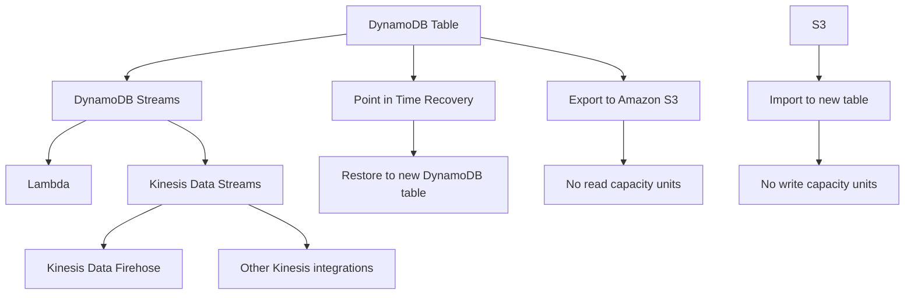

# 239. DynamoDB

## 🎯 Giới thiệu
- **Amazon DynamoDB** là một **proprietary technology from AWS**.
- Đây là một **managed serverless NoSQL database**.
- Điểm nổi bật là có **millisecond latency** ngay từ đầu.
- DynamoDB xuất hiện khá nhiều trong đề thi AWS, nên cần nhớ rõ các đặc điểm và use case chính.

## 1. Capacity Modes
- DynamoDB có **2 capacity modes**:
  - **Provisioned capacity** với **optional auto scaling**
    - Phù hợp với workload tăng/giảm **gradually** theo thời gian.
  - **On-demand capacity**
    - Không cần provision trước.
    - Tự scale tự động.
    - Phù hợp với workload **unpredictable** hoặc có **sudden steep spikes**.

## 2. Tính năng cốt lõi và hiệu năng
- DynamoDB có thể thay thế **ElasticCache** như một **key-value store**.
- Một use case điển hình là lưu **session data** cho website.
- Có thể kết hợp với **TTL** để tự động expire một row sau một khoảng thời gian.
- DynamoDB **highly available** và mặc định chạy **across multiple Availability Zones**.
- **Reads** và **writes** được **fully decoupled**.
- Hỗ trợ **transactions** trên DynamoDB tables.
- Có thể tạo **read cache** tương thích với DynamoDB là **DAX cluster (DynamoDB Accelerator)**.
  - Điểm cần nhớ: **microsecond read latency**.

## 3. Bảo mật, Event Processing và Replication
- Authentication và authorization được thực hiện qua **IAM**.
- DynamoDB hỗ trợ **event processing**:
  - Bật **DynamoDB Streams** để stream mọi thay đổi trong database.
  - Có thể tích hợp để **invoke Lambda** từ DynamoDB stream.
  - Nghĩa là **Lambda can be invoked for every single change** trong table.
- Ngoài DynamoDB Streams, có thể gửi dữ liệu sang **Kinesis Data Streams**.
  - Có thể dùng **Kinesis Data Firehose** hoặc các integration khác dựa trên Kinesis.
  - Kinesis Data Streams có thể giữ **longer term retention up to one year**.
- **Global Table** cho phép **active-active replication across multiple regions**.
  - Người dùng có thể **read and write from any region**.

## 4. Backup, Restore và S3 Integration
- Có **2 backup options**:
  - **Automated backup**
    - Cần bật **Point in Time Recovery**.
    - Có thể restore table sang **new DynamoDB table** tại bất kỳ thời điểm nào trong vòng **35 days**.
  - **On-demand backup**
    - Dùng cho backup dài hạn hơn.
    - Khi restore cũng tạo ra **new table**.
- Có thể **export DynamoDB table to Amazon S3**:
  - Không dùng **read capacity units**.
  - Thực hiện trong cửa sổ **Point in Time Recovery**.
  - Transcript nhấn mạnh mốc **35 days** với export to S3 feature.
- Có thể **import from S3**:
  - Không dùng **write capacity units**.
  - Import vào **new table**.

## 5. Use Cases Quan Trọng Cho Thi
- Khi cần một database có thể **rapidly evolve schema** và **flexible database schema** thì DynamoDB là lựa chọn rất tốt.
- Use case phù hợp:
  - Xây dựng **serverless application development**.
  - Lưu **small documents**, tối đa khoảng **hundreds of kilobytes**.
  - Dùng như một **distributed serverless cache**.

## Mermaid Flow

## 📊 Bảng tóm tắt
| Tiêu chí | Mô tả |
|----------|------|
| Loại dịch vụ | **Managed serverless NoSQL database** từ AWS |
| Độ trễ | **Millisecond latency** mặc định |
| Capacity modes | **Provisioned capacity** và **On-demand capacity** |
| Mở rộng | On-demand phù hợp workload **unpredictable** và spike lớn |
| Tính sẵn sàng | **Highly available**, đa **Availability Zones** |
| Hiệu năng đọc | **DAX cluster** cho **microsecond read latency** |
| Bảo mật | Authentication/authorization qua **IAM** |
| Event processing | **DynamoDB Streams**, tích hợp **Lambda** hoặc **Kinesis Data Streams** |
| Multi-region | **Global Table** cho **active-active replication** |
| Backup | **Point in Time Recovery** và **on-demand backups** |
| S3 integration | **Export to S3** và **import from S3** |
| Use case | **Serverless app**, session data, small documents, distributed cache |

## 💡 Mẹo ghi nhớ cho kỳ thi AWS
- Nhớ 2 mode chính: **Provisioned** cho workload tăng/giảm đều, **On-demand** cho workload khó đoán.
- **DAX = microsecond read latency**.
- **DynamoDB Streams + Lambda** = xử lý thay đổi theo từng record.
- **Global Table** = **active-active replication across multiple regions**.
- **Point in Time Recovery** = restore về bất kỳ thời điểm nào trong **35 days**.
- Khi đề bài nói đến **flexible schema**, **serverless**, hoặc **small documents**, hãy nghĩ ngay đến **DynamoDB**.
- Khi cần **session data** hoặc **distributed serverless cache**, DynamoDB là ứng viên mạnh.

## ✅ Kết luận
- DynamoDB là **serverless NoSQL** của AWS, mạnh về **low latency**, **scalability**, **high availability**, và **event-driven integration**.
- Các ý hay gặp trong thi gồm: **capacity modes**, **DAX**, **DynamoDB Streams**, **Global Table**, **backup/restore**, và **S3 import/export**.
- Nếu đề bài nhấn mạnh **unpredictable workload**, **flexible schema**, hoặc **serverless application**, DynamoDB thường là lựa chọn đúng.
