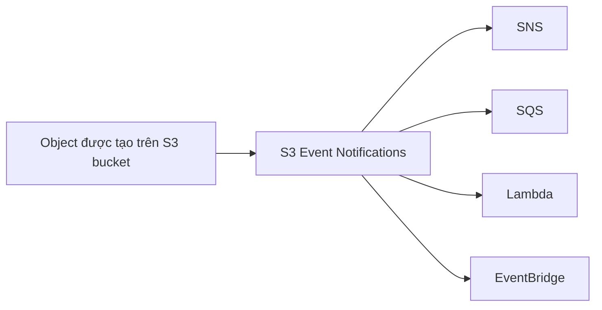

# 240. S3

## 🎯 Giới thiệu
Amazon S3 là một **key-value store cho objects**, phù hợp nhất khi cần lưu **big objects** hoặc **static files**.

- **Serverless** và có khả năng **infinite scaling**
- **Không lý tưởng** để lưu quá nhiều **small objects**
- **Maximum object size**: **50 terabytes**
- Hỗ trợ **versioning** để lưu nhiều phiên bản của object theo thời gian

## 1. Storage Classes và Lifecycle
S3 có nhiều **storage tiers**:

- **S3 Standard**
- **Infrequent Access**
- **Intelligent**
- **Glacier**

Khi muốn chuyển dữ liệu giữa các tầng lưu trữ, có thể dùng **lifecycle policies**.

### Các ý quan trọng cần nhớ
- **Versioning**
- **Replication**
- **MFA deletes**
- **Access logs**
- **Object lock**
- **Vault lock** cho **Glacier**

## 2. Security và Encryption
Về bảo mật, S3 có nhiều lớp kiểm soát:

- **IAM**
- **Bucket policies**
- **ACL**
- **Access points** cho Amazon S3
- **S3 Object Lambda** để chỉnh sửa object trước khi gửi cho application
- **CORS**

### Encryption
Các cơ chế mã hóa được nhắc đến:

- **SSE-S3**
- **SSE-KMS**: có thể bring your own **KMS key**
- **SSE-C**
- **Client-side encryption**
- **TLS** cho dữ liệu **in transit**

Ngoài ra, có thể đặt **default encryption scheme** cho S3 bucket.

## 3. Batch, Performance và Automation
### Batch operations
Nếu muốn thao tác trên nhiều file cùng lúc, dùng **S3 Batch**.

Use cases được nêu:
- Mã hóa các object chưa được mã hóa trong bucket hiện có
- Copy file từ bucket này sang bucket khác trước khi bật **S3 replication**

Để tạo danh sách file, có thể dùng **S3 Inventory**.

### Performance improvements
- **Multi-part upload**: upload file theo cách song song
- **S3 Transfer Acceleration**: truyền file S3 nhanh hơn giữa các region
- **S3 Select**: chỉ lấy phần dữ liệu cần thiết từ S3

### Event-driven automation
**S3 Event Notifications** có thể tích hợp với:

- **SNS**
- **SQS**
- **Lambda**
- **EventBridge**

## 📊 Bảng tóm tắt
| Tiêu chí | Mô tả |
|----------|------|
| Bản chất | **Key-value store** cho objects |
| Phù hợp | **Big objects**, **static files**, **website hosting** |
| Không phù hợp | Nhiều **small objects** |
| Tính năng lõi | **Versioning**, **Replication**, **MFA deletes**, **Access logs** |
| Bảo mật | **IAM**, **Bucket policies**, **ACL**, **Access points**, **S3 Object Lambda** |
| Mã hóa | **SSE-S3**, **SSE-KMS**, **SSE-C**, **TLS** |
| Tối ưu vận hành | **S3 Batch**, **S3 Inventory** |
| Tối ưu hiệu năng | **Multi-part upload**, **Transfer Acceleration**, **S3 Select** |
| Tự động hóa | **S3 Event Notifications** với **SNS/SQS/Lambda/EventBridge** |

## 💡 Mẹo ghi nhớ cho kỳ thi AWS
- Nhớ S3 là **object storage**, không phải database truyền thống.
- Khi cần lưu **file lớn**, **static content**, hoặc **website hosting** thì nghĩ đến S3.
- Khi đề bài nói **chuyển tầng lưu trữ theo thời gian**, hãy nghĩ ngay đến **lifecycle policies**.
- Khi cần **encrypt data at rest**, phân biệt rõ **SSE-S3** và **SSE-KMS**.
- Khi cần **xử lý nhiều object cùng lúc**, nhớ **S3 Batch** và **S3 Inventory**.
- Khi cần **phản ứng theo sự kiện tạo object**, nhớ **S3 Event Notifications** với **SNS/SQS/Lambda/EventBridge**.

## ✅ Kết luận
Amazon S3 là dịch vụ **serverless object storage** rất quan trọng trong AWS, nổi bật với **scaling lớn**, nhiều **storage tiers**, các cơ chế **security/encryption**, và khả năng **automation** qua event notifications. Đây là phần kiến thức rất dễ xuất hiện trong đề thi AWS, đặc biệt ở các câu hỏi về **versioning**, **lifecycle**, **encryption**, và **event-driven architecture**.
