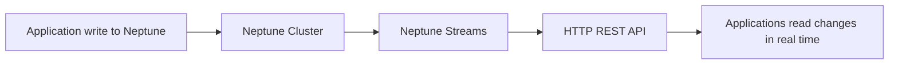

# 242. Neptune

## 🎯 Giới thiệu
Amazon Neptune là một **fully managed graph database** trên AWS, phù hợp cho các **graph dataset** có nhiều quan hệ kết nối với nhau.

- Dữ liệu dạng graph rất giống **social network**: user kết bạn, like, comment, share, post liên kết với comment, v.v.
- Neptune được tối ưu cho các truy vấn **phức tạp** trên dữ liệu graph.
- Có khả năng lưu **billions of relations** và truy vấn với **milliseconds latency**.
- Hỗ trợ **high availability** với replication across **3 AZ** và **up to 15 read replicas**.
- Rất phù hợp cho:
  - **Social networking**
  - **Fraud detection**
  - **Recommendation engine**
  - **Knowledge graph** như Wikipedia

## 1. Neptune là gì và dùng cho dữ liệu nào? 🧠
- Neptune là **graph database** được AWS quản lý hoàn toàn.
- Dùng khi dữ liệu có tính **interconnected** cao.
- Nếu đề bài nhắc đến **graph database**, trong ngữ cảnh thi AWS hãy nghĩ ngay đến **Neptune**.
- Ví dụ trong transcript:
  - User có friends
  - Post có comments
  - Comment có likes từ users
  - Các thực thể liên kết chặt chẽ tạo thành graph

## 2. Neptune Streams 🔄
Neptune có tính năng **Neptune Streams** để theo dõi thay đổi dữ liệu trong graph theo thời gian thực.

- Là một **real-time ordered sequence of data** cho mọi thay đổi trong Neptune database
- Khi application ghi dữ liệu vào Neptune:
  - thay đổi sẽ xuất hiện **immediately** trong Neptune Streams
- Đặc điểm:
  - **No duplicates**
  - **Strict ordering** của các thay đổi trong Neptune cluster
- Dữ liệu stream có thể truy cập qua **HTTP REST API**

### Mermaid: luồng thay đổi dữ liệu

## 3. Use cases và ý nghĩa cho kỳ thi 🎓
Neptune Streams có thể dùng để:

- Gửi **notifications** khi có thay đổi trong graph data
- Đồng bộ dữ liệu sang data store khác
- Replicate thay đổi sang:
  - **Amazon S3**
  - **OpenSearch**
  - **ElastiCache**
  - Hoặc các hệ thống khác
- Replicate dữ liệu giữa nhiều regions bằng cách đọc thay đổi từ stream và ghi vào target Neptune cluster

### So sánh nhanh
| Tiêu chí | Mô tả |
|----------|------|
| Loại database | **Fully managed graph database** |
| Dữ liệu phù hợp | Dữ liệu **highly connected** |
| Hiệu năng | Query graph phức tạp với **milliseconds latency** |
| HA | Replication across **3 AZ** |
| Mở rộng đọc | **Up to 15 read replicas** |
| Tính năng nổi bật | **Neptune Streams** |
| Truy cập stream | **HTTP REST API** |

## 📊 Bảng tóm tắt
| Tiêu chí | Mô tả |
|----------|------|
| Neptune | **Graph database** được AWS quản lý hoàn toàn |
| Use case chính | Social network, fraud detection, recommendation engine, knowledge graph |
| Điểm mạnh | Tối ưu cho dữ liệu có nhiều quan hệ phức tạp |
| Khả năng lưu trữ | Có thể lưu **billions of relations** |
| Độ trễ truy vấn | **Milliseconds latency** |
| Tính sẵn sàng | Replication across **3 AZ** |
| Mở rộng | **Up to 15 read replicas** |
| Neptune Streams | Theo dõi thay đổi dữ liệu theo thời gian thực, có thứ tự, không trùng lặp |

## 💡 Mẹo ghi nhớ cho kỳ thi AWS
- Thấy từ khóa **graph database** thì chọn **Neptune**.
- Thấy bài toán kiểu:
  - social network
  - recommendations
  - fraud detection
  - knowledge graph
  => nghĩ đến **Neptune**
- Nếu đề bài hỏi về **real-time changes** của Neptune, nhớ ngay **Neptune Streams**.
- Nếu cần đồng bộ dữ liệu sang hệ thống khác từ thay đổi graph, dùng **Neptune Streams + HTTP REST API**.

## ✅ Kết luận
Amazon Neptune là lựa chọn phù hợp khi cần xử lý **graph dataset** và các mối quan hệ phức tạp giữa dữ liệu. Với **Neptune Streams**, hệ thống có thể theo dõi thay đổi theo thời gian thực để phục vụ notification, synchronization và replication sang các dịch vụ khác.
