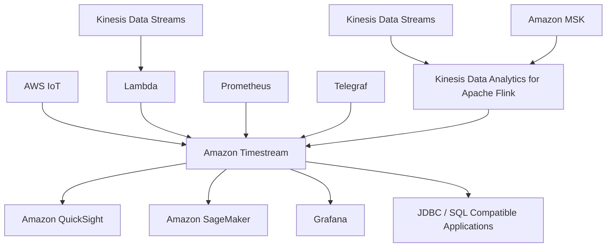

# 245. Timestream

## 🎯 Giới thiệu
Amazon Timestream là một **time series database** được AWS **fully managed**, **fast**, **scalable** và **serverless**.

- **Time series** là tập hợp các điểm dữ liệu có kèm **time**.
- Timestream cho phép **auto scale** lên/xuống theo nhu cầu.
- Có thể lưu trữ và phân tích **trillions of events per day**.
- Mục tiêu là làm việc với time series data **nhanh hơn** và **rẻ hơn** so với relational databases trong các bài toán cùng loại.
- Hỗ trợ:
  - **scheduled queries**
  - **multiple measures**
  - **full SQL compatibility**
- Dữ liệu:
  - **recent data** được giữ trong **memory**
  - **historical data** được lưu ở **cost-optimized storage tier**
- Có **time series analytics function** để phân tích dữ liệu và tìm pattern gần **real-time**
- Hỗ trợ **encryption in transit** và **encryption at rest**

## 1. Đặc điểm chính của Timestream
- Là database chuyên cho **time series data**
- **Serverless** nên không cần quản lý hạ tầng
- **Scalable** theo nhu cầu dữ liệu và truy vấn
- Tối ưu cho việc lưu và phân tích dữ liệu có yếu tố thời gian
- Có khả năng xử lý khối lượng sự kiện rất lớn mỗi ngày

## 2. Use cases
Timestream phù hợp cho các bài toán:
- **IoT application**
- **Operational applications**
- **Real-time analytics**
- Bất kỳ hệ thống nào làm việc với **time series database**

## 3. Kiến trúc và luồng dữ liệu

- Dữ liệu có thể đi vào Timestream từ:
  - **AWS IoT**
  - **Kinesis Data Streams** qua **Lambda**
  - **Prometheus**
  - **Telegraf**
  - **Kinesis Data Streams** qua **Kinesis Data Analytics for Apache Flink**
  - **Amazon MSK** qua cùng luồng xử lý
- Timestream có thể được kết nối bởi:
  - **Amazon QuickSight** để làm dashboard
  - **Amazon SageMaker** để machine learning
  - **Grafana**
  - các ứng dụng tương thích **JDBC** và **SQL**

## 📊 Bảng tóm tắt
| Tiêu chí | Mô tả |
|----------|------|
| Loại database | **Time series database** |
| Quản lý | **Fully managed**, **serverless** |
| Mở rộng | **Auto scale** lên/xuống theo nhu cầu |
| Hiệu năng | Nhanh, tối ưu cho time series data |
| Lưu trữ dữ liệu | **Recent data** trong memory, **historical data** trong cost-optimized storage tier |
| Truy vấn | **Scheduled queries**, **full SQL compatibility**, **multiple measures** |
| Phân tích | Có **time series analytics function** gần real-time |
| Bảo mật | **Encryption in transit** và **at rest** |
| Use cases | **IoT**, **operational applications**, **real-time analytics** |
| Kết nối đầu ra | **QuickSight**, **SageMaker**, **Grafana**, app qua **JDBC/SQL** |

## 💡 Mẹo ghi nhớ cho kỳ thi AWS
- Nhớ 3 ý khóa: **time series database**, **serverless**, **scalable**.
- Khi thấy bài toán có dữ liệu theo thời gian như **IoT** hoặc **real-time analytics**, nghĩ ngay đến **Amazon Timestream**.
- Ghi nhớ cách lưu dữ liệu:
  - **recent data** = memory
  - **historical data** = cost-optimized storage tier
- Timestream không chỉ để lưu mà còn để **analyze** dữ liệu time series.
- Nếu đề bài nhắc đến **JDBC** hoặc **SQL compatibility**, đó là dấu hiệu Timestream có thể được dùng bởi nhiều ứng dụng khác nhau.

## ✅ Kết luận
Amazon Timestream là lựa chọn của AWS cho **time series data** khi cần một giải pháp **fully managed**, **serverless**, **scalable** và có khả năng **SQL query**. Đây là dịch vụ phù hợp cho các hệ thống **IoT**, **operational workloads** và **real-time analytics**, đồng thời hỗ trợ nhiều nguồn dữ liệu đầu vào và công cụ phân tích đầu ra.
