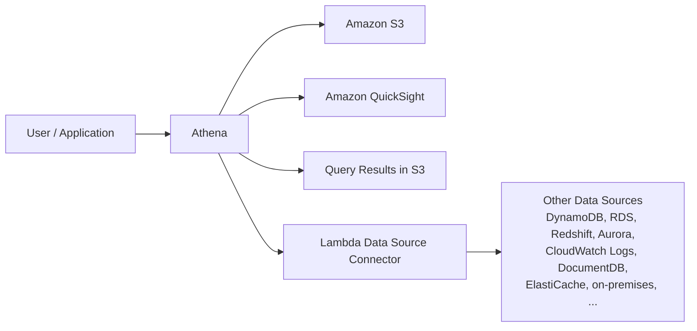

# 246. Athena

## 🎯 Giới thiệu
Amazon Athena là một **serverless query service** dùng để phân tích dữ liệu lưu trực tiếp trong **Amazon S3** bằng **standard SQL**.

- Athena dùng **Presto engine** ở phía sau
- Không cần move data ra khỏi S3
- Không cần provision database
- Thường dùng để:
  - **ad hoc queries**
  - **business intelligence**
  - **analytics**
  - **reporting**
  - phân tích log từ AWS services như **VPC Flow Logs**, **Load Balancer logs**, **CloudTrail**

## 1. Cách Athena hoạt động
- Dữ liệu được load vào **S3 bucket**
- Athena dùng **SQL** để query trực tiếp trên file trong S3
- Dữ liệu không bị di chuyển khỏi S3
- Athena hỗ trợ nhiều định dạng:
  - **CSV**
  - **JSON**
  - **ORC**
  - **Avro**
  - **Parquet**

## 2. Pricing và Use Case
- Giá tính theo **amount of data scanned per terabyte**
- Vì vậy, càng scan ít data thì càng tiết kiệm chi phí
- Athena hay đi cùng **Amazon QuickSight** để tạo:
  - reports
  - dashboards
- Exam tip:
  - Khi cần phân tích dữ liệu trong **Amazon S3** bằng **serverless SQL engine** thì nghĩ ngay đến **Athena**

## 3. Tối ưu hiệu năng Athena
### 3.1 Dùng định dạng cột
- Nên dùng **columnar data type** để chỉ scan các cột cần thiết
- Format khuyến nghị:
  - **Apache Parquet**
  - **ORC**
- Có thể dùng **Glue** để chuyển dữ liệu, ví dụ từ **CSV** sang **Parquet** bằng ETL job

### 3.2 Compression
- Nén dữ liệu để giảm lượng dữ liệu cần truy xuất
- Mục tiêu là scan ít hơn và truy xuất nhanh hơn

### 3.3 Partitioning
- Chia dữ liệu theo folder path trong S3
- Mỗi phần của path đại diện cho một partition, ví dụ:
  - `year=1991`
  - `month=1`
  - `day=1`
- Khi query theo filter phù hợp, Athena chỉ scan đúng partition cần thiết

### 3.4 Dùng file lớn hơn
- Nên tránh quá nhiều file nhỏ trong S3
- File lớn hơn, ví dụ từ **128 MB trở lên**, thường scan và retrieve hiệu quả hơn

### 3.5 Federated Query
- Athena không chỉ query S3 mà còn query được nhiều nguồn khác thông qua **Data Source Connector**
- Connector này là một **Lambda function**
- Có thể query:
  - **DynamoDB**
  - **RDS**
  - **CloudWatch Logs**
  - **Redshift**
  - **Aurora**
  - **SQL Server**
  - **MySQL**
  - **HBase trên EMR**
  - **on-premises database**
  - và các custom data sources khác
- Kết quả query có thể lưu về **Amazon S3** để phân tích tiếp

## 📊 Bảng tóm tắt
| Tiêu chí | Mô tả |
|----------|------|
| Bản chất | **Serverless query service** cho dữ liệu trong **Amazon S3** |
| Query language | **Standard SQL** |
| Engine | **Presto engine** |
| Dữ liệu hỗ trợ | **CSV, JSON, ORC, Avro, Parquet** |
| Pricing | Tính theo **data scanned per terabyte** |
| Use case | **Ad hoc queries, BI, analytics, reporting, logs analysis** |
| Tối ưu hiệu năng | **Parquet/ORC, compression, partitioning, large files** |
| Mở rộng nguồn dữ liệu | **Federated Query** qua **Lambda Data Source Connector** |

## 💡 Mẹo ghi nhớ cho kỳ thi AWS
- **Athena = S3 + Serverless SQL**
- Khi đề bài nói:
  - phân tích dữ liệu ngay trong **S3**
  - không muốn quản lý server
  - query bằng SQL
  - trả tiền theo lượng data scan  
  thì chọn **Athena**
- Nếu cần tối ưu:
  - nhớ **Parquet / ORC**
  - nhớ **partitioning**
  - nhớ **larger files**
- Nếu hỏi về query ngoài S3:
  - nhớ **Federated Query** + **Lambda Data Source Connector**

## ✅ Kết luận
Amazon Athena là dịch vụ **serverless** để query và phân tích dữ liệu trong **Amazon S3** bằng **SQL**. Điểm quan trọng nhất khi ôn thi là hiểu 3 ý: **không cần server**, **trả tiền theo data scanned**, và **tối ưu bằng Parquet/ORC, partitioning, compression, large files**.
