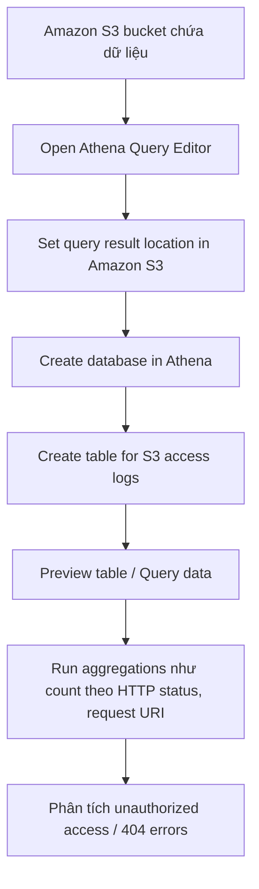

# 247. Athena Hands On

## 🎯 Giới thiệu
Athena là service dùng để query dữ liệu trực tiếp từ Amazon S3 bằng SQL, theo mô hình **serverless**. Trong bài thực hành này, người học:
- Thiết lập **query result location** trong S3
- Tạo **database** và **table** trong Athena để đại diện cho S3 access logs
- Chạy query để xem dữ liệu mẫu và làm phân tích thống kê
- Tận dụng Athena để làm việc với dữ liệu mà không cần tự dựng server

## 1. Thiết lập Athena để query dữ liệu từ S3
- Mở **Athena query editor** để bắt đầu làm việc.
- Trước khi chạy query đầu tiên, cần cấu hình **query result location** trong **Amazon S3**.
- Tạo một S3 bucket riêng để lưu kết quả query.
- Sau đó dán bucket path vào phần setting của Athena và lưu lại.
- Đây là nơi Athena sẽ ghi kết quả truy vấn.

## 2. Tạo database và table trong Athena
- Athena sẽ query dữ liệu trong một bucket S3 chứa **access logs**.
- Bước đầu tiên trong editor là tạo **database**:
  - Ví dụ: `S3 access logs DB`
- Sau khi tạo xong, database mới xuất hiện ở panel bên trái.
- Tiếp theo là chạy query để tạo **table** biểu diễn access logs.
- Query này lấy từ tài liệu **Amazon S3** và **Athena documentation**.
- Chỉ cần chỉnh lại:
  - **target bucket name**
  - **prefix** nếu dữ liệu nằm trong folder
- Nếu dữ liệu nằm ở top level của bucket thì không cần prefix.
- Khi chạy query thành công, table và các fields sẽ hiển thị trong Athena.

## 3. Query, preview và phân tích dữ liệu
- Có thể chọn **Preview table** để xem thử 10 dòng dữ liệu.
- Kết quả trả về gồm các thông tin như:
  - `bucket owner`
  - `bucket`
  - `request date time`
  - `IP`
  - `requester`
  - `request ID`
- Athena giúp xem dữ liệu dễ hơn nhiều so với mở từng file riêng lẻ.
- Có thể tạo query mới để làm **aggregations**.
- Ví dụ trong bài:
  - Đếm request theo **HTTP status**
  - Đếm theo **request URI operation**
- Query này scan toàn bộ dữ liệu và trả về số liệu thống kê.
- Có thể phát hiện:
  - `404 Not Found` nếu có lỗi bất thường
  - `403` để kiểm tra truy cập **unauthorized**
- Đây là cách dùng Athena để phân tích dữ liệu S3 rất nhanh và không cần server.

## 📊 Bảng tóm tắt
| Tiêu chí | Mô tả |
|----------|------|
| Service | **Athena** |
| Mục tiêu | Query dữ liệu từ **Amazon S3** bằng **SQL** |
| Mô hình | **Serverless** |
| Bước khởi tạo | Set **query result location** trong S3 |
| Cấu trúc dữ liệu | Tạo **database** rồi tạo **table** trong Athena |
| Trải nghiệm làm việc | **Preview table** và chạy query phân tích |
| Ví dụ phân tích | Count theo **HTTP status**, **request URI**, kiểm tra `403`, `404` |

## 💡 Mẹo ghi nhớ cho kỳ thi AWS
- Athena = query dữ liệu trong **S3** bằng **SQL**, không cần server.
- Muốn chạy query trước tiên phải có **query result location** trong **Amazon S3**.
- Cần phân biệt:
  - **Database**: nơi chứa logic tổ chức trong Athena
  - **Table**: đại diện cho dữ liệu thật trong S3
- Athena rất hợp cho:
  - xem log
  - thống kê
  - phân tích truy cập
- `403` thường gợi ý vấn đề **unauthorized access** trong ngữ cảnh bài học này.
- `404` là tín hiệu có thể cần điều tra khi phân tích logs.

## ✅ Kết luận
Athena cho phép query dữ liệu trong S3 một cách đơn giản, nhanh và **serverless**. Quy trình trong bài gồm: cấu hình kết quả query trong S3, tạo database, tạo table từ access logs, rồi chạy các truy vấn phân tích để lấy insight trực tiếp từ dữ liệu.
