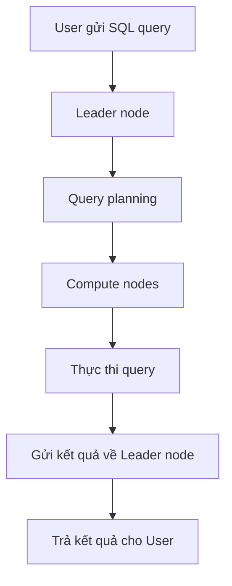
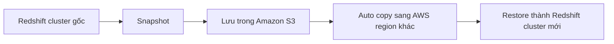
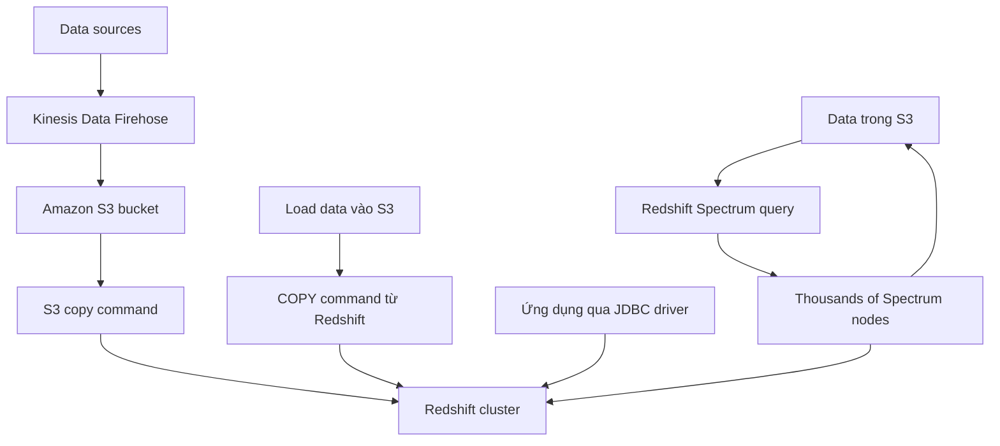

# 248. Redshift

## 🎯 Giới thiệu
- **Redshift** là database dựa trên **PostgreSQL**, nhưng không dùng cho **OLTP**.
- Nó được thiết kế cho **OLAP**, tức **online analytical processing**, phù hợp cho:
  - **analytics**
  - **data warehousing**
  - các phép tính và xử lý dữ liệu lớn
- Redshift có thể đạt hiệu năng cao hơn các data warehouse khác và mở rộng đến mức **petabytes** dữ liệu.
- Dữ liệu được lưu theo **column** thay vì **row**, giúp truy vấn phân tích nhanh hơn vì có thể xử lý theo từng cột.
- Redshift có **parallel query engine** để tăng tốc truy vấn.
- Có thể bắt đầu Redshift theo 2 mode:
  - **provisioned cluster**
  - **serverless cluster**
- Query được thực hiện qua **SQL interface** và tích hợp trực tiếp với BI tools như **Amazon Quicksight** và **Tableau**.

## 1. Kiến trúc Redshift Cluster 🏗️
- Redshift cluster có 2 thành phần chính:
  - **leader node**: query planning và results aggregation
  - **compute nodes**: thực thi query và gửi kết quả về leader node
- Khi gửi query:
  - leader node lên kế hoạch
  - query được phân phối xuống compute nodes
  - compute nodes xử lý dữ liệu
  - kết quả quay lại leader node rồi trả về cho người dùng
- Ở **provisioned mode**:
  - bạn chọn **instance types** trước
  - có thể **reserve instances** để tiết kiệm chi phí
- Ở **serverless mode**:
  - AWS quản lý cluster/node
  - bạn không phải tự vận hành cluster

## 2. Snapshots và Disaster Recovery 💾
- Redshift thường là **single AZ** cho đa số cluster, nhưng có một số cluster type hỗ trợ **multi AZ**.
- Nếu dùng **multi AZ** thì có lợi cho **disaster recovery**.
- Nếu là **single AZ**, cần dùng **snapshots** để DR.
- **Snapshot** là **point in time backup** của cluster.
- Snapshot được lưu nội bộ trong **Amazon S3**.
- Snapshot là **incremental only**, chỉ lưu phần thay đổi để tiết kiệm dung lượng.
- Có 2 cách tạo snapshot:
  - **manual**
  - **automated**
- Automated snapshot có thể chạy theo lịch:
  - **every eight hours**
  - hoặc **every five gigabytes**
- Có thể đặt **retention** cho automated snapshots.
- Manual snapshot được giữ cho đến khi bạn xóa thủ công.
- Redshift có thể tự động **copy snapshots** sang **another AWS region** để hỗ trợ DR.
- Từ snapshot đã copy sang region khác, bạn có thể restore thành một **new Redshift cluster**.

## 3. Ingest Data và Redshift Spectrum 🚚
- Có 3 cách ingest data vào Redshift trong transcript:

### a) Kinesis Data Firehose
- **Amazon Kinesis Data Firehose** nhận data từ nhiều nguồn.
- Firehose ghi dữ liệu vào **Amazon S3 bucket** trước.
- Sau đó Firehose tự động gọi **S3 copy command** để load dữ liệu vào Redshift.

### b) COPY command từ S3
- Bạn có thể:
  - load data vào **S3**
  - rồi dùng **copy command** từ Redshift để copy dữ liệu từ S3 vào cluster
- Cần dùng **IAM role** để truy cập S3.
- Có 2 kiểu network flow:
  - đi qua **internet**
  - hoặc private toàn bộ trong **VPC** nếu bật **enhanced VPC routing**
- Khi bật **enhanced VPC routing**, toàn bộ data flow sẽ đi qua VPC.

### c) JDBC driver
- Có thể insert data bằng **JDBC driver** vào Redshift.
- Phù hợp cho ứng dụng cần ghi dữ liệu vào cluster.
- Nên ghi theo **large batches** thay vì từng dòng một vì từng row sẽ rất kém hiệu quả.

### d) Redshift Spectrum
- Dùng khi dữ liệu nằm trong **Amazon S3** nhưng bạn muốn query bằng Redshift mà **không cần load vào Redshift trước**.
- Cần có **Redshift cluster** sẵn để bắt đầu query.
- Khi query chạy:
  - query được gửi đến **thousands of Redshift Spectrum nodes**
  - các nodes này đọc dữ liệu trực tiếp từ **S3**
  - thực hiện aggregations và trả kết quả về cluster
- Redshift Spectrum giúp tận dụng thêm processing power ngoài phần đã provision trong cluster.

## 📊 Bảng tóm tắt
| Tiêu chí | Mô tả |
|----------|------|
| Loại workload | **OLAP**, không phải **OLTP** |
| Mục đích | **analytics** và **data warehousing** |
| Storage model | Lưu dữ liệu theo **column** |
| Hiệu năng | Có **parallel query engine**, nhanh cho query phân tích |
| Deployment mode | **provisioned cluster** hoặc **serverless cluster** |
| Kiến trúc cluster | **leader node** + **compute nodes** |
| DR | **Snapshots**, hỗ trợ copy sang region khác |
| Ingest data | **Firehose**, **COPY from S3**, **JDBC driver** |
| Query data in S3 | **Redshift Spectrum** |

## 💡 Mẹo ghi nhớ cho kỳ thi AWS
- Nhớ câu: **Redshift = OLAP + data warehouse + columnar storage**.
- **Leader node** lo **planning**, **compute nodes** lo **execution**.
- **Snapshot** của Redshift là **incremental** và lưu trong **Amazon S3**.
- Nếu muốn private network flow khi load dữ liệu, hãy nhớ **enhanced VPC routing**.
- Nếu dữ liệu vẫn ở **S3** mà chưa muốn load vào cluster, nghĩ đến **Redshift Spectrum**.
- Nếu cần ingest từ app, dùng **JDBC**, nhưng nên ghi **large batches**.

## ✅ Kết luận
- Redshift là dịch vụ phù hợp cho **phân tích dữ liệu lớn** và **data warehousing**.
- Điểm quan trọng cần nhớ là kiến trúc **leader node / compute nodes**, cơ chế **snapshot + DR**, các cách **ingest data**, và khả năng query trực tiếp dữ liệu trong **S3** qua **Redshift Spectrum**.
