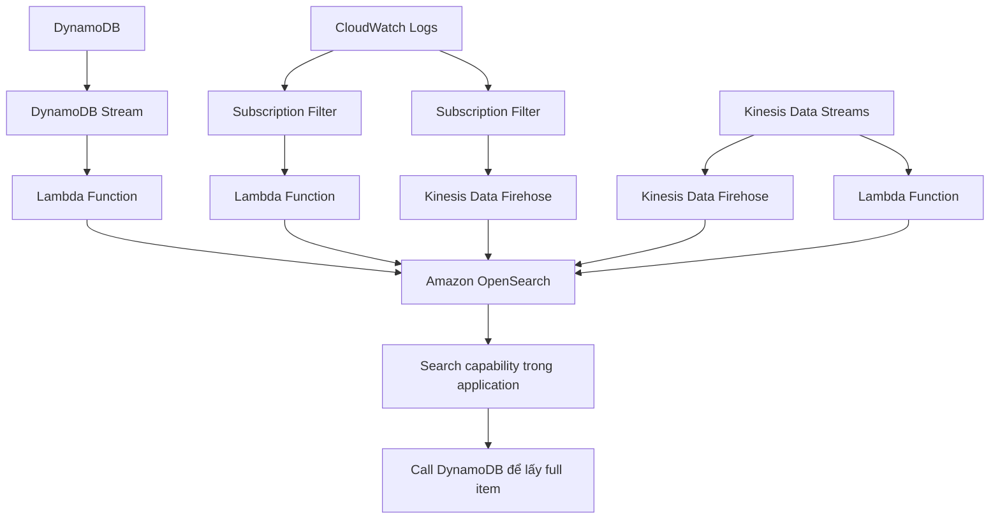

# 249. OpenSearch (ex. ElasticSearch)

## 🎯 Giới thiệu
- Amazon OpenSearch Service là successor của Amazon ElasticSearch.
- Việc đổi tên là do vấn đề licensing.
- OpenSearch thường được dùng để bổ sung cho một database khác, đặc biệt khi cần **search** mạnh hơn.

## 1. OpenSearch dùng để làm gì?
- Khác với DynamoDB chỉ query theo **primary key** hoặc **index**, OpenSearch có thể:
  - search trên nhiều field
  - hỗ trợ **partial matches**
- Vì vậy, OpenSearch rất phù hợp để:
  - cung cấp search cho application
  - thực hiện **analytic queries** trên dữ liệu

## 2. Cách triển khai và tính năng chính
- Có 2 cách provision OpenSearch Cluster:
  - **Managed cluster**: AWS provision các physical instances cho bạn
  - **Serverless**: AWS xử lý toàn bộ scaling và operations
- OpenSearch có query language riêng:
  - không native support **SQL**
  - có thể bật **SQL compatibility** qua plugin
- Nguồn ingest dữ liệu có thể đến từ:
  - **Kinesis Data Firehose**
  - **IoT**
  - **CloudWatch Logs**
  - custom-built application
- Bảo mật:
  - tích hợp với **Cognito**
  - tích hợp với **IAM**
  - có **at rest encryption**
  - có **in-flight encryption**
- Dùng **OpenSearch Dashboards** để tạo visualization trên dữ liệu OpenSearch

## 3. Luồng kiến trúc phổ biến 🔄

- Mẫu kiến trúc rất phổ biến:
  - **DynamoDB** giữ dữ liệu chính
  - **DynamoDB Stream** đẩy thay đổi sang **Lambda**
  - **Lambda** insert dữ liệu vào **Amazon OpenSearch** theo thời gian thực
  - Application dùng OpenSearch để tìm item theo tên hoặc partial search
  - Sau khi có item ID, application gọi lại **DynamoDB** để lấy full item
- Với **CloudWatch Logs**:
  - dùng **Subscription Filter** để đẩy logs real time sang **Lambda**, rồi vào OpenSearch
  - hoặc qua **Kinesis Data Firehose** để vào OpenSearch theo kiểu near real time
- Với **Kinesis**:
  - dùng **Kinesis Data Firehose** để đưa data vào OpenSearch
  - có thể dùng **Lambda Function** để transform dữ liệu trước khi gửi
  - hoặc dùng **Kinesis Data Streams + Lambda** để đọc real time và ghi trực tiếp vào OpenSearch

## 📊 Bảng tóm tắt
| Tiêu chí | Mô tả |
|----------|------|
| Mục đích chính | Search và analytics trên dữ liệu |
| So với DynamoDB | OpenSearch search nhiều field, hỗ trợ partial matches |
| Triển khai | Managed cluster hoặc Serverless |
| Query | Có query language riêng, hỗ trợ SQL qua plugin |
| Ingest dữ liệu | Kinesis Data Firehose, IoT, CloudWatch Logs, custom app |
| Bảo mật | Cognito, IAM, at rest encryption, in-flight encryption |
| Trực quan hóa | OpenSearch Dashboards |
| Use case phổ biến | Dùng OpenSearch làm search layer, database chính vẫn là DynamoDB |

## 💡 Mẹo ghi nhớ cho kỳ thi AWS
- **OpenSearch = search layer**: không phải database chính, mà thường đi kèm DynamoDB hoặc nguồn dữ liệu khác.
- Nhớ điểm khác với DynamoDB:
  - DynamoDB mạnh ở **primary key/index**
  - OpenSearch mạnh ở **search nhiều field** và **partial matches**
- Nhớ 2 kiểu provision:
  - **Managed cluster**
  - **Serverless**
- Nhớ các nguồn ingest hay gặp:
  - **DynamoDB Stream + Lambda**
  - **CloudWatch Logs + Subscription Filter**
  - **Kinesis Data Firehose**
- Nhớ **OpenSearch Dashboards** dùng cho visualization và analytics

## ✅ Kết luận
- OpenSearch là dịch vụ rất phù hợp khi cần **search**, **partial search** và **analytics**.
- Trong các kiến trúc phổ biến, OpenSearch thường đứng bên cạnh database chính như **DynamoDB** để cung cấp khả năng tìm kiếm nhanh và linh hoạt.
- Khi ôn thi AWS, hãy nhớ các luồng ingest dữ liệu, 2 chế độ triển khai, và các tính năng security/visualization của OpenSearch.
