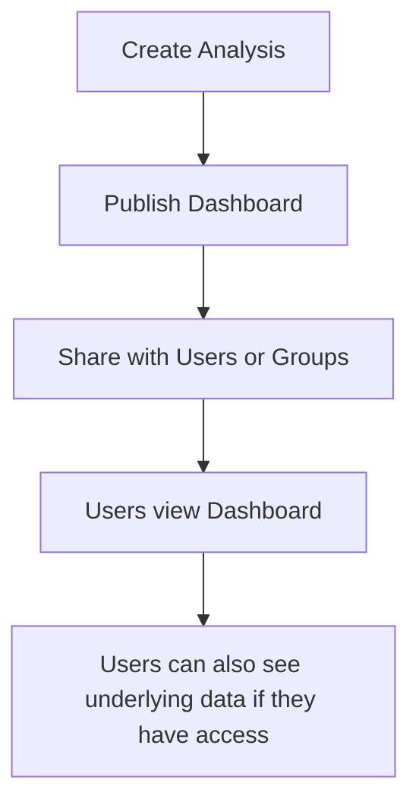

# 250. EMR

## 🎯 Giới thiệu
Amazon QuickSight là một **serverless, machine-powered business intelligence service** dùng để tạo **interactive dashboards** và trực quan hóa dữ liệu.

- Tập trung vào **business analytics**, **visualization**, và **ad-hoc analysis**
- Có thể **embed** vào website
- **Fast**, **automatically scalable**
- Tính phí theo **per-session pricing**
- Dùng để lấy **business insights** từ dữ liệu

## 1. Data Sources và SPICE Engine
QuickSight có thể kết nối với nhiều nguồn dữ liệu khác nhau.

- Nguồn AWS:
  - **RDS**
  - **Aurora**
  - **Redshift**
  - **Athena**
  - **S3**
  - **OpenSearch**
  - **Timestream**
- Nguồn bên thứ ba:
  - **Salesforce**
  - **Jira**
  - Database bên ngoài như **Teradata**
  - **On-premises database** qua **JDBC**
- Có thể import trực tiếp:
  - **Excel**
  - **CSV**
  - **JSON**
  - **TSV**
  - **EFS CLF format** cho log

### SPICE
- **SPICE engine** là một **in-memory computation engine**
- Chỉ hoạt động khi data được **import trực tiếp vào QuickSight**
- Nếu QuickSight chỉ **connected to another database** thì SPICE không dùng được
- Khi data đã import vào QuickSight, SPICE giúp xử lý **rất nhanh**

## 2. Analysis, Dashboard, Users và Groups
Trong QuickSight có hai khái niệm chính: **analysis** và **dashboard**.

- **Users**:
  - Có ở **Standard version**
  - Chỉ tồn tại **trong QuickSight service**
  - **Không tương đương với IAM users**
- **Groups**:
  - Chỉ có ở **Enterprise version**
  - Cũng chỉ tồn tại trong QuickSight
- **IAM users**:
  - Chỉ dùng cho **administration**

### Analysis vs Dashboard
- **Analysis**:
  - Là bản làm việc đầy đủ hơn
  - Có thể chứa **filters, parameters, controls, sorting options**
- **Dashboard**:
  - Là **read-only snapshot** của analysis
  - Giữ nguyên toàn bộ cấu hình từ analysis
  - Dùng để **share**

### Flow chia sẻ

- Muốn share dashboard hoặc analysis cho user/group thì cần **publish**
- Khi user có access tới dashboard, họ cũng có thể xem **underlying data**

## 3. Ý Nghĩa Khi Ôn Thi
QuickSight thường được nhắc trong ngữ cảnh:
- Tạo **dashboards**
- Kết nối với **Athena**
- Kết nối với **Redshift**
- Import dữ liệu vào QuickSight để dùng **SPICE**
- Chia sẻ bằng **users/groups** trong QuickSight, không phải IAM

## 📊 Bảng tóm tắt
| Tiêu chí | Mô tả |
|----------|------|
| Loại dịch vụ | **Serverless business intelligence service** |
| Mục đích | Tạo **interactive dashboards** và phân tích dữ liệu |
| Tính năng nổi bật | **Fast**, **automatically scalable**, **embed in website**, **per-session pricing** |
| Data sources | **RDS, Aurora, Redshift, Athena, S3, OpenSearch, Timestream**, và bên thứ ba |
| SPICE | **In-memory computation engine**, chỉ hoạt động khi import data trực tiếp vào QuickSight |
| Users/Groups | Tồn tại trong QuickSight, **không phải IAM users** |
| Dashboard | **Read-only snapshot** của analysis |
| Enterprise feature | **Column-level security (CLS)** |

## 💡 Mẹo ghi nhớ cho kỳ thi AWS
- Nhớ rằng **QuickSight = BI service** để làm **dashboard** và **visualization**
- **SPICE** chỉ dùng khi data được **import trực tiếp** vào QuickSight
- **Users và groups trong QuickSight không phải IAM users**
- **Dashboard** là bản **read-only snapshot** của **analysis**
- Hay gặp nhất trong đề thi: **QuickSight + Athena** hoặc **QuickSight + Redshift**
- **CLS (column-level security)** là tính năng của **Enterprise edition**

## ✅ Kết luận
Amazon QuickSight là dịch vụ **business intelligence** giúp tạo dashboard trực quan, kết nối nhiều nguồn dữ liệu, dùng **SPICE** để tăng tốc xử lý, và hỗ trợ chia sẻ qua **users/groups** trong QuickSight. Với AWS exam, cần nhớ rõ sự khác nhau giữa **analysis**, **dashboard**, **SPICE**, và vai trò của **IAM** so với QuickSight users.
