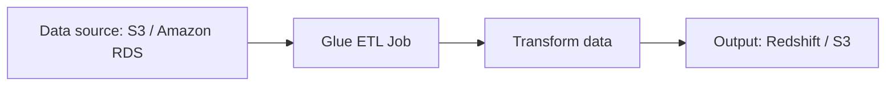
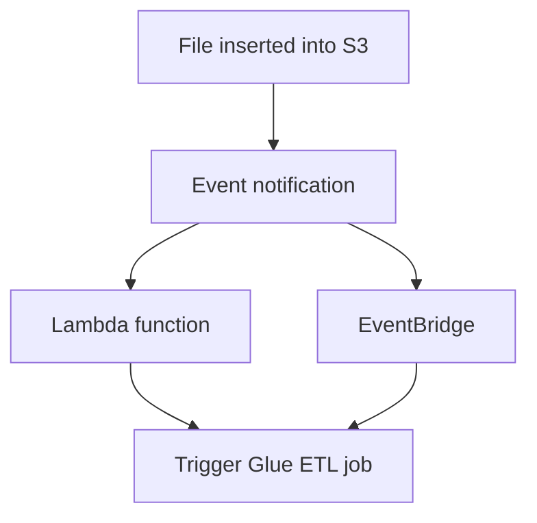

# 252. Glue

## 🎯 Giới thiệu
AWS Glue là một **managed ETL service** (extract, transform, load) và là **fully serverless**. Mục tiêu chính của Glue là **prepare** và **transform data** để phục vụ **analytics**.

- Bạn chỉ cần submit công việc cần làm, viết code cho ETL job, rồi chạy job.
- Glue có thể lấy dữ liệu từ **S3** hoặc **Amazon RDS**, xử lý, rồi đẩy sang đích như **Redshift data warehouse**.
- Glue cũng có thể dùng để chuyển đổi dữ liệu sang **Parquet format** để tối ưu cho phân tích, đặc biệt với **Amazon Athena**.

## 1. Glue ETL workflow 🔄
Glue thường xuất hiện trong các luồng xử lý dữ liệu kiểu:

- **Extract** dữ liệu từ nguồn như `S3`, `Amazon RDS`
- **Transform** dữ liệu theo nhu cầu:
  - filter data
  - add columns
  - chuyển đổi format
- **Load** dữ liệu đầu ra vào đích như `Redshift` hoặc `S3`

### Ví dụ quan trọng trong exam
- Dữ liệu trong `S3` ở dạng `CSV`
- Dùng `Glue ETL` để import `CSV`
- Chuyển sang `Parquet`
- Ghi ra `output S3 bucket`
- `Amazon Athena` sẽ analyze tốt hơn với `Parquet` vì đây là **columnar data format**

### Tự động hóa ETL
- Khi có file mới được insert vào `S3`
- Có thể gửi **event notification** tới `Lambda`
- `Lambda` sẽ trigger một `Glue ETL job`
- Hoặc có thể thay `Lambda` bằng `EventBridge`

## 2. Glue Data Catalog 📚
`Glue Data Catalog` dùng để **catalog data sets** và là một phần rất quan trọng của Glue.

- `Glue data crawlers` sẽ kết nối tới nhiều nguồn dữ liệu:
  - `Amazon S3`
  - `Amazon RDS`
  - `Amazon DynamoDB`
  - một `compatible JDBC database` on-premises
- Crawler sẽ thu thập và ghi metadata vào `Glue Data Catalog`, bao gồm:
  - databases
  - tables
  - columns
  - data types

### Vai trò của Data Catalog
- `Glue jobs` dùng metadata này để thực hiện ETL
- `Amazon Athena` cũng leverage `AWS Glue Data Catalog` để:
  - data discovery
  - schema discovery
- Ngoài ra, `Amazon Redshift Spectrum` và `Amazon EMR` cũng dùng `Glue Data Catalog`

### Ý nghĩa thi AWS
- `Glue Data Catalog` là thành phần **central** cho nhiều dịch vụ AWS khác.
- Nếu đề bài nói về **schema metadata**, **data discovery**, hoặc **shared catalog**, hãy nghĩ ngay tới `Glue Data Catalog`.

## 3. Các tính năng khác cần nhớ 🧠
### Glue Job Bookmarks
- Dùng để tránh **reprocessing all data** khi chạy ETL job mới
- Rất quan trọng vì giúp xử lý incremental thay vì làm lại toàn bộ

### Glue DataBrew
- Dùng để **clean** và **normalize data**
- Có `pre-built transformation`

### Glue Studio
- Là `GUI` để:
  - create
  - run
  - monitor
  ETL jobs trong Glue

### Glue Streaming ETL
- Dùng cho **streaming jobs** thay vì batch jobs
- Built on top of `Apache Spark Structured Streaming`
- Có thể đọc dữ liệu từ:
  - `Kinesis Data Streams`
  - `Kafka`
  - `MSK` (`managed Kafka on AWS`)

## 📊 Bảng tóm tắt
| Tiêu chí | Mô tả |
|----------|------|
| Loại dịch vụ | `managed ETL service`, `fully serverless` |
| Mục đích | Chuẩn bị và chuyển đổi dữ liệu cho analytics |
| Luồng chính | `Extract -> Transform -> Load` |
| Nguồn dữ liệu | `S3`, `Amazon RDS`, `Amazon DynamoDB`, `JDBC database` on-premises |
| Đích dữ liệu | `Redshift`, `S3` |
| Format quan trọng | `Parquet` tốt hơn cho `Athena` so với `CSV` |
| Tự động hóa | `S3 event notification` -> `Lambda` hoặc `EventBridge` -> `Glue ETL job` |
| Thành phần trung tâm | `Glue Data Catalog` |
| Tính năng thi exam | `Glue Job Bookmarks`, `Glue DataBrew`, `Glue Studio`, `Glue Streaming ETL` |

## 💡 Mẹo ghi nhớ cho kỳ thi AWS
- `Glue = ETL + serverless + analytics`
- Thấy `CSV -> Parquet` thì nghĩ ngay đến `Glue ETL` và `Athena`
- Thấy `schema discovery`, `metadata`, `tables`, `columns` thì nghĩ tới `Glue Data Catalog`
- Thấy tránh xử lý lại dữ liệu cũ thì nhớ `Glue Job Bookmarks`
- Thấy xử lý dữ liệu dạng stream thì nhớ `Glue Streaming ETL`
- Thấy giao diện kéo thả để tạo ETL job thì nhớ `Glue Studio`
- Thấy làm sạch và chuẩn hóa dữ liệu bằng thao tác dựng sẵn thì nhớ `Glue DataBrew`

## ✅ Kết luận
AWS Glue là dịch vụ `ETL` **serverless** dùng để xử lý và chuẩn bị dữ liệu cho analytics. Hai điểm thi cốt lõi nhất là `Glue ETL workflow` và `Glue Data Catalog`. Ngoài ra, cần nhớ các tính năng như `Job Bookmarks`, `DataBrew`, `Glue Studio`, và `Streaming ETL` vì chúng thường xuất hiện trong câu hỏi AWS certification.
