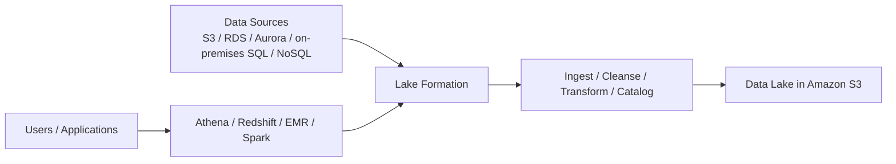
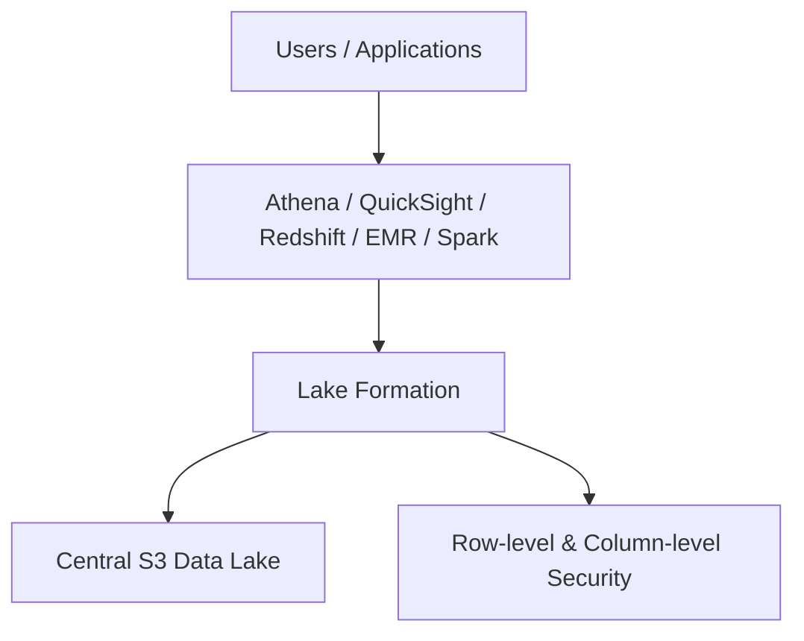

# 253. Lake Formation

## 🎯 Giới thiệu
AWS Lake Formation là dịch vụ giúp bạn tạo **data lake** trên AWS một cách **fully managed**.

- **Data lake** là nơi tập trung toàn bộ dữ liệu ở một chỗ để làm analytics.
- Lake Formation giúp dựng data lake nhanh hơn rất nhiều, từ có thể mất **months** xuống chỉ còn **a few days**.
- Dịch vụ này hỗ trợ:
  - **discover**
  - **cleanse**
  - **transform**
  - **ingest** dữ liệu vào data lake
- Nó tự động hóa nhiều bước thủ công phức tạp như:
  - collecting
  - cleansing
  - moving
  - cataloging
  - de-duplication
- Lake Formation dùng **machine learning transforms** cho một số tác vụ này.

## 1. Kiến trúc và vai trò của Lake Formation
Lake Formation là một **layer on top of AWS Glue**.

- Bạn không tương tác trực tiếp với Glue.
- Data lake được lưu trong **Amazon S3**.
- Nguồn dữ liệu có thể đến từ:
  - **Amazon S3**
  - **RDS**
  - **Aurora**
  - database on-premises
  - **SQL** hoặc **NoSQL**
- Lake Formation có sẵn:
  - **Source Crawlers**
  - **ETL**
  - **data preparation tools**
  - **data cataloging**
- Các thành phần này đến từ dịch vụ nền là **AWS Glue**.

## 2. Blueprints và nguồn dữ liệu
Lake Formation có các **blueprints** có sẵn.

- Blueprints giúp bạn migrate dữ liệu từ nhiều nguồn về data lake trung tâm.
- Một số blueprint được nhắc đến:
  - **Amazon S3**
  - **Amazon RDS**
  - relational databases on-premises
  - **NoSQL** databases
- Mục tiêu là gom dữ liệu **structured** và **unstructured** vào cùng một nơi.

## 3. Bảo mật và centralized permissions
Điểm quan trọng nhất của Lake Formation là **centralized permissions**.

- Bạn có thể quản lý security ở nhiều nơi như:
  - Athena
  - QuickSight
  - S3 bucket policies
  - RDS
  - Aurora
- Nhưng cách đó dễ trở nên rối và khó quản lý.
- Lake Formation giải quyết vấn đề này bằng cách quản lý access control tập trung.

Các điểm nổi bật:
- **Fine-grained access controls**
- **row-level security**
- **column-level security**
- Tất cả application kết nối qua Lake Formation sẽ chỉ thấy đúng dữ liệu được phép.

## 📊 Bảng tóm tắt
| Tiêu chí | Mô tả |
|----------|------|
| Mục đích | Tạo và quản lý **data lake** |
| Tính chất | **Fully managed** |
| Tốc độ triển khai | Từ **months** xuống còn **a few days** |
| Chức năng chính | **discover, cleanse, transform, ingest** dữ liệu |
| Nền tảng bên dưới | **AWS Glue** |
| Nơi lưu dữ liệu | **Amazon S3** |
| Nguồn dữ liệu | S3, RDS, Aurora, on-premises SQL/NoSQL |
| Điểm mạnh nổi bật | **Centralized permissions** |
| Mức kiểm soát | **row-level** và **column-level security** |
| Dịch vụ tích hợp | Athena, Redshift, EMR, Spark |

## 💡 Mẹo ghi nhớ cho kỳ thi AWS
- Nhớ câu: **Lake Formation = data lake + centralized security**.
- Nếu đề bài nhắc đến:
  - gom dữ liệu từ nhiều nguồn
  - quản lý quyền tập trung
  - row/column-level security  
  thì nghĩ ngay đến **Lake Formation**.
- Lake Formation là lớp trên **AWS Glue**, còn dữ liệu cuối cùng nằm trong **Amazon S3**.
- Khi security bị quản lý ở quá nhiều nơi và trở nên phức tạp, Lake Formation là giải pháp hợp lý.
- Dịch vụ này hay được gắn với các tool analytics như **Athena**, **QuickSight**, **Redshift**, **EMR**.

## ✅ Kết luận
AWS Lake Formation giúp bạn xây dựng **data lake** nhanh hơn, tự động hóa các bước ingest và chuẩn bị dữ liệu, đồng thời cung cấp **fine-grained access control** tập trung cho toàn bộ hệ thống. Với kỳ thi AWS, hãy nhớ 3 ý chính: **data lake**, **AWS Glue-based**, và **centralized permissions**.
