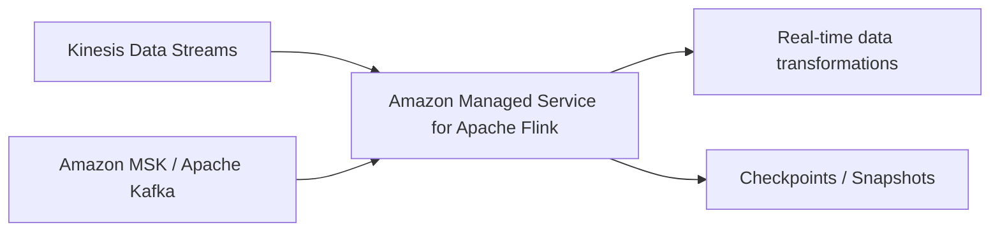

# 254. Amazon Managed Service for Apache Flink

## 🎯 Giới thiệu
- **Amazon Managed Service for Apache Flink** là dịch vụ AWS dùng để **xử lý data streams theo thời gian thực**.
- Dịch vụ này trước đây có tên là **Kinesis Data Analytics for Apache Flink**, sau đó được đổi tên thành **Managed Service for Apache Flink**.
- **Apache Flink** là một framework, thường dùng với các ngôn ngữ **Java**, **SQL**, hoặc **Scala**.

## 1. Apache Flink là gì?
- Là framework để **real-time stream processing**.
- Cho phép xử lý dữ liệu streaming liên tục.
- Hỗ trợ các kiểu biến đổi dữ liệu khác nhau nhờ các tính năng lập trình mà Apache Flink hỗ trợ.

## 2. Amazon Managed Service for Apache Flink hoạt động thế nào?
- AWS cho phép bạn chạy **Apache Flink application** trên **managed cluster**.
- AWS sẽ tự provision:
  - **compute resources**
  - **parallel computation**
  - **automatic scaling**
- AWS cũng quản lý **application backups** bằng:
  - **checkpoints**
  - **snapshots**

## 3. Điểm cần nhớ cho kỳ thi AWS
- Dịch vụ này **chỉ dùng để xử lý data streams**.
- Có thể đọc dữ liệu từ:
  - **Kinesis Data Streams**
  - **Amazon MSK** (Apache Kafka)
- **Không thể đọc từ Amazon Data Firehose**.
- Đây là một chi tiết dễ bị ra đề theo kiểu **exam trick**.

## 📊 Bảng tóm tắt
| Tiêu chí | Mô tả |
|----------|------|
| Tên dịch vụ | Amazon Managed Service for Apache Flink |
| Tên cũ | Kinesis Data Analytics for Apache Flink |
| Mục đích | Xử lý data streams thời gian thực |
| Ngôn ngữ thường dùng | Java, SQL, Scala |
| Nguồn dữ liệu hỗ trợ | Kinesis Data Streams, Amazon MSK |
| Nguồn dữ liệu không hỗ trợ | Amazon Data Firehose |
| Quản lý bởi AWS | Compute, parallel computation, automatic scaling, backups |
| Cơ chế backup | Checkpoints, snapshots |

## 💡 Mẹo ghi nhớ cho kỳ thi AWS
- Nhớ cụm: **“Flink = real-time stream processing”**.
- Nhớ **đọc được từ Kinesis Data Streams và MSK**, nhưng **không đọc từ Firehose**.
- Nếu đề bài nhắc đến **managed cluster**, **automatic scaling**, **checkpoints**, **snapshots** thì đang nói về **Amazon Managed Service for Apache Flink**.
- Ghi nhớ đây là dịch vụ để **transform data streams**, không phải dịch vụ lưu trữ dữ liệu.

## ✅ Kết luận
- **Amazon Managed Service for Apache Flink** là dịch vụ AWS cho phép chạy **Apache Flink** trên hạ tầng được AWS quản lý.
- Dịch vụ tập trung vào **real-time stream processing**, hỗ trợ **Kinesis Data Streams** và **Amazon MSK**.
- Điểm thi quan trọng nhất: **không đọc từ Amazon Data Firehose**.
