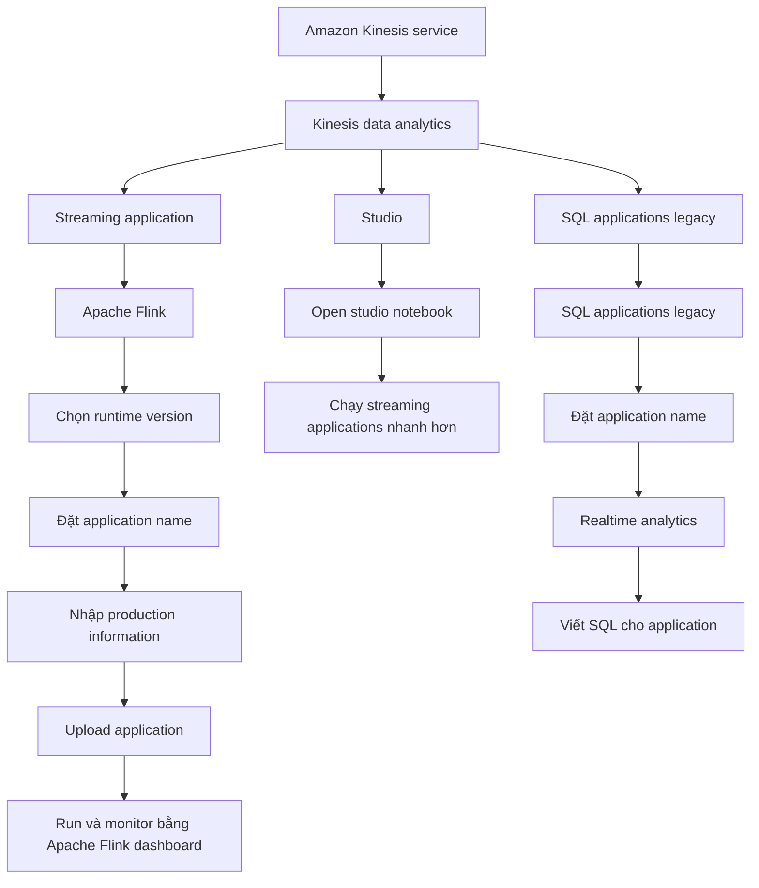

# 255. Amazon Managed Service for Apache Flink - Hands On

## 🎯 Giới thiệu
- Bài giảng này giới thiệu nhanh các tùy chọn của **Amazon Kinesis Data Analytics** trong console.
- Nội dung tập trung vào 2 hướng chính:
  - **Streaming application** dùng **Apache Flink**
  - **SQL applications** ở dạng **legacy**
- Mục tiêu là giúp quan sát cách tạo và quản lý ứng dụng trực tiếp trên AWS console, không đi sâu vào kỹ thuật chi tiết.

## 1. Các lựa chọn trong console
- Khi vào **Amazon Kinesis service**, bạn sẽ thấy các tùy chọn cho **Kinesis data analytics**.
- Có 2 cách chính:
  - Tạo **streaming application**
  - Vào **Studio**
- **Streaming application** thực chất là ứng dụng dựa trên **Apache Flink**.
- Khi tạo ứng dụng, bạn cần:
  - Chọn **runtime version** của **Apache Flink** được hỗ trợ
  - Đặt **application name**
  - Nhập thông tin triển khai sản xuất
- Sau đó, bạn sẽ cần **upload application** của mình lên AWS để chạy.

## 2. Streaming application với Apache Flink
- **Streaming application** là phần chính của **Kinesis Data Analytics for Apache Flink**.
- Sau khi tạo, bạn có thể:
  - **Run** ứng dụng
  - **Monitor** ứng dụng bằng **Apache Flink dashboard**
- Trong bài giảng, có lưu ý rằng:
  - Đây là một service để tạo **Apache Flink applications**
  - Vì ứng dụng Flink khá phức tạp nên trên console có thể chưa có ứng dụng mẫu sẵn để dùng ngay
- Nếu muốn làm phân tích nhanh hơn, có thể mở **Studio notebook** để bắt đầu chạy các streaming applications.

## 3. SQL applications legacy
- Phần **Amazon Kinesis data analytics for SQL applications** nằm ở phía bên trái trong console.
- Đây là mục **SQL applications legacy**.
- Bài giảng nhấn mạnh rằng hiện tại AWS **recommend** dùng:
  - **Kinesis data analytics studio**
  - **Apache Flink**
- Tuy nhiên, nếu cần, bạn vẫn có thể tạo **SQL application** theo kiểu legacy.
- Ví dụ được nêu:
  - Đọc từ **Kinesis Data Firehose**
  - Đặt **application name**
  - Vào **realtime analytics**
  - Viết câu lệnh **SQL** cho application

## 📊 Bảng tóm tắt
| Tiêu chí | Mô tả |
|----------|------|
| Streaming application | Ứng dụng dựa trên **Apache Flink** |
| Studio | Tạo notebook nhanh để chạy streaming applications |
| SQL applications legacy | Cách cũ để tạo application bằng **SQL** |
| Các bước tạo Flink app | Chọn **runtime version**, đặt **application name**, nhập **production information**, upload application |
| Quản lý | Có thể **run** và **monitor** bằng **Apache Flink dashboard** |
| Khuyến nghị | Dùng **Kinesis data analytics studio** và **Apache Flink** thay vì SQL legacy |

## 💡 Mẹo ghi nhớ cho kỳ thi AWS
- Nhớ rằng trong bài này, trọng tâm là **Amazon Managed Service for Apache Flink** trong console của **Kinesis**.
- Cần phân biệt:
  - **Streaming application** = hướng **Apache Flink**
  - **SQL applications legacy** = hướng cũ, nằm trong mục legacy
  - **Studio** = cách mở notebook nhanh để làm streaming
- Khi làm **Flink application**, các ý quan trọng là:
  - Chọn **runtime version**
  - Đặt **application name**
  - Cung cấp thông tin triển khai
  - Upload application
- Nếu thấy câu hỏi về nơi monitor, nhớ tới **Apache Flink dashboard**.
- Nếu thấy nhắc đến cách cũ, hãy liên tưởng đến **SQL applications legacy**.

## ✅ Kết luận
- Bài giảng chỉ nhằm giới thiệu nhanh các lựa chọn trong **Kinesis data analytics**.
- Có 3 hướng cần nhớ:
  - **Streaming application** cho **Apache Flink**
  - **Studio notebook**
  - **SQL applications legacy**
- Với mục đích ôn thi, chỉ cần nắm được luồng tổng quan và cách phân biệt các tùy chọn trên console.
