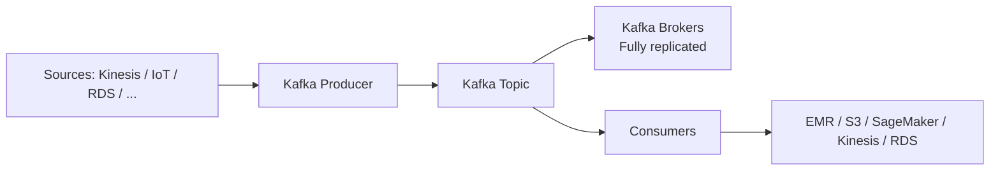

# 256. MSK - Managed Streaming for Apache Kafka

## 🎯 Giới thiệu
Amazon Managed Streaming for Apache Kafka, hay **Amazon MSK**, là dịch vụ giúp bạn chạy **Apache Kafka** trên AWS theo kiểu **fully-managed**.

- Kafka là một lựa chọn thay thế cho **Amazon Kinesis** trong bài toán **stream data**.
- MSK cho phép **create, update, delete** Kafka cluster một cách linh hoạt.
- AWS sẽ tự quản lý:
  - **Kafka broker nodes**
  - **Zookeeper broker nodes**
- Cluster được triển khai trong **VPC**, chạy trên nhiều **AZ**:
  - tối đa **3 AZ** để tăng **high availability**
- Có **automatic recovery** khi Kafka gặp các lỗi phổ biến.
- Dữ liệu được lưu trên **EBS volumes** và có thể giữ lâu tùy nhu cầu, miễn là bạn trả phí cho storage.

### MSK Serverless
Ngoài MSK thông thường, còn có **MSK Serverless**:

- Chạy Apache Kafka trên MSK nhưng **không cần provision servers**
- Không phải quản lý **capacity**
- MSK tự động **provision resources** và scale **compute** + **storage**

## 1. Apache Kafka hoạt động như thế nào? 📡
Apache Kafka dùng để **stream data** theo thời gian thực.

- Một **Kafka cluster** gồm nhiều **brokers**
- **Producers** gửi dữ liệu vào cluster
- Dữ liệu có thể đến từ nhiều nguồn như:
  - **Kinesis**
  - **IoT**
  - **RDS**
- Producer gửi dữ liệu vào **Kafka topic**
- Topic được **fully replicated** sang các brokers khác
- **Consumers** sẽ pull dữ liệu từ topic để xử lý

Consumers có thể gửi dữ liệu tới các đích như:

- **EMR**
- **S3**
- **SageMaker**
- **Kinesis**
- **RDS**

## 2. So sánh MSK và Kinesis Data Streams ⚖️
Kafka và Kinesis khá giống nhau vì cả hai đều dùng để **stream data**, nhưng transcript nêu một số điểm khác biệt quan trọng:

| Tiêu chí | Kinesis Data Streams | Amazon MSK |
|----------|----------------------|------------|
| Đơn vị mở rộng | **Shards** | **Kafka Topics with Partitions** |
| Scale up | **Shard Splitting** | Chỉ có thể **add partitions** |
| Scale down | **Merging** | **Không thể remove partitions** |
| In-flight encryption | Có | **Plain text** hoặc **TLS** |
| Data retention | Theo cấu hình Kinesis | Có thể giữ rất lâu, **hơn 1 year** nếu trả phí **EBS storage** |

### Điểm cần nhớ cho kỳ thi
- Trong MSK, để scale topic, bạn **chỉ thêm partitions**, không xóa được partitions.
- Với encryption, transcript chỉ nhấn mạnh:
  - Kinesis: **in-flight encryption**
  - MSK: **plain text** hoặc **TLS in-flight encryption**
  - Cả hai đều có **at-rest encryption**

## 3. Cách đọc dữ liệu từ MSK 🔄
Để produce vào MSK, bạn cần tạo **Kafka Producer**.

Để consume từ MSK, transcript nêu các cách sau:

- **Kinesis Data Analytics for Apache Flink**
  - Tạo một **Flink Application**
  - App đọc trực tiếp từ **MSK cluster**
- **Glue**
  - Dùng cho **streaming ETL jobs**
  - Transcript nói lúc đó được powered by **Apache Spark Streaming**
- **Lambda**
  - Dùng **Amazon MSK** như một **event source**
- **Custom Kafka consumer**
  - Tự viết consumer của bạn
  - Chạy trên:
    - **Amazon EC2**
    - **ECS cluster**
    - **EKS cluster**

## 📊 Bảng tóm tắt
| Tiêu chí | Mô tả |
|----------|------|
| Dịch vụ | **Amazon MSK** là **fully-managed Kafka cluster** trên AWS |
| So sánh | Kafka là lựa chọn thay thế cho **Amazon Kinesis** |
| Quản lý hạ tầng | AWS quản lý **Kafka broker nodes** và **Zookeeper broker nodes** |
| Triển khai | Chạy trong **VPC**, trên nhiều **AZ**, tối đa 3 AZ |
| Tính sẵn sàng | Có **automatic recovery** cho các lỗi Kafka phổ biến |
| Lưu trữ | Dữ liệu lưu trên **EBS volumes** |
| Bản Serverless | **MSK Serverless** tự provision và scale **compute** + **storage** |
| Scale topic | Chỉ **add partitions**, không remove partitions |
| Consume | Dùng **Flink**, **Glue**, **Lambda**, hoặc custom consumer trên **EC2/ECS/EKS** |

## 💡 Mẹo ghi nhớ cho kỳ thi AWS
- **MSK = Managed Kafka**: nhớ đây là Kafka chạy trên AWS theo kiểu **fully-managed**.
- **Kafka vs Kinesis**:
  - Kinesis dùng **Shards**
  - MSK dùng **Partitions**
- **Scale MSK topic**: chỉ **add partitions**, không có remove.
- **MSK Serverless**: không quản lý server hay capacity, AWS tự lo **resource provisioning**.
- **Consumer options** rất hay bị hỏi:
  - **Flink**
  - **Glue**
  - **Lambda**
  - custom consumer trên **EC2/ECS/EKS**
- **Data retention** có thể rất lâu vì dữ liệu nằm trên **EBS**.

## ✅ Kết luận
Amazon **MSK** là dịch vụ giúp bạn chạy **Apache Kafka** trên AWS một cách **fully-managed**, hỗ trợ triển khai trong **VPC**, nhiều **AZ**, lưu trữ trên **EBS**, và có cả **MSK Serverless**.

Điểm trọng tâm cần nhớ cho AWS exam là:
- MSK tương tự **Kinesis** ở mục đích streaming
- MSK dùng **Kafka Topics** và **Partitions**
- Scale topic chỉ bằng cách **thêm partitions**
- Có nhiều cách consume như **Flink**, **Glue**, **Lambda**, hoặc custom consumer
