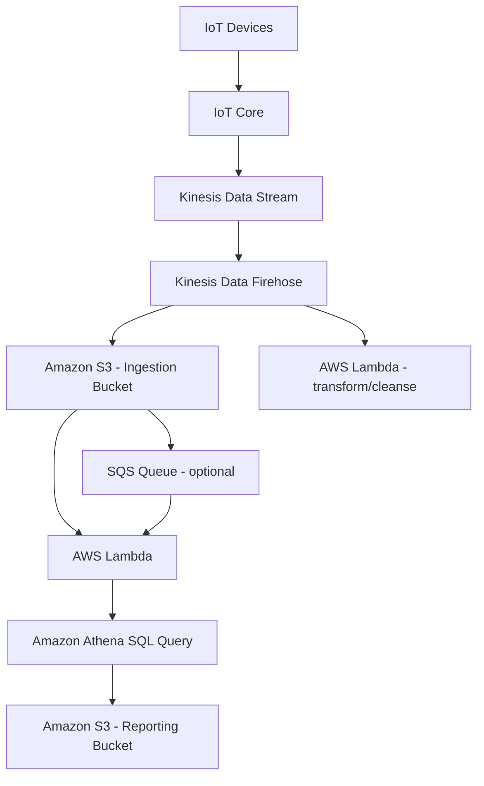

# 257. Big Data Ingestion Pipeline

## 🎯 Giới thiệu
- Mục tiêu của kiến trúc này là xây dựng một **Big Data Ingestion Pipeline**:
  - **fully serverless**
  - **fully managed by AWS**
  - thu thập dữ liệu **real-time**
  - **transform** dữ liệu
  - truy vấn dữ liệu đã xử lý bằng **SQL**
  - lưu report vào **S3**
  - nạp vào **data warehouse** để tạo dashboard
- Đây là bài toán tổng quát về:
  - ingestion
  - collection
  - transformations
  - querying
  - analysis

## 1. Luồng dữ liệu chính 📥➡️⚙️➡️📊
- **IoT devices** là nguồn phát sinh dữ liệu.
- **IoT Core** dùng để quản lý các IoT devices và nhận data real-time.
- IoT Core đẩy dữ liệu vào **Kinesis Data Stream** để xử lý dữ liệu lớn theo thời gian thực.
- **Kinesis Data Firehose** nhận dữ liệu từ Kinesis và deliver dữ liệu vào **Amazon S3** theo near real time.
- Tần suất thấp nhất được nhắc đến là **1 minute**.
- **AWS Lambda** có thể gắn trực tiếp với **Kinesis Data Firehose** để **cleanse** hoặc **transform** dữ liệu nhanh trước khi lưu.

## 2. Truy vấn và xử lý serverless 🔎
- Sau khi có **ingestion bucket** trong **S3**, pipeline có thể tiếp tục bằng:
  - **S3** trigger **SQS Queue** hoặc trực tiếp trigger **Lambda**
  - **Lambda** gọi **Amazon Athena** để chạy **SQL query**
- **Athena** sẽ đọc dữ liệu từ **ingestion bucket** và trả kết quả về **S3**.
- Toàn bộ bước query này là **serverless**.
- Kết quả truy vấn được lưu vào một **reporting bucket** khác trong **Amazon S3**.

## 3. Reporting, Analytics và Visualization 📈
- Dữ liệu trong **reporting bucket** là dữ liệu đã được:
  - cleanse
  - analyze
  - report
- Có 2 hướng sử dụng tiếp:
  - **QuickSight** để visualization trực tiếp
  - **Amazon Redshift** nếu muốn làm analytics sâu hơn
- **Redshift** cũng có thể là endpoint cho **QuickSight**.
- Pipeline này cho thấy cách kết hợp:
  - real-time ingestion
  - serverless transformation
  - serverless SQL with **Athena**
  - data warehousing với **Redshift**
  - dashboard với **QuickSight**

## 📊 Bảng tóm tắt
| Tiêu chí | Mô tả |
|----------|------|
| Nguồn dữ liệu | **IoT Devices** |
| Quản lý IoT | **IoT Core** |
| Ingestion real-time | **Kinesis Data Stream** |
| Delivery vào storage | **Kinesis Data Firehose** |
| Storage ban đầu | **Amazon S3** ingestion bucket |
| Transform/Cleanse | **AWS Lambda** gắn với Firehose |
| Trigger xử lý tiếp | **S3**, **SQS Queue**, hoặc **Lambda** |
| SQL serverless | **Amazon Athena** |
| Output báo cáo | **Amazon S3** reporting bucket |
| Visualization | **QuickSight** |
| Data warehouse | **Amazon Redshift** |

## 💡 Mẹo ghi nhớ cho kỳ thi AWS
- Nhớ chuỗi chính: **IoT Core -> Kinesis Data Stream -> Firehose -> S3**.
- **Firehose** dùng để deliver dữ liệu vào **S3** theo near real time, với mức thấp nhất là **1 minute**.
- **Lambda** có thể dùng để transform data trong pipeline.
- **Athena** là **serverless SQL service** và query dữ liệu từ **S3**.
- **S3** có thể trigger **SQS**, **SNS**, hoặc **Lambda**.
- Kết quả sau query có thể đi vào:
  - **S3** để report
  - **QuickSight** để visualize
  - **Redshift** để analytics sâu hơn

## ✅ Kết luận
- Đây là một kiến trúc **Big Data Ingestion Pipeline** ở mức high level, nhấn mạnh cách AWS kết hợp **IoT Core**, **Kinesis**, **Firehose**, **S3**, **Lambda**, **Athena**, **Redshift**, và **QuickSight** để xử lý dữ liệu lớn theo kiểu **serverless** và **real-time**.
