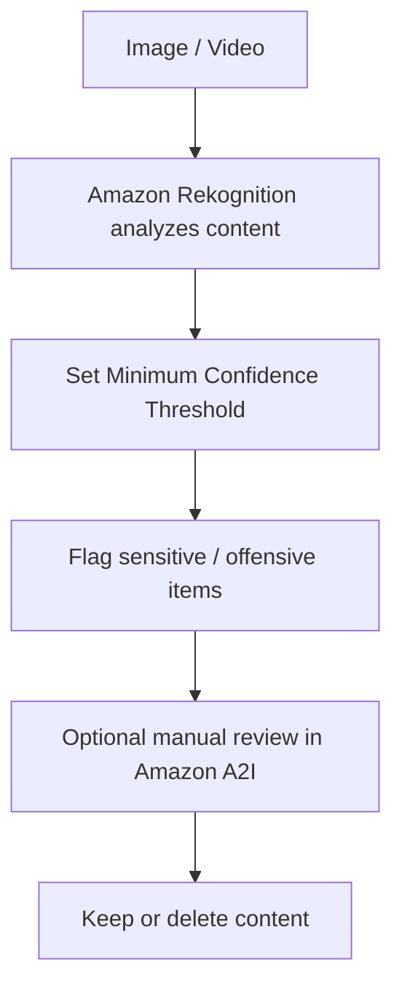

# 258. Rekognition Overview

## 🎯 Giới thiệu
Amazon Rekognition là dịch vụ dùng **machine learning** để tìm kiếm và phân tích **objects, people, texts, scenes** trong **images** và **videos**.

- Tập trung vào phân tích hình ảnh và video
- Hỗ trợ **facial analysis**, **face search**, **celebrity recognition**
- Có thể dùng để **count people** trong ảnh
- Phù hợp cho các bài toán nhận diện, kiểm tra, phân loại và giám sát nội dung

## 1. Rekognition làm được gì?
Rekognition có thể thực hiện nhiều tác vụ phân tích khác nhau trên image/video:

- **Labeling**: nhận diện các đối tượng trong ảnh/video
- **Content moderation**: phát hiện nội dung không phù hợp
- **Text detection**: nhận diện text trong ảnh
- **Face detection and analysis**:
  - nhận diện khuôn mặt
  - phân tích **gender**
  - ước lượng **age range**
  - nhận diện **emotions**
- **Face search and verification**
- **Celebrity recognition**
- **Pathing**: theo dõi hướng di chuyển trong video, ví dụ phân tích trận thể thao

## 2. Các use case chính
Rekognition được dùng khi cần tự động phân tích image/video bằng ML, ví dụ:

- Phân loại ảnh như **person**, **rock**, **mountain bike**, **outdoors**
- Nhận diện động vật như **dogs**, **golden retrievers**
- Kiểm tra ảnh có phù hợp với mọi lứa tuổi hay không
- Đọc text từ ảnh, ví dụ số áo của vận động viên
- Phân tích biểu cảm khuôn mặt, ví dụ **happy**, **smiling**, **eyes open**, **female**
- Dùng cho ứng dụng bảo mật với **face search and verification**
- Nhận diện người nổi tiếng
- Theo dõi chuyển động trong các tình huống như **soccer game** để làm analytics

## 3. Content moderation flow
Một điểm quan trọng cho kỳ thi là **content moderation**.

### Mục đích
- Detect nội dung **inappropriate, unwanted, or offensive** trong images và videos
- Dùng trong:
  - social network
  - broadcast media
  - advertising
  - e-commerce
- Mục tiêu là tạo **safe user experience** và tránh hiển thị nội dung bị xem là offensive như:
  - racist content
  - pornography

### Cách hoạt động

- Rekognition phân tích image/video trước
- Bạn tự đặt **Minimum Confidence Threshold**
- Threshold càng thấp thì càng có nhiều kết quả bị flag
- **Confidence percentage** thể hiện mức độ chắc chắn của Rekognition rằng nội dung đó thật sự inappropriate/offensive
- Sau khi flag, có thể dùng **Amazon Augmented AI (A2I)** để **manual review**
- Quy trình này giúp:
  - tự động phát hiện nội dung nhạy cảm
  - sau đó review thủ công nếu cần
  - hỗ trợ tuân thủ quy định trước khi đăng nội dung lên ứng dụng

## 📊 Bảng tóm tắt
| Tiêu chí | Mô tả |
|----------|------|
| Dịch vụ | Amazon Rekognition |
| Loại dữ liệu | Images và Videos |
| Công nghệ | Machine learning |
| Chức năng chính | Labeling, content moderation, text detection, face detection and analysis, face search, celebrity recognition, pathing |
| Điểm cần nhớ khi thi | **Content moderation** và **Minimum Confidence Threshold** |
| Review thủ công | Có thể dùng **Amazon A2I** |
| Mục tiêu | Tự động phân tích nội dung và tạo safe user experience |

## 💡 Mẹo ghi nhớ cho kỳ thi AWS
- Nhớ Rekognition = **images + videos**
- Nhớ 3 nhóm lớn:
  - **Labeling / Detection**
  - **Face analysis / Face search**
  - **Content moderation**
- Khi thấy câu hỏi về kiểm duyệt nội dung:
  - nghĩ ngay đến **Minimum Confidence Threshold**
  - và **Amazon A2I** cho manual review
- Nếu đề cập đến nhận diện người, cảm xúc, tuổi, giới tính, celebrity trong ảnh/video thì đây là **Rekognition**

## ✅ Kết luận
Amazon Rekognition là dịch vụ **machine learning** cho phép phân tích **images** và **videos** để nhận diện object, text, face, celebrity và nội dung nhạy cảm. Điểm quan trọng nhất cần nhớ cho kỳ thi là **content moderation**, cơ chế **Minimum Confidence Threshold**, và khả năng kết hợp với **Amazon A2I** để review thủ công.
