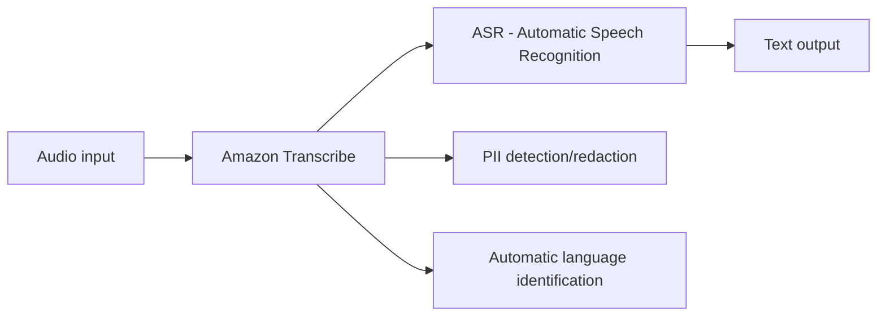

# 259. Transcribe Overview

## 🎯 Giới thiệu
Amazon Transcribe là dịch vụ tự động chuyển **speech** thành **text**.

- Bạn đưa vào **audio**, hệ thống sẽ tự động **transcribe** thành văn bản.
- Transcribe dùng deep learning gọi là **ASR (Automatic Speech Recognition)** để chuyển giọng nói sang text nhanh và chính xác.
- Dịch vụ còn hỗ trợ:
  - tự động **remove PII** bằng **redaction/reduction**
  - **automatic language identification** cho audio đa ngôn ngữ

## 1. Cách hoạt động của Amazon Transcribe
- Nhận **audio input**
- Dùng **ASR** để phân tích và chuyển thành **text**
- Có thể hiển thị kết quả gần như trực tiếp khi **streaming**

Ví dụ trong transcript:
- Nói câu như “hello, I really like this course”
- Kết quả sẽ được chuyển ngay thành text trên giao diện

## 2. Các tính năng quan trọng
### 🔒 PII removal
- Có thể tự động xóa thông tin nhận dạng cá nhân (**PII**)
- Ví dụ PII được nhắc đến:
  - tên
  - tuổi
  - **Social Security Number**
  - số điện thoại
- Có thể chọn chế độ **identify and redact**

### 🌐 Automatic language identification
- Hỗ trợ nhận diện ngôn ngữ tự động cho audio đa ngôn ngữ
- Transcript nêu ví dụ:
  - tiếng Anh
  - tiếng Pháp
  - tiếng Tây Ban Nha
- Transcribe có thể nhận ra nhiều ngôn ngữ trong cùng luồng audio

## 3. Use cases chính
- Transcribe **customer service calls**
- Tự động tạo **closed captioning** và **subtitling**
- Tạo **metadata** cho media assets
- Xây dựng **searchable archive** để tìm kiếm nội dung dễ hơn

## 📊 Bảng tóm tắt
| Tiêu chí | Mô tả |
|----------|------|
| Mục đích | Chuyển **speech** thành **text** |
| Công nghệ chính | **ASR (Automatic Speech Recognition)** |
| Tính năng nổi bật | **PII removal**, **automatic language identification** |
| Xử lý PII | Có thể **identify and redact** thông tin nhạy cảm |
| Hỗ trợ đa ngôn ngữ | Có, nhận diện được audio nhiều ngôn ngữ |
| Use cases | Call transcription, captioning, subtitling, metadata, searchable archive |

## 💡 Mẹo ghi nhớ cho kỳ thi AWS
- **Transcribe = speech to text**
- Nhớ từ khóa **ASR** vì đây là công nghệ cốt lõi được transcript nhắc đến
- Nếu đề bài nói đến:
  - **call transcription**
  - **closed captioning**
  - **subtitling**
  - **searchable archive**
  thì nghĩ ngay đến **Amazon Transcribe**
- Nếu có yêu cầu che thông tin cá nhân, nhớ đến **PII redaction**
- Nếu audio có nhiều ngôn ngữ, nhớ đến **automatic language identification**

## ✅ Kết luận
Amazon Transcribe là dịch vụ dùng **ASR** để chuyển **audio** thành **text**, đồng thời hỗ trợ **PII redaction** và **automatic language identification**. Đây là dịch vụ quan trọng khi học về xử lý giọng nói, transcript, captioning và tạo archive có thể tìm kiếm trong AWS.
