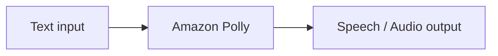

# 260. Polly Overview

## 🎯 Giới thiệu
Amazon Polly là dịch vụ **text-to-speech** của AWS, tức là chuyển **text** thành **speech** bằng **deep learning**.

- Polly được mô tả là “ngược lại với Transcribe”.
- Mục tiêu của Polly là tạo ra ứng dụng có thể **nói ra âm thanh tự nhiên**.
- Bạn có thể thử trực tiếp trên **console** để nghe kết quả sinh ra từ văn bản.

## 1. Polly chuyển text thành speech
Amazon Polly nhận nội dung văn bản và tạo ra **audio** tương ứng.

- Có thể chọn **voice** mong muốn.
- Có thể dùng **neural network** để tạo giọng đọc **natural** và **human-like** hơn.
- Kết quả là text được chuyển thành giọng nói phát ra ngay trong ứng dụng hoặc trên console.

### Luồng xử lý cơ bản

## 2. Pronunciation lexicons
Polly hỗ trợ **Lexicon** để tùy chỉnh cách phát âm của từ.

- Dùng khi gặp:
  - Từ viết cách điệu, stylized word
  - Tên riêng khó đọc
  - **Acronyms** như `AWS`
- Mục đích:
  - Chuyển cách đọc không mong muốn thành cách đọc đúng
- Ví dụ trong transcript:
  - `Stephane` có thể bị đọc sai nếu viết theo kiểu stylized
  - `AWS` có thể được cấu hình để đọc thành **Amazon Web Services**
- Lexicon được **upload** và dùng trong **SynthesizeSpeech** operation.

## 3. SSML
**SSML** là viết tắt của **Speech Synthesis Markup Language**.

- Dùng để tùy chỉnh sâu hơn cách Polly tạo speech.
- Các khả năng được nhắc đến trong transcript:
  - Nhấn mạnh từ hoặc cụm từ
  - **Phonetic pronunciation**
  - Chèn **breathing sounds**
  - **Whispering**
  - **Newscaster speaking style**
  - Chèn **break** để ngắt câu theo thời gian mong muốn
- Khi muốn điều khiển cách đọc chi tiết hơn plain text, dùng **SSML**.

### So sánh nhanh
| Tính năng | Mục đích |
|----------|------|
| **Pronunciation lexicons** | Tùy chỉnh phát âm cho stylized words và acronyms |
| **SSML** | Tùy chỉnh cách nói, nhịp nghỉ, whispering, phonetic pronunciation, speaking style |

## 📊 Bảng tóm tắt
| Tiêu chí | Mô tả |
|----------|------|
| Dịch vụ | **Amazon Polly** |
| Chức năng chính | Chuyển **text** thành **speech** |
| Công nghệ nhấn mạnh | **deep learning**, **neural network** |
| Tùy chỉnh phát âm | **Pronunciation lexicons** |
| Tùy chỉnh cách nói | **SSML** |
| API/Operation được nhắc đến | **SynthesizeSpeech** |
| Dùng khi cần | Ứng dụng cần giọng nói tự nhiên, phát âm đúng acronym/từ đặc biệt |

## 💡 Mẹo ghi nhớ cho kỳ thi AWS
- Nhớ câu chốt: **Polly = text to speech**.
- **Transcribe** là ngược lại với Polly, vì Transcribe xử lý **speech to text**.
- Nếu cần sửa cách đọc của từ đặc biệt hoặc acronym như `AWS`, hãy nghĩ đến **Pronunciation lexicons**.
- Nếu cần điều khiển cách nói như **whisper**, **break**, hoặc **phonetic pronunciation**, hãy nghĩ đến **SSML**.
- **SynthesizeSpeech** là operation quan trọng cần nhớ khi nói về Polly.

## ✅ Kết luận
Amazon Polly là dịch vụ **text-to-speech** của AWS, tạo ra **lifelike speech** từ văn bản. Hai điểm quan trọng nhất cho kỳ thi là:

- **Pronunciation lexicons** để chỉnh phát âm
- **SSML** để tùy biến cách nói và cách ngắt câu

Đây là các khái niệm cốt lõi cần nhớ khi ôn phần **Amazon Polly**.
