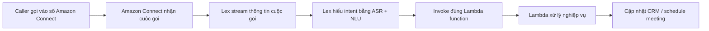

# 262. Lex + Connect Overview

## 🎯 Giới thiệu
- Bài này giới thiệu 2 dịch vụ AWS liên quan đến chatbot và contact center:
  - `Amazon Lex` cho `ASR` và `NLP` để hiểu câu nói, ý định.
  - `Amazon Connect` cho `visual contact center` trên cloud.
- Mục tiêu là xây dựng hệ thống tổng đài thông minh có thể nhận cuộc gọi, hiểu yêu cầu và tự động xử lý tác vụ.

## 1. Amazon Lex
- `Amazon Lex` là công nghệ đứng sau các thiết bị `Alexa` của Amazon.
- Chức năng chính:
  - `ASR` (`Automatic Speech Recognition`): chuyển `speech` thành `text`.
  - `Natural Language Understanding`: hiểu `intent` của câu nói.
- Dùng để xây dựng:
  - `chatbots`
  - `call center bots`
- Ý chính cần nhớ: `Lex` tập trung vào việc hiểu lời nói và ý định của người dùng.

## 2. Amazon Connect
- `Amazon Connect` là một `visual contact center` chạy hoàn toàn trên cloud.
- Dùng để:
  - nhận cuộc gọi
  - tạo `contact flows`
  - tích hợp với `CRM` hoặc các `AWS services`
- Điểm nổi bật:
  - không cần trả trước (`no upfront payment`)
  - rẻ hơn khoảng `80%` so với giải pháp contact center truyền thống
- Ý chính cần nhớ: `Connect` là nền tảng để xây dựng hệ thống tổng đài / contact center.

## 3. Flow hoạt động của hệ thống Lex + Connect
- Một người gọi điện vào số do `Amazon Connect` định nghĩa.
- `Amazon Connect` nhận cuộc gọi và điều phối luồng xử lý.
- `Lex` stream thông tin từ cuộc gọi để:
  - hiểu nội dung
  - xác định `intent`
- Sau đó hệ thống gọi đúng `Lambda function` để xử lý nghiệp vụ.
- Ví dụ trong transcript:
  - người gọi muốn đặt lịch hẹn
  - `Lex` hiểu yêu cầu “schedule a meeting tomorrow with Tom at 3:00 PM”
  - `Lambda` có thể ghi vào `CRM` để tạo lịch hẹn

## 📊 Bảng tóm tắt
| Tiêu chí | Mô tả |
|----------|------|
| `Amazon Lex` | Dịch vụ cho `ASR` và hiểu `intent`, dùng để tạo `chatbots` và `call center bots` |
| `Amazon Connect` | `visual contact center` trên cloud, nhận cuộc gọi và tạo `contact flows` |
| Tích hợp | Có thể tích hợp với `CRM` và `AWS services` |
| Mô hình xử lý | `Connect` nhận cuộc gọi, `Lex` hiểu nội dung, `Lambda` xử lý tác vụ |
| Lợi ích | Không có `upfront payment`, rẻ hơn khoảng `80%` so với contact center truyền thống |

## 💡 Mẹo ghi nhớ cho kỳ thi AWS
- `Lex` = hiểu lời nói, `ASR`, `intent`, `chatbot`.
- `Connect` = contact center, nhận cuộc gọi, `contact flows`.
- Nhớ luồng:
  - `Caller` -> `Connect` -> `Lex` -> `Lambda` -> `CRM`
- Khi đề hỏi về hệ thống tổng đài thông minh:
  - `Connect` là phần contact center
  - `Lex` là phần hiểu ngôn ngữ tự nhiên
- Khi đề hỏi về chatbot thoại:
  - nghĩ đến `Amazon Lex`

## ✅ Kết luận
- `Amazon Lex` dùng để chuyển `speech` thành `text` và hiểu `intent`.
- `Amazon Connect` dùng để xây dựng `cloud contact center` và xử lý cuộc gọi.
- Kết hợp cả hai giúp tạo `smart contact center` có thể tự động nhận biết yêu cầu và gọi `Lambda` để xử lý nghiệp vụ.
