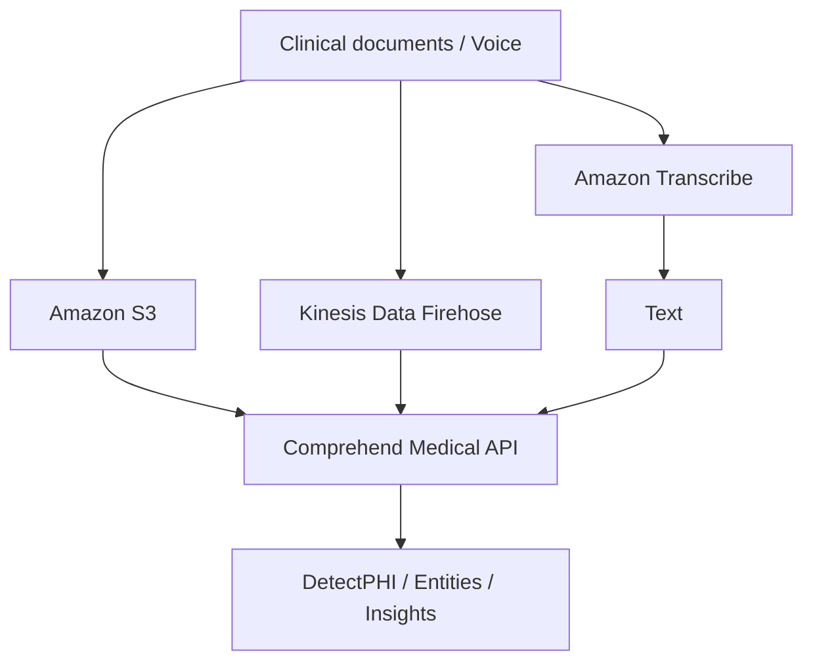

# 264. Comprehend Medical Overview

## 🎯 Giới thiệu
Amazon Comprehend Medical là dịch vụ dùng **NLP (natural language processing)** để phân tích **unstructured clinical text** và trích xuất thông tin hữu ích.  
Nó có thể phát hiện **protected health information (PHI)** trong tài liệu y tế thông qua **DetectPHI API**.

Ví dụ dữ liệu đầu vào:
- Doctor notes
- Discharge summaries
- Test results
- Case notes

## 1. Mục đích chính của Comprehend Medical 🏥
- Phân tích văn bản y tế không có cấu trúc.
- Nhận diện và trả về thông tin quan trọng trong tài liệu.
- Giúp biến dữ liệu sức khỏe từ dạng text thành dữ liệu có cấu trúc hơn.
- Dựa trên **machine learning** để trích xuất insight từ text.

## 2. Luồng xử lý dữ liệu và kiến trúc 🚀
Có thể đưa dữ liệu vào Comprehend Medical theo nhiều cách:
- Lưu tài liệu trong **Amazon S3** rồi gọi **Comprehend Medical API**.
- Dùng **Kinesis Data Firehose** để phân tích **real time**.
- Dùng **Amazon Transcribe** để chuyển voice thành text trước, sau đó gửi text sang Comprehend Medical.

## 3. Kết quả phân tích và thông tin trích xuất 📌
Khi nhập text của bác sĩ vào console, Comprehend Medical có thể trả về:
- **Entities**
- **Age**
- **Procedure name**
- **Time** và **date** liên quan đến procedure
- Tên generic của một molecule
- **Strength**
- **Dosage**
- **Route**
- **Modes**
- **Frequency**

Điểm chính:
- Dữ liệu sau phân tích trở nên **organized** hơn.
- Dịch vụ hỗ trợ cấu trúc hóa dữ liệu y tế từ text không có cấu trúc.

## 📊 Bảng tóm tắt
| Tiêu chí | Mô tả |
|----------|------|
| Dịch vụ | Amazon Comprehend Medical |
| Loại dữ liệu | Unstructured clinical text |
| Công nghệ chính | NLP, machine learning |
| Chức năng nổi bật | DetectPHI API, trích xuất entities |
| Nguồn đầu vào | S3, Kinesis Data Firehose, Amazon Transcribe |
| Kết quả | PHI, entities, thông tin y tế có cấu trúc hơn |

## 💡 Mẹo ghi nhớ cho kỳ thi AWS
- Nhớ keyword: **Comprehend Medical = NLP cho clinical text**.
- **DetectPHI** dùng để tìm **protected health information**.
- Luồng hay gặp trong đề:
  - **S3 -> Comprehend Medical**
  - **Transcribe -> text -> Comprehend Medical**
  - **Kinesis Data Firehose -> real time analysis**
- Khi thấy bài toán về trích xuất thông tin từ **doctor notes** hoặc tài liệu y tế, hãy nghĩ đến **Comprehend Medical**.

## ✅ Kết luận
Amazon Comprehend Medical được dùng để phân tích **unstructured clinical text**, phát hiện **PHI**, và trích xuất các **entities** y tế hữu ích. Dịch vụ này giúp chuyển dữ liệu y tế từ text thô sang dạng có cấu trúc hơn để dễ phân tích và sử dụng.
