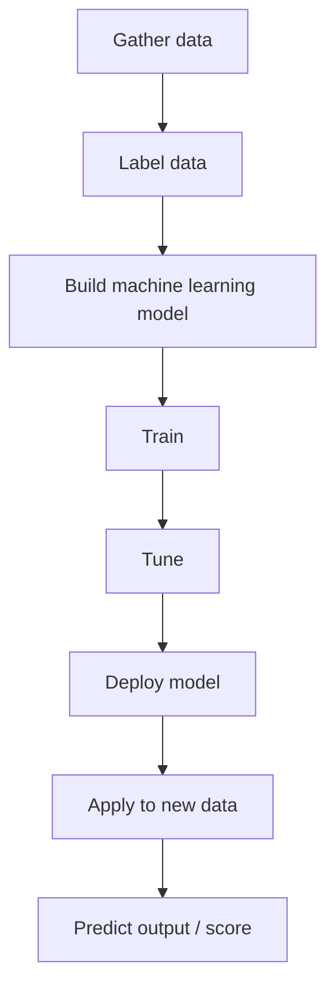

# 265. SageMaker Overview

## 🎯 Giới thiệu
Amazon SageMaker là một **fully managed service** dành cho **developers** và **data scientists** để **build machine learning model**.

- Khác với các managed ML service có mục đích rất cụ thể như:
  - translate text
  - transcribe audio
  - convert text into audio
  - analyze parts of a text
- SageMaker là dịch vụ ở cấp cao hơn, tập trung vào việc **tạo, huấn luyện, tinh chỉnh và triển khai** machine learning model.
- Quá trình này thường **phức tạp hơn** và cần nhiều bước hơn, nên SageMaker xuất hiện để hỗ trợ xuyên suốt toàn bộ workflow.

## 1. 🧩 Quy trình xây dựng machine learning model
Để build một model, transcript mô tả các bước chính sau:

- **Gather data**: thu thập dữ liệu từ thực tế.
- **Label data**: gán nhãn dữ liệu, xác định cột nào đại diện cho gì và gắn kết quả đầu ra.
- **Build model**: tạo machine learning model từ historical data.
- **Train and tune**: huấn luyện và tinh chỉnh model để phù hợp hơn với dữ liệu và output.
- **Deploy model**: đưa model đã hoàn thiện vào sử dụng với dữ liệu mới.

Mermaid flow:

## 2. ⚙️ SageMaker hỗ trợ gì?
SageMaker hỗ trợ toàn bộ vòng đời của ML model trong transcript:

- **Labeling**
- **Building**
- **Training**
- **Tuning**
- **Applying / deploying**

Ý chính:
- Các bước này vốn khó làm riêng lẻ và khó làm trong một nơi duy nhất.
- Cũng cần provision servers để thực hiện các computation, nên có thể rất cumbersome.
- SageMaker giúp xử lý chuỗi công việc này trong cùng một service.

## 3. 📈 Ví dụ minh họa trong transcript
Ví dụ được đưa ra là tạo model để **predict exam score** của một student:

- Dữ liệu đầu vào có thể gồm:
  - số năm kinh nghiệm IT
  - số năm kinh nghiệm với AWS
  - thời gian học course
  - số practice exams đã làm
- Sau đó:
  - dữ liệu được label
  - model được build
  - model được train và tune
  - model được deploy
- Khi có student mới, model sẽ nhận dữ liệu mới và **predict score** cho student đó.

## 📊 Bảng tóm tắt
| Tiêu chí | Mô tả |
|----------|------|
| Dịch vụ | Amazon SageMaker |
| Loại dịch vụ | fully managed service |
| Người dùng chính | developers, data scientists |
| Mục đích | build machine learning model |
| Workflow chính | labeling, building, training, tuning, deploying |
| Điểm nổi bật | hỗ trợ toàn bộ quá trình ML trong một nơi |
| Ví dụ trong transcript | dự đoán score của exam dựa trên dữ liệu student |

## 💡 Mẹo ghi nhớ cho kỳ thi AWS
- Nhớ rằng **SageMaker** không phải service làm một tác vụ ML đơn lẻ, mà là nền tảng để **build machine learning model**.
- Từ khóa cần nhớ theo đúng flow:
  - **labeling**
  - **building**
  - **training**
  - **tuning**
  - **deploying**
- Nếu đề thi hỏi về dịch vụ dành cho **developers/data scientists** để xây dựng model end-to-end, nghĩ ngay đến **SageMaker**.
- Phân biệt với các managed AI services có nhiệm vụ cụ thể như translate/transcribe/analyze.

## ✅ Kết luận
Amazon SageMaker là **fully managed service** giúp developers và data scientists xây dựng machine learning model từ đầu đến cuối. Trong transcript, điểm cốt lõi là SageMaker hỗ trợ toàn bộ quy trình: **label data, build model, train, tune và deploy** để áp dụng model lên dữ liệu mới.
