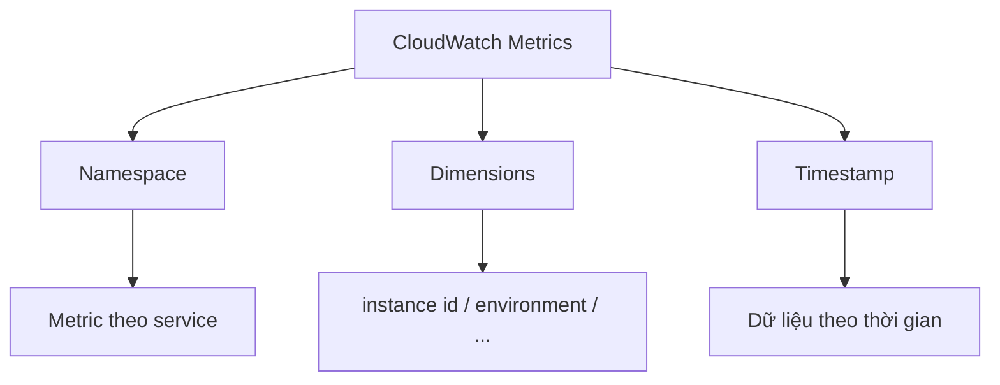
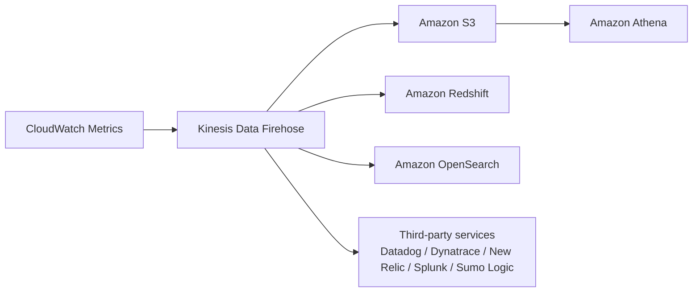

# 271. CloudWatch Metrics

## 🎯 Giới thiệu
CloudWatch Metrics là phần đầu tiên của Amazon CloudWatch được nhắc đến trong bài giảng. Mục tiêu chính là giúp theo dõi các **metrics** của từng dịch vụ AWS để quan sát trạng thái tài nguyên trong account.

- **Metric** là một biến cần theo dõi.
- Ví dụ:
  - EC2: `CPUUtilization`, `NetworkIn`, `CPUCreditBalance`
  - S3: `bucket size`
- Metrics có thể được hiển thị, lọc theo thời gian, đưa vào dashboard, hoặc stream ra bên ngoài CloudWatch.

## 1. Cấu trúc của CloudWatch Metrics 📌
CloudWatch Metrics được tổ chức theo một số khái niệm chính:

- **Namespace**:
  - Mỗi service thường có một namespace riêng.
  - Metrics được nhóm theo service, ví dụ: `ELB`, `Auto Scaling`, `EBS`, `EC2`, `EFS`.
- **Dimensions**:
  - Là các thuộc tính của metric.
  - Ví dụ: `CPUUtilization` có thể gắn với `instance id` hoặc `environment`.
  - Một metric có thể có tối đa **30 dimensions**.
- **Timestamp**:
  - Metrics là dữ liệu theo thời gian nên luôn có timestamp.

### Mermaid: Cấu trúc cơ bản

## 2. Khả năng theo dõi và hiển thị 📊
CloudWatch Metrics cho phép bạn quan sát và tổ chức dữ liệu theo nhiều cách:

- Tạo **CloudWatch dashboard** để xem nhiều metrics cùng lúc.
- Lọc theo:
  - `region`
  - `dimension`
  - `resource id`
  - khoảng thời gian
- Đổi kiểu hiển thị:
  - `Stacked area`
  - `Line`
  - `Number`
  - `Pie chart`
- Có thể:
  - thêm vào dashboard
  - tải xuống `.csv`
  - chia sẻ dữ liệu

### Lưu ý về monitoring
- Nếu **detailed monitoring** không bật, dữ liệu có thể xuất hiện **mỗi 5 phút**.
- Nếu bật **detailed monitoring**, dữ liệu có thể có **mỗi 1 phút**.

## 3. Custom Metrics và Streaming 🚀
Ngoài metrics mặc định từ AWS services, bạn có thể tạo **CloudWatch Custom Metrics**.

- Mục đích:
  - tự tạo metric riêng theo nhu cầu
- Ví dụ trong bài:
  - lấy **memory usage** từ EC2 instance

CloudWatch Metrics cũng có thể được **stream** ra ngoài CloudWatch:

- Stream **near real-time** đến **Amazon Kinesis Data Firehose**
- Từ đó có thể đưa dữ liệu đến:
  - `Amazon S3`
  - `Amazon Athena` để phân tích
  - `Amazon Redshift` để data warehousing
  - `Amazon OpenSearch` để build dashboard / analytics
- Hoặc gửi trực tiếp sang bên thứ ba:
  - `Datadog`
  - `Dynatrace`
  - `New Relic`
  - `Splunk`
  - `Sumo Logic`

### Mermaid: Luồng streaming metrics

## 📊 Bảng tóm tắt
| Tiêu chí | Mô tả |
|----------|------|
| CloudWatch Metrics | Dùng để theo dõi metrics của AWS services |
| Metric | Một biến cần monitor như `CPUUtilization`, `NetworkIn`, `bucket size` |
| Namespace | Nhóm metrics theo service |
| Dimensions | Thuộc tính của metric, tối đa 30 dimensions |
| Timestamp | Metrics luôn gắn với thời gian |
| Dashboard | Gom nhiều metrics để xem cùng lúc |
| Custom Metrics | Tự tạo metric riêng, ví dụ memory usage từ EC2 |
| Streaming | Stream near real-time ra `Kinesis Data Firehose` |
| Destination | `S3`, `Athena`, `Redshift`, `OpenSearch`, hoặc third-party |

## 💡 Mẹo ghi nhớ cho kỳ thi AWS
- Nhớ công thức: **Metric + Namespace + Dimensions + Timestamp**.
- `EC2` thường được hỏi với các metric như `CPUUtilization`, `NetworkIn`, `CPUCreditBalance`.
- `Custom Metrics` dùng khi AWS không cung cấp metric bạn cần, ví dụ `memory usage`.
- Nếu gặp câu hỏi về xuất dữ liệu metrics ra ngoài CloudWatch, nghĩ ngay đến:
  - `Kinesis Data Firehose`
  - `S3`
  - `Athena`
  - `Redshift`
  - `OpenSearch`
- `detailed monitoring`:
  - mặc định: **5 phút**
  - bật lên: **1 phút**

## ✅ Kết luận
CloudWatch Metrics là nền tảng để giám sát tài nguyên AWS theo thời gian thực hoặc gần thời gian thực. Điểm cần nhớ nhất là cách metrics được tổ chức bằng **Namespace** và **Dimensions**, khả năng tạo **Custom Metrics**, và luồng **streaming** qua `Kinesis Data Firehose` để phân tích hoặc tích hợp hệ thống khác.
