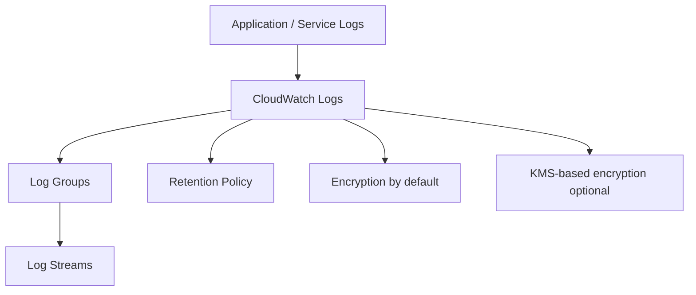
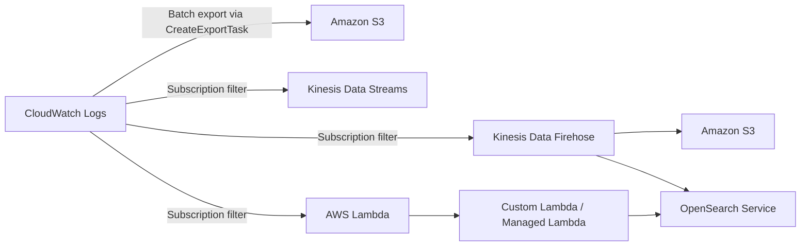
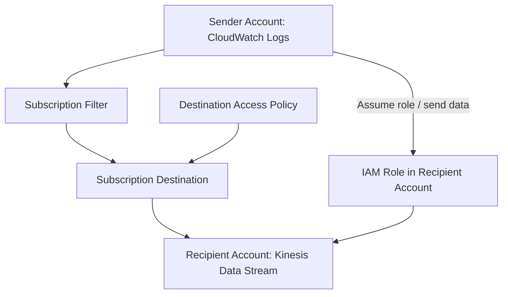

# 272. CloudWatch Logs

## 🎯 Giới thiệu
CloudWatch Logs là nơi phù hợp để lưu trữ **application logs** trong AWS. Muốn sử dụng, bạn cần hiểu 3 lớp chính:

- **Log groups**: tên do bạn tự đặt, thường đại diện cho một application
- **Log streams**: các log instance bên trong log group, hoặc file log / container cụ thể
- **Retention policy**: quy định thời gian lưu log

CloudWatch Logs cũng hỗ trợ:
- **Encryption by default**
- Tùy chọn dùng **KMS-based encryption** với key của riêng bạn
- Xuất log sang nhiều đích khác nhau
- Query log bằng **CloudWatch Logs Insights**

## 1. Cấu trúc và lưu trữ log 🗂️
CloudWatch Logs tổ chức dữ liệu theo 2 cấp chính:

- **Log group**
  - Là tên logic do bạn đặt
  - Thường map với một ứng dụng
- **Log stream**
  - Đại diện cho log instance trong ứng dụng
  - Có thể là từng log file hoặc từng container trong cluster

### Retention policy
- Có thể giữ log **không bao giờ hết hạn**
- Hoặc đặt thời gian lưu từ:
  - **1 day**
  - đến **10 years**

### Bảo mật
- Log được **encrypt by default**
- Có thể cấu hình thêm **KMS-based encryption** với key riêng

## 2. Nguồn log đưa vào CloudWatch Logs 🔄
Các log có thể được gửi vào CloudWatch Logs bằng:
- **SDK**
- **CloudWatch Logs Agent**
- **CloudWatch Unified Agent**

Lưu ý:
- **CloudWatch Unified Agent** là hướng được dùng hiện tại
- **CloudWatch Log Agent** được mô tả là đã sort of deprecated

### Các dịch vụ có thể đẩy log trực tiếp
- **Elastic Beanstalk**: thu log ứng dụng trực tiếp vào CloudWatch
- **ECS**: gửi log trực tiếp từ containers
- **Lambda**: gửi log từ functions
- **VPC Flow Logs**: log traffic metadata của VPC
- **API Gateway**: log mọi request vào CloudWatch Logs
- **CloudTrail**: có thể gửi log theo filter
- **Route53**: log DNS queries

### Mermaid: luồng log trong CloudWatch Logs

## 3. Query, export và subscription 📈
### CloudWatch Logs Insights
Đây là **query engine** داخل CloudWatch Logs, dùng để:
- Viết query
- Chọn **timeframe**
- Nhận kết quả dưới dạng **visualization**
- Xem các **specific log lines** tạo ra visualization đó
- Export kết quả hoặc thêm vào **dashboard**

Khả năng của Logs Insights:
- Có sẵn nhiều query mẫu như:
  - lấy **25 most recent events**
  - đếm events có **exceptions or errors**
  - tìm theo **specific IP**
- Có **purpose-built query language**
- Field được **auto-detect**
- Có thể:
  - filter theo conditions
  - tính aggregate statistics
  - sort events
  - limit số lượng events
- Có thể query **multiple log groups**
- Thậm chí query được log groups ở **different accounts**

### Điểm cần nhớ
- **CloudWatch Logs Insights là query engine, không phải real-time engine**
- Chỉ query **historical data**

### Export sang Amazon S3
- CloudWatch Logs có thể **export batch** sang **Amazon S3**
- Quá trình export có thể mất tới **12 hours**
- API dùng để khởi tạo là **CreateExportTask**
- Đây **không phải real-time** hoặc near real-time

### Subscription filters
Nếu cần gần real-time, dùng **CloudWatch Logs subscription**:
- Gửi **real-time stream** của log events
- Có thể xử lý và phân tích dữ liệu
- Đích đến:
  - **Kinesis Data Streams**
  - **Kinesis Data Firehose**
  - **Lambda**

Subscription filter giúp chọn loại log events muốn gửi đi.

### Mermaid: export và subscription flow

## 4. Log aggregation và cross-account delivery 🔗
CloudWatch Logs subscription filters có thể dùng để **aggregate logs** từ:
- nhiều CloudWatch Logs
- nhiều **accounts**
- nhiều **regions**

### Cơ chế hoạt động
- Có **sender account**
- Có **recipient account**
- Tạo **CloudWatch Log subscription filter**
- Log được gửi đến **subscription destination**
  - là đại diện virtual của **Kinesis Data Stream** ở recipient account
- Gắn **destination access policy**
  - để cho phép account đầu tiên gửi dữ liệu
- Tạo **IAM role** ở recipient account
  - có quyền gửi records vào **Kinesis Data Stream**
  - role này phải được account đầu tiên assume

### Mermaid: cross-account log delivery

## 📊 Bảng tóm tắt
| Tiêu chí | Mô tả |
|----------|------|
| Mục đích | Lưu trữ **application logs** trong AWS |
| Tổ chức dữ liệu | **Log groups** chứa nhiều **log streams** |
| Retention | Giữ vĩnh viễn hoặc từ **1 day** đến **10 years** |
| Bảo mật | **Encrypted by default**, có thể dùng **KMS** riêng |
| Nguồn log | SDK, **CloudWatch Logs Agent**, **CloudWatch Unified Agent**, Elastic Beanstalk, ECS, Lambda, VPC Flow Logs, API Gateway, CloudTrail, Route53 |
| Query | **CloudWatch Logs Insights** |
| Tính chất Insights | Query **historical data**, không phải real-time |
| Export batch | Sang **Amazon S3**, tối đa **12 hours**, dùng **CreateExportTask** |
| Real-time stream | Dùng **subscription filters** |
| Đích subscription | **Kinesis Data Streams**, **Kinesis Data Firehose**, **Lambda** |
| Aggregation | Có thể gom log từ nhiều account/region về một destination chung |

## 💡 Mẹo ghi nhớ cho kỳ thi AWS
- **Log group = ứng dụng**, **log stream = instance/file/container**
- **Insights = query historical data**, không phải real-time
- **S3 export = batch**, nhớ keyword **CreateExportTask**
- Muốn **real-time** thì nhớ **subscription filters**
- **Kinesis Data Firehose** và **Lambda** thường xuất hiện như đích xử lý log
- **CloudWatch Logs** mặc định **encrypted**
- Cross-account log delivery cần nhớ chuỗi:
  - **subscription filter**
  - **destination**
  - **destination access policy**
  - **IAM role**

## ✅ Kết luận
CloudWatch Logs là dịch vụ trung tâm để lưu, truy vấn và phân phối log trong AWS. Khi ôn thi, cần nắm chắc 4 ý chính: **cấu trúc log groups/log streams**, **retention và encryption**, **CloudWatch Logs Insights**, và **subscription/export flow** sang S3, Kinesis, Lambda hoặc cross-account destination.
