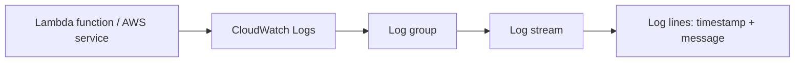
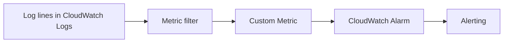

# 273. CloudWatch Logs - Hands On

## 🎯 Giới thiệu
CloudWatch Logs là nơi lưu trữ và theo dõi log của AWS service hoặc application. Trong bài hands-on này, nội dung tập trung vào cách:
- Xem `Log groups` và `Log streams`
- Tạo `Metric filter` từ log
- Tạo `Alarm` dựa trên metric
- Điều chỉnh retention, export, tail log
- Dùng `Logs Insights` để truy vấn log

## 1. Log groups và log streams
- Trong CloudWatch console, vào mục `Logs` để xem toàn bộ `log groups`.
- `Log groups` có thể được tạo tự động bởi AWS service, ví dụ:
  - `AWS Glue`
  - `/Kinesis`
  - `/Lambda`
- Bạn cũng có thể tự tạo `log group` riêng, ví dụ `demo logs`.
- Khi tạo `log group`, có thể cấu hình:
  - `retention policy`
  - storage class: `standard` hoặc `infrequent access`
  - `KMS key` để mã hóa
  - `deletion protection` để tránh xóa nhầm

- `Log streams` được tạo theo thời gian.
- Trong ví dụ, `Lambda` function `HelloWorld` tạo output và đẩy trực tiếp vào `CloudWatch Logs`.
- Mỗi `log stream` chứa các log line riêng, có:
  - `timestamp`
  - `message`

### Mermaid: luồng log cơ bản

## 2. Metric filter và Alarm từ log
- `Metric filter` dùng để tìm các pattern hoặc text cụ thể trong log line.
- Khi pattern khớp, CloudWatch tạo ra metric từ log.
- Ví dụ:
  - filter theo từ `info`
  - filter theo từ `start`
- Có thể chọn từng `log stream` cụ thể để test pattern.
- Bài giảng lưu ý rằng filter quá rộng có thể gây `false positive`, nên cần chỉnh pattern kỹ hơn, ví dụ chỉ bắt `start request ID`.

- Khi tạo metric filter, cần nhập:
  - `namespace`
  - `metric name`
  - `metric value`
  - `dimensions` nếu cần theo account hoặc region
- Metric này chỉ được populate cho dữ liệu mới, không áp dụng ngược cho dữ liệu lịch sử.

- Sau khi metric được tạo, có thể dùng nó để tạo `Alarm`.
- Ví dụ: nếu số lần `start Lambda` lớn hơn `10` trong `5 minutes`, có thể tạo cảnh báo.

### Mermaid: log -> metric -> alarm

## 3. Các thao tác hữu ích khác và Logs Insights
- Trong phần `Action`, có thể:
  - chỉnh `retention settings`
  - `export` dữ liệu sang `Amazon S3`
  - `tail` logs để xem gần như real time
- `Subscription filters` dùng để stream log sang dịch vụ khác.
- Các destination được nhắc trong bài:
  - `Amazon OpenSearch Service`
  - `Kinesis`
  - `Amazon Data Firehose`
  - `Lambda`

- `CloudWatch Logs Insights` cho phép query log bằng `Logs Insight QL`.
- Có thể:
  - chạy query
  - xem kết quả dạng bảng
  - xem graph theo thời gian
- Một số query mẫu có sẵn:
  - `25 most recently added log events`
  - số `exceptions` mỗi `5 minutes`
  - `latency statistics` theo interval `5 minutes`
- Bài giảng nhấn mạnh đây là phần thực hành hữu ích trong thực tế hơn là phần trọng tâm thi.

## 📊 Bảng tóm tắt
| Tiêu chí | Mô tả |
|----------|------|
| `Log group` | Nơi chứa log, có thể do AWS tạo tự động hoặc tự tạo thủ công |
| `Log stream` | Nhóm log theo thời gian / invocation, chứa log lines |
| `Metric filter` | Lọc pattern trong log để tạo metric |
| `Alarm` | Cảnh báo dựa trên metric tạo từ log |
| `Retention` | Quy định thời gian lưu log |
| `Export to S3` | Xuất log sang `Amazon S3` |
| `Tail logs` | Xem log gần như real time |
| `Subscription filters` | Stream log sang dịch vụ khác như `OpenSearch`, `Kinesis`, `Firehose`, `Lambda` |
| `Logs Insights` | Query log bằng `Logs Insight QL` |

## 💡 Mẹo ghi nhớ cho kỳ thi AWS
- `CloudWatch Logs` không chỉ để xem log, mà còn có thể biến log thành `metric` rồi tạo `Alarm`.
- Nhớ chuỗi quan trọng: `Log group` -> `Log stream` -> `Metric filter` -> `Metric` -> `Alarm`.
- `Metric filter` rất hay xuất hiện trong thực tế khi cần đếm sự kiện từ log.
- `Subscription filters` dùng để đẩy log sang dịch vụ khác.
- `Logs Insights` là công cụ query log, dùng `Logs Insight QL`.
- Nếu thấy `Lambda`, log thường nằm trong `CloudWatch Logs` và có thể dùng để debug.

## ✅ Kết luận
Bài hands-on này cho thấy `CloudWatch Logs` là trung tâm để lưu, xem, lọc và khai thác log của AWS service hoặc application. Điểm quan trọng nhất là bạn có thể:
- đọc `log groups` và `log streams`
- tạo `metric filter` từ log
- dựng `Alarm` từ metric
- dùng `Logs Insights` để phân tích log hiệu quả hơn
