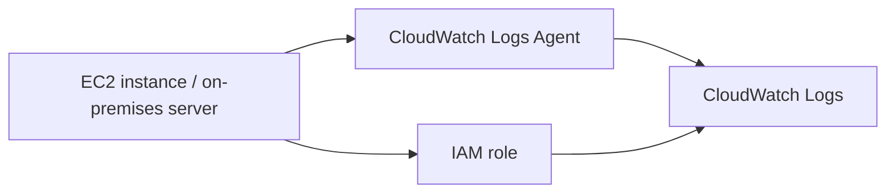

# 275. CloudWatch Agent and CloudWatch Logs Agent

## 🎯 Giới thiệu
- **CloudWatch Agents** dùng để lấy **logs** từ **EC2 instances** và cả **metrics** rồi gửi lên **CloudWatch**.
- Mặc định, **EC2** không tự động đẩy logs sang CloudWatch.
- Muốn hoạt động, cần cài và chạy một **agent** nhỏ trên EC2 hoặc server khác để push dữ liệu lên **CloudWatch Logs**.

## 1. CloudWatch Logs Agent và yêu cầu cơ bản
- **CloudWatch Logs Agent** là agent cũ, chuyên dùng để gửi **logs** lên **CloudWatch Logs**.
- EC2 instance phải có **IAM role** cho phép gửi log vào **CloudWatch Logs**.
- Agent không chỉ dùng cho EC2 mà còn có thể cài trên **on-premises servers**.
- Có thể cài trên các server vật lý hoặc virtual server như **VMware on-premises**, rồi log vẫn đổ về **CloudWatch Logs**.

## 2. CloudWatch Logs Agent vs CloudWatch Unified Agent
- Có 2 loại agent trong CloudWatch:
  - **CloudWatch Logs Agent**: phiên bản cũ
  - **CloudWatch Unified Agent**: phiên bản mới
- So sánh nhanh:
  
| Agent | Chức năng chính | Ghi chú |
|------|------------------|--------|
| CloudWatch Logs Agent | Chỉ gửi **logs** | Phiên bản cũ |
| CloudWatch Unified Agent | Gửi **logs** và thu thập **metrics** | Phiên bản mới, đầy đủ hơn |

- **Unified Agent** tốt hơn vì làm được cả **metrics** lẫn **logs** nên gọi là “Unified”.
- **Unified Agent** còn hỗ trợ cấu hình tập trung bằng **SSM Parameter Store**, điều mà agent cũ không có.

## 3. Metrics mà CloudWatch Unified Agent thu thập
- Khi cài **CloudWatch Unified Agent** trên EC2 hoặc Linux servers, có thể thu thập nhiều metrics chi tiết hơn monitoring mặc định của EC2.
- Các nhóm metrics được nhắc đến trong transcript:
  - **CPU metrics** ở mức granular hơn: active, guest, idle, system, user, steal
  - **Disk metrics**: free, used, total
  - **Disk I/O**: writes, reads, bytes, iops
  - **RAM**: free, inactive, used, total, cached
  - **Netstats**: số kết nối **TCP/UDP**, net packets, bytes
  - **Processes**: dead, blocked, idle, running, sleep
  - **Swap Space**: phần memory spill xuống disk, theo free/used/%used
- Ý chính cần nhớ:
  - Monitoring mặc định của **EC2** chỉ cho thông tin ở mức cao về **disk, CPU, network**
  - Không có **memory** và **swap**
  - Muốn chi tiết hơn thì nhớ tới **CloudWatch Unified Agent**

## 📊 Bảng tóm tắt
| Tiêu chí | Mô tả |
|----------|------|
| Mục đích | Gửi **logs** và thu thập **metrics** lên CloudWatch |
| Agent cũ | **CloudWatch Logs Agent**, chỉ gửi logs |
| Agent mới | **CloudWatch Unified Agent**, gửi logs + metrics |
| Nguồn cài đặt | **EC2 instances** và **on-premises servers** |
| Yêu cầu quyền | **EC2 instance** cần **IAM role** để gửi log |
| Cấu hình | **Unified Agent** hỗ trợ **SSM Parameter Store** |
| Metrics nổi bật | **CPU, Disk, Disk I/O, RAM, Netstats, Processes, Swap Space** |
| Điểm thi cần nhớ | Default EC2 monitoring không có **memory** và **swap** ở mức chi tiết |

## 💡 Mẹo ghi nhớ cho kỳ thi AWS
- **Logs only** = nhớ đến **CloudWatch Logs Agent**.
- **Logs + metrics** = nhớ đến **CloudWatch Unified Agent**.
- **Unified** nghĩa là “gom nhiều thứ trong một”, nên vừa **logs** vừa **metrics**.
- Nếu đề bài nói đến cấu hình tập trung qua **SSM Parameter Store**, gần như chắc chắn đang nói về **Unified Agent**.
- Nếu cần log từ **EC2** đi vào **CloudWatch Logs**, luôn nhớ phải có **IAM role** phù hợp.

## ✅ Kết luận
- **CloudWatch Logs Agent** là agent cũ, chỉ gửi **logs**.
- **CloudWatch Unified Agent** là lựa chọn mới hơn, mạnh hơn vì có thể gửi **logs** và thu thập **metrics** chi tiết.
- Cả hai đều có thể dùng cho **EC2** và **on-premises servers**, nhưng để học và thi AWS thì trọng tâm là: **Unified Agent** = đầy đủ hơn, linh hoạt hơn, và hỗ trợ **SSM Parameter Store**.
