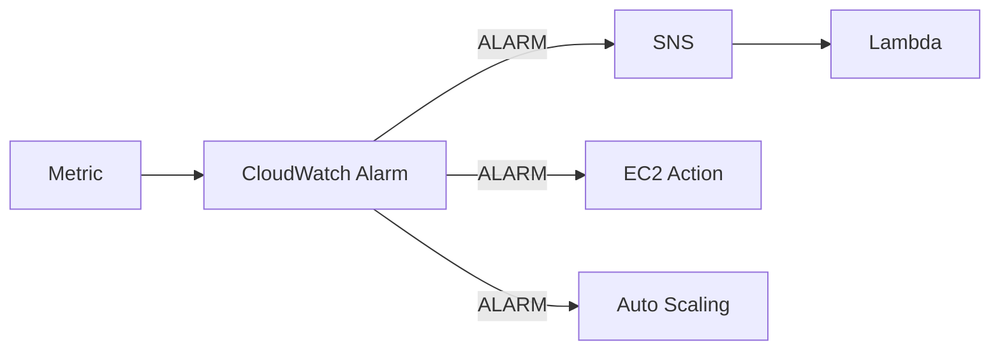

# 276. CloudWatch Alarms

## 🎯 Giới thiệu
CloudWatch Alarms dùng để **trigger notifications** từ bất kỳ **metric** nào trong CloudWatch. Bạn có thể tạo alarm với điều kiện phức tạp, ví dụ dựa trên **sampling**, **percentage**, **maximum**, và các kiểu đánh giá khác.

## 1. CloudWatch Alarms cơ bản
- Alarm có **3 states**:
  - `OK`: chưa bị trigger
  - `INSUFFICIENT_DATA`: chưa đủ data để xác định trạng thái
  - `ALARM`: đã vượt **threshold** và sẽ gửi notification
- `Period` là khoảng thời gian alarm dùng để **evaluate metric**.
- `Period` có thể rất ngắn hoặc rất dài, và hỗ trợ cả **high resolution custom metrics**:
  - 10 seconds
  - 30 seconds
  - hoặc bội số của 60 seconds

### 🎯 3 mục tiêu chính của Alarm
- Thực hiện action trên **EC2 instances**
  - stop
  - terminate
  - reboot
  - recover
- Kích hoạt **Auto Scaling**
  - scale out
  - scale in
- Gửi notification tới **SNS**
  - từ SNS có thể hook sang **Lambda**
  - Lambda có thể làm gần như bất kỳ việc gì khi alarm bị breach

## 2. Composite Alarms
- **CloudWatch Alarms** thường dựa trên **single metric**.
- Nếu cần theo dõi **multiple metrics**, dùng **Composite Alarms**.
- Composite Alarm theo dõi **states của nhiều alarm khác**.
- Mỗi alarm bên dưới có thể dựa trên **một metric khác nhau**.
- Có thể dùng điều kiện:
  - `AND`
  - `OR`
- Mục đích quan trọng:
  - **reduce alarm noise**
  - tạo điều kiện cảnh báo linh hoạt hơn

### Ví dụ trong transcript
- `Alarm A` theo dõi **CPU** của EC2 instance
- `Alarm B` theo dõi **IOPS** của EC2 instance
- Composite Alarm là sự kết hợp của `Alarm A` và `Alarm B`
- Khi cả hai cùng ở trạng thái alarm theo điều kiện đã định nghĩa, Composite Alarm sẽ trigger và có thể gửi **SNS notification**

## 3. EC2 instance recovery và test alarm
### EC2 instance recovery
CloudWatch Alarm có thể theo dõi các **status checks** sau:
- **Instance status check**: kiểm tra EC2 virtual machine
- **System status check**: kiểm tra underlying hardware layer
- **Attached EBS status check**: kiểm tra health của EBS volumes gắn vào instance

Khi alarm bị breach:
- có thể thực hiện **EC2 instance recovery**
- ví dụ chuyển EC2 instance từ **one host to another**
- sau recovery, instance giữ nguyên:
  - `private IP`
  - `public IP`
  - `elastic IP`
  - `metadata`
  - `placement group`
- cũng có thể gửi alert tới **SNS topic** để biết instance đã được recover

### Alarm từ CloudWatch Logs metric filter
- Có thể tạo alarm trên **CloudWatch Logs metric filter**
- Khi số lượng xuất hiện của một từ khóa, ví dụ `error`, quá nhiều:
  - tạo alert
  - gửi message vào **Amazon SNS**

### Test alarm và notifications
- Có thể dùng CLI call **`set alarm states`**
- Mục đích:
  - test alarm và notification
  - trigger alarm dù chưa chạm threshold thật
  - kiểm tra alarm trigger có dẫn đến đúng action cho infrastructure hay không

## 📊 Bảng tóm tắt
| Tiêu chí | Mô tả |
|----------|------|
| Mục đích | Trigger notification hoặc action từ metric |
| Alarm states | `OK`, `INSUFFICIENT_DATA`, `ALARM` |
| `Period` | Khoảng thời gian để evaluate metric |
| High resolution | Hỗ trợ 10s, 30s, hoặc bội số của 60s |
| Target chính | EC2 actions, Auto Scaling, SNS notification |
| Composite Alarms | Kết hợp nhiều alarm, dùng `AND` / `OR` |
| EC2 recovery | Recover instance khi status checks bị breach |
| Giữ nguyên sau recovery | private/public/elastic IP, metadata, placement group |
| Testing | Dùng CLI `set alarm states` |

## 💡 Mẹo ghi nhớ cho kỳ thi AWS
- Nhớ bộ 3 trạng thái của alarm: `OK`, `INSUFFICIENT_DATA`, `ALARM`.
- `Composite Alarms` dùng khi cần theo dõi **nhiều metric** và muốn **giảm alarm noise**.
- Alarm có 3 hướng hành động chính: **EC2 action**, **Auto Scaling**, **SNS**.
- EC2 recovery gắn với các **status checks**: instance, system, attached EBS.
- Khi recovery, các thông tin quan trọng như **IP**, **metadata**, **placement group** được giữ nguyên.
- Muốn test nhanh alarm mà không chờ metric thật, nhớ `set alarm states`.

## ✅ Kết luận
CloudWatch Alarms là cơ chế quan trọng để giám sát metric, kích hoạt hành động, và gửi cảnh báo qua SNS. Trong bài này, trọng tâm là:
- hiểu các **states** và **period**
- phân biệt **CloudWatch Alarms** với **Composite Alarms**
- nắm **EC2 instance recovery**
- biết cách test bằng **`set alarm states`**
