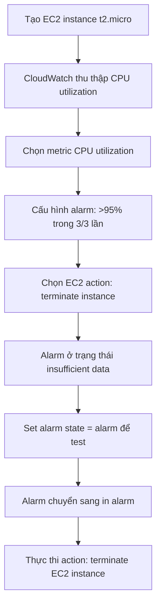

# 277. CloudWatch Alarms Hands On

## 🎯 Giới thiệu
- Bài thực hành này tạo một `CloudWatch Alarm` trên `EC2 instance` dựa vào `CPU utilization`.
- Mục tiêu là kiểm tra cách alarm chuyển trạng thái và kích hoạt `EC2 action`.
- Trong ví dụ, khi CPU vượt ngưỡng lâu, alarm sẽ thực hiện hành động `terminate instance`.

## 1. Tạo `EC2 instance` và chọn metric 📈
- Tạo nhanh một `EC2 instance` loại `t2.micro`.
- Chờ metric của instance xuất hiện trong `CloudWatch`.
- Vào phần metric của `EC2 instance`, tìm theo `instance ID`.
- Chọn metric `CPU utilization` của instance đó.
- Có thể chọn cách tính metric như `average`, `sum`, `maximum`.
- Vì không bật `detailed monitoring`, metric được cập nhật mỗi `5 minutes`.

## 2. Cấu hình `CloudWatch Alarm` ⚙️
- Đặt điều kiện:
  - Loại ngưỡng: `Static` hoặc `Anomaly detection`
  - So sánh: ví dụ `greater than`
  - Ngưỡng: ví dụ `95%`
  - Điều kiện thời gian: `3 out of 3`
- Ý nghĩa của cấu hình trên:
  - Nếu CPU > `95%` liên tục trong `15 minutes`, coi như instance có vấn đề.
- Chọn loại hành động khi alarm kích hoạt:
  - `Notification`
  - `Auto Scaling action`
  - `EC2 action`
  - `Systems Manager action`
- Trong bài này chọn `EC2 action` và cấu hình:
  - Khi `ALARM` thì `terminate` instance
- Đặt tên alarm ví dụ: `Terminate EC2 on high CPU`
- Sau khi tạo xong, alarm ban đầu có thể ở trạng thái `insufficient data` vì cần thời gian thu thập metric.

## 3. Kiểm tra trạng thái alarm và kích hoạt action 🧪
- Thay vì chờ CPU thật sự tăng lâu, có thể dùng API `Set alarm state` để mô phỏng.
- Các tham số cần có:
  - `alarm name`
  - `state value`
  - `state reason`
- Đặt:
  - `state value = alarm`
  - `state reason = testing`
- Khi alarm chuyển sang `in alarm`:
  - Lịch sử alarm ghi nhận từ `OK` sang `in alarm`
  - Action được thực thi thành công
  - `EC2 instance` bắt đầu `shutting down` và bị `terminated`

## 📊 Bảng tóm tắt
| Tiêu chí | Mô tả |
|----------|------|
| Đối tượng giám sát | `EC2 instance` |
| Metric | `CPU utilization` |
| Tần suất metric | Mỗi `5 minutes` nếu không bật `detailed monitoring` |
| Điều kiện mẫu | CPU > `95%` trong `3 out of 3` lần |
| Kiểu hành động | `EC2 action` |
| Kết quả khi alarm | `Terminate` instance |
| Cách test nhanh | Dùng `Set alarm state` để ép alarm sang `ALARM` |

## 💡 Mẹo ghi nhớ cho kỳ thi AWS
- `CloudWatch Alarm` không chỉ để thông báo, mà còn có thể kích hoạt hành động tự động.
- Nếu không có `detailed monitoring`, metric có thể mất vài phút mới xuất hiện.
- `3 out of 3` nghĩa là trạng thái phải đúng liên tục trong toàn bộ khoảng thời gian đó.
- `Set alarm state` là cách hữu ích để test hành vi alarm mà không cần chờ điều kiện thật.
- Trong đề thi, hãy nhớ các loại action của alarm: `Notification`, `Auto Scaling`, `EC2 action`, `Systems Manager action`.

## ✅ Kết luận
- Bài thực hành minh họa quy trình tạo `CloudWatch Alarm` dựa trên `CPU utilization` của `EC2`.
- Khi vượt ngưỡng trong thời gian xác định, alarm có thể thực thi `EC2 action` như `terminate instance`.
- `Set alarm state` giúp kiểm tra nhanh toàn bộ flow từ `OK` sang `ALARM` và quan sát action được kích hoạt.
