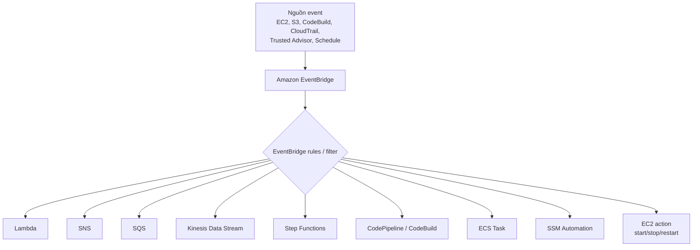

# 278. EventBridge Overview (formerly CloudWatch Events)

## 🎯 Giới thiệu
Amazon EventBridge là dịch vụ nhận và phân phối events trong AWS. Dịch vụ này trước đây có tên là **CloudWatch Events**, nên khi ôn thi bạn có thể gặp cả hai tên.

EventBridge dùng để:
- **Schedule** tác vụ theo thời gian, như `cron` jobs trong Cloud
- **React to event pattern** từ các AWS services
- Gửi event đến nhiều đích khác nhau như `Lambda`, `SNS`, `SQS`, `Step Functions`, `ECS`, `Kinesis`, `CodeBuild`, `CodePipeline`, `SSM Automation`, hoặc thao tác với `EC2`

## 1. Cách EventBridge hoạt động
EventBridge nằm ở giữa các nguồn phát sinh event và các đích nhận event.

- Nguồn có thể là:
  - `EC2` khi start, stop, terminate
  - `S3` khi object được upload
  - `CodeBuild` khi build fail
  - `Trusted Advisor` khi có security finding
  - `CloudTrail` để intercept API calls trong AWS accounts
  - Lịch `schedule` như mỗi giờ, mỗi 4 giờ, mỗi thứ Hai lúc 8:00 AM, hoặc ngày đầu tiên thứ Hai trong tháng

- EventBridge sẽ:
  - Nhận event từ nguồn
  - Áp dụng **filter** / `EventBridge rules`
  - Tạo ra event dạng **JSON document**
  - Chuyển event tới destination phù hợp

## 2. Các loại event bus
EventBridge có 3 loại event bus quan trọng:

- **Default event bus**
  - Nhận events từ các AWS services
  - Đây là loại phổ biến nhất khi nói về EventBridge

- **Partner event bus**
  - Dùng cho các đối tác tích hợp với AWS, thường là SaaS
  - Ví dụ trong transcript: `Zendesk`, `Datadog`, `Auth0`
  - Các dịch vụ này có thể gửi event trực tiếp vào partner event bus

- **Custom event bus**
  - Bạn tự tạo event bus riêng
  - Ứng dụng của bạn có thể gửi events vào đó
  - Sau đó dùng `EventBridge rules` để chuyển tiếp đến các đích mong muốn

## 3. Tính năng quan trọng cho ôn thi
### 🗂️ Archive & Replay
- Có thể **archive events**
- Có thể archive toàn bộ hoặc chỉ một phần theo filter
- Hỗ trợ retention:
  - **indefinite retention**
  - hoặc giữ trong một khoảng thời gian xác định
- Có thể **replay archived events**
  - Rất hữu ích khi debug
  - Hữu ích khi troubleshooting
  - Hữu ích khi fix production rồi muốn test lại event cũ

### 📚 Schema Registry
- EventBridge có thể phân tích events trong event bus
- Từ đó **infer schema**
- `Schema Registry` giúp:
  - Hiểu trước cấu trúc dữ liệu của event
  - Generate code cho application
  - Làm việc với event dạng JSON dễ hơn
- Schema có thể được **versioned**

### 🔐 Resource-based policies
- EventBridge hỗ trợ **resource based policies**
- Dùng để quản lý permission cho một event bus cụ thể
- Có thể allow / deny events từ account hoặc region khác
- Use case chính:
  - Xây dựng **central event bus** trong AWS Organization
  - Các account khác được phép `PutEvents` vào central bus
  - Phù hợp cho mô hình cross-account aggregation

## 📊 Bảng tóm tắt
| Tiêu chí | Mô tả |
|----------|------|
| Tên dịch vụ | `Amazon EventBridge`, trước đây là `CloudWatch Events` |
| Chức năng chính | Nhận, lọc, và phân phối events |
| Hỗ trợ schedule | Có, chạy `cron` / schedule theo thời gian |
| Hỗ trợ event pattern | Có, phản ứng với sự kiện từ AWS services |
| Event bus | `default`, `partner`, `custom` |
| Đích đến | `Lambda`, `SNS`, `SQS`, `Kinesis`, `Step Functions`, `ECS`, `CodeBuild`, `CodePipeline`, `SSM Automation`, `EC2` actions |
| Archive / Replay | Có, dùng để lưu và chạy lại events |
| Schema Registry | Có, infer schema và generate code |
| Cross-account | Có, thông qua `resource based policies` |

## 💡 Mẹo ghi nhớ cho kỳ thi AWS
- `EventBridge = CloudWatch Events` là một điểm rất dễ hỏi.
- Nhớ 3 loại event bus:
  - `default`
  - `partner`
  - `custom`
- Nhớ EventBridge không chỉ để schedule, mà còn để **react to events**.
- Khi thấy nhu cầu **cross-account event bus**, hãy nghĩ đến **resource based policies**.
- Khi cần **debug/replay events**, nhớ tính năng **archive & replay**.
- Khi cần hiểu cấu trúc event để generate code, nhớ **Schema Registry**.
- Các target thường gặp trong đề: `Lambda`, `SNS`, `SQS`, `Step Functions`, `CodePipeline`, `CodeBuild`.

## ✅ Kết luận
Amazon EventBridge là dịch vụ trung tâm để xử lý events trong AWS. Nó hỗ trợ cả **schedule** và **event-driven architecture**, có nhiều **event bus** khác nhau, cho phép **archive/replay**, quản lý cấu trúc dữ liệu bằng **Schema Registry**, và mở rộng cross-account nhờ **resource based policies**. Đây là chủ đề rất quan trọng khi ôn thi AWS Solutions Architect Associate.
