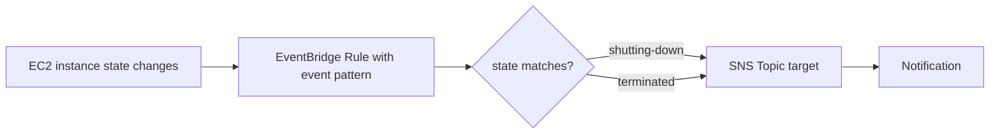
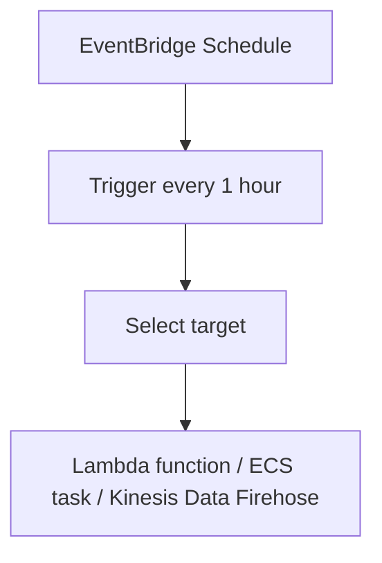

# 279. Amazon EventBridge - Hands On

## 🎯 Giới thiệu
Amazon EventBridge là dịch vụ dùng để xử lý các **event** và kết nối chúng tới các **target** khác nhau. Trong bài học này có 4 hướng chính:

- **EventBridge rule with event pattern**: tạo rule để bắt một số event cụ thể
- **Schedule rule / EventBridge schedule**: chạy theo lịch
- **Event buses**: dùng default event bus hoặc custom event bus
- Các phần khác như **archive**, **replay**, **partner event sources**, **API destinations**, và **schema registry**

---

## 1. EventBridge rule với event pattern
Mục tiêu của phần này là tạo rule để phản ứng khi **EC2 instance** bị **shut down** hoặc **terminated**.

### Điểm chính
- Chọn **Service Events**
- Chọn event phổ biến: **EC2 instance State-change Notification**
- Event này xảy ra khi trạng thái của EC2 instance thay đổi
- Có thể xem:
  - **schema** của event
  - **sample event**
- Dựa vào schema, lọc theo field **state**
- Giá trị cần bắt:
  - `shutting-down`
  - `terminated`

### Flow

### Target
- Có nhiều target như:
  - **API Gateway**
  - **Batch jobs**
  - **SNS topic**
  - **SQS queue**
  - các thao tác với **EC2**
- Trong ví dụ này chọn **SNS Topic** để nhận alert
- Nếu chưa có topic thì tạo mới
- Cần một **execution role** để gửi message vào SNS topic
- Khi tạo rule, có thêm thông tin về:
  - **retry policy**
  - **dead-letter queue**

### Kết quả
- Rule được đặt tên: **NotifyEC2InstanceShutdownOrTerminated**
- Khi EC2 instance **shut down** hoặc **terminate**, sẽ nhận được notification

---

## 2. EventBridge schedule
Phần này là tạo lịch chạy theo thời gian.

### Điểm chính
- Ở bên trái có **schedules**
- Tạo schedule mới: **InvokeLambdaEveryHour**
- Có 2 kiểu:
  - **one-time schedule**
  - **recurring**
- Với recurring, có:
  - **Cron-based schedule**
  - **rate schedule**
- Trong ví dụ:
  - dùng **1 hour**
  - chọn **no flexible time window**

### Target theo lịch
- Có thể invoke nhiều loại target như:
  - chạy task trên **Amazon ECS**
  - ghi record vào **Kinesis Data Firehose**
  - invoke **Lambda function**
- Ví dụ chọn **Invoke Lambda function**
- Chọn Lambda function nếu đã có sẵn

### Flow

---

## 3. Event buses, archive, partner sources, API destinations, schemas
### Event buses
- Hiện có **default event bus**
- **Default event bus** chứa các event do AWS tạo ra
- Có thể tạo **custom event bus**
- Custom event bus cho phép:
  - tự gửi event của mình vào EventBridge
  - xây dựng **custom applications** dựa trên EventBridge

### Archive và replay
- Có thể **archive** event khi chúng xuất hiện trên event bus
- Có thể **replay** event cũ từ archive nếu muốn chạy lại sự kiện trước đó

### Partner event sources
- Có thể nhận data trực tiếp từ **third-party partners** vào AWS account
- Ví dụ được nhắc tới: **Auth0**
- Event từ partner có thể được đưa vào EventBridge, rồi xử lý tiếp bằng **Lambda function** hoặc workflow khác

### API destinations
- Dùng khi muốn nối event trong EventBridge tới một **external HTTP destination**
- Cho phép tích hợp EventBridge với **outside source** hoặc hệ thống riêng

### Schemas / Schema registry
- **Schemas** là nơi xem schema của các AWS events
- Có thể tạo **custom registry** cho custom events
- Mục đích là hiểu được **shape** và **form** của event trong EventBridge

---

## 📊 Bảng tóm tắt
| Tiêu chí | Mô tả |
|----------|------|
| EventBridge rule | Bắt event theo **event pattern** |
| Ví dụ rule | Bắt **EC2 instance State-change Notification** |
| Điều kiện lọc | `state = shutting-down` hoặc `terminated` |
| Target phổ biến | **SNS topic**, **SQS**, **API Gateway**, **Lambda**, **ECS** |
| Schedule | Chạy theo lịch bằng **Cron** hoặc **rate** |
| Default event bus | Chứa **AWS-generated events** |
| Custom event bus | Nhận **custom events** do mình gửi vào |
| Archive / Replay | Lưu event và phát lại event cũ |
| Partner event sources | Nhận event từ bên thứ ba như **Auth0** |
| API destinations | Kết nối tới **external HTTP destination** |
| Schema registry | Xem cấu trúc event và custom registry |

---

## 💡 Mẹo ghi nhớ cho kỳ thi AWS
- **Rule + event pattern**: dùng khi muốn phản ứng với event cụ thể, ví dụ **EC2 shutting-down / terminated**
- **Schedule**: dùng khi muốn chạy theo giờ, ngày, hoặc định kỳ
- **Default event bus**: cho **AWS-generated events**
- **Custom event bus**: cho **your own events**
- **Archive + replay**: lưu lại và phát lại event
- **Partner event sources**: nhận event từ bên thứ ba
- **API destinations**: đẩy event ra ngoài qua **HTTP**
- **Schema registry**: giúp hiểu cấu trúc event trước khi xử lý

---

## ✅ Kết luận
Amazon EventBridge trong bài này được giới thiệu qua các khả năng chính:

- tạo **rule** để bắt event theo pattern
- tạo **schedule** để chạy theo lịch
- dùng **event bus** cho AWS events hoặc custom events
- hỗ trợ **archive**, **replay**, **partner event sources**, **API destinations**, và **schema registry**

Trọng tâm cần nhớ khi ôn thi là: **EventBridge dùng để route event tới target phù hợp, hoặc chạy theo lịch, hoặc tích hợp với nguồn sự kiện bên ngoài**.
