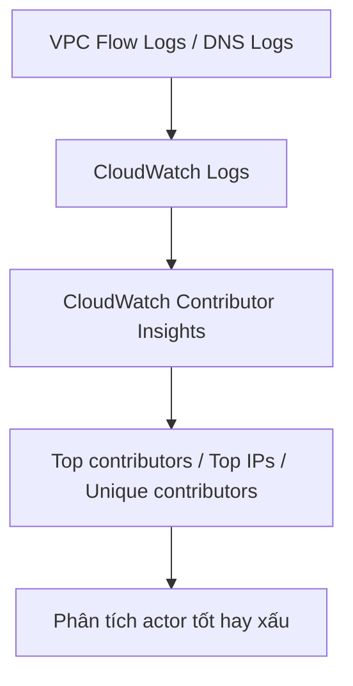
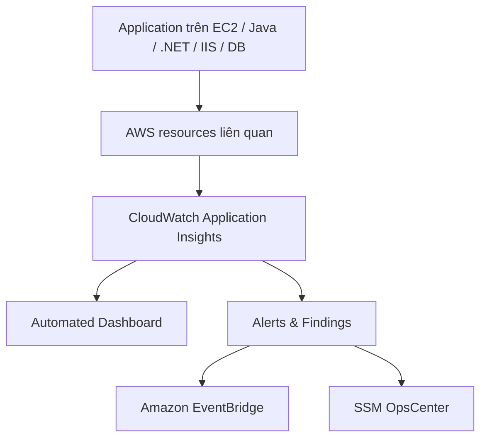

# 280. CloudWatch Insights and Operational Visibility

## 🎯 Giới thiệu
CloudWatch Insights and Operational Visibility tập trung vào các nhóm tính năng trong CloudWatch giúp **collect, aggregate, summarize** metrics, logs và trạng thái vận hành của ứng dụng.

Các ý chính cần nhớ cho kỳ thi AWS:
- **CloudWatch Container Insights**: theo dõi container.
- **CloudWatch Lambda Insights**: theo dõi chi tiết Lambda.
- **CloudWatch Contributor Insights**: phân tích logs để tìm “top contributors”.
- **CloudWatch Application Insights**: tạo dashboard tự động để phát hiện vấn đề của ứng dụng và các AWS services liên quan.

---

## 1. CloudWatch Container Insights & Lambda Insights 🚀

### CloudWatch Container Insights
- Dùng để **collect, aggregate, summarize metrics and logs** từ containers.
- Áp dụng cho:
  - **Amazon ECS**
  - **Amazon EKS**
  - **Kubernetes on EC2**
  - **Fargate** cho cả ECS và EKS
- Mục tiêu:
  - Tạo dashboard **chi tiết và granular** trong CloudWatch.
- Với **Kubernetes**:
  - CloudWatch Insights dùng **containerized version of CloudWatch agents** để discover containers.

### CloudWatch Lambda Insights
- Là giải pháp **monitoring and troubleshooting** cho serverless applications chạy trên **AWS Lambda**.
- Thu thập và tổng hợp:
  - **CPU time**
  - **memory**
  - **disk**
  - **network**
  - **cold starts**
  - **Lambda worker shutdowns**
- Được cung cấp dưới dạng **Lambda layer**.
- Tạo dashboard riêng gọi là **Lambda insights** để quan sát hiệu năng Lambda functions.
- Phù hợp khi cần **detailed monitoring** cho Lambda.

---

## 2. CloudWatch Contributor Insights 📈

### Mục đích
- Phân tích logs và tạo **time series** hiển thị dữ liệu đóng góp.
- Giúp tìm:
  - **top contributors**
  - **total number of unique contributors**
  - ai đang ảnh hưởng đến system performance

### Ví dụ sử dụng
- Tìm **top talkers** trong network.
- Phát hiện **bad hosts**.
- Xem URLs tạo nhiều lỗi nhất từ **DNS logs**.

### Dữ liệu đầu vào
- Có thể chạy trên các logs do AWS tạo ra, ví dụ:
  - **VPC logs**
  - **DNS logs**
  - và các log khác

### Luồng hoạt động

### Điểm cần nhớ
- Có thể dùng:
  - **rules tự tạo**
  - hoặc **simple rules** do AWS tạo sẵn
- Bên dưới vẫn dựa trên **CloudWatch Logs**
- Có **built-in rules** để phân tích metrics từ các AWS services khác

---

## 3. CloudWatch Application Insights 🧠

### Mục đích
- Tạo **automated dashboard** để phát hiện vấn đề tiềm năng của monitored applications.
- Giúp **isolate ongoing issues** nhanh hơn.

### Ứng dụng
- Application có thể chạy trên **Amazon EC2**.
- Chọn các technology cụ thể, ví dụ:
  - **Java**
  - **.NET**
  - **Microsoft IIS web server**
  - các **specific databases**

### Liên kết với AWS resources
Application Insights có thể liên kết với:
- **EBS**
- **RDS**
- **ELB**
- **ASG**
- **Lambda**
- **SQS**
- **DynamoDB**
- **S3 buckets**
- **ECS cluster**
- **EKS cluster**
- **SNS topics**
- **API Gateway**

### Cách hoạt động
- Khi có issue trong ứng dụng:
  - CloudWatch Application Insights sẽ tự động tổng hợp dashboard.
  - Dashboard hiển thị các **potential issues** từ những services liên quan.
- Công cụ này dùng **SageMaker machine learning service** internally.
- Alerts và findings được gửi tới:
  - **Amazon EventBridge**
  - **SSM OpsCenter**

### Luồng hoạt động

---

## 📊 Bảng tóm tắt
| Tiêu chí | Mô tả |
|----------|------|
| Container Insights | Thu thập, tổng hợp metrics và logs từ ECS, EKS, Kubernetes on EC2, Fargate |
| Lambda Insights | Monitoring và troubleshooting chi tiết cho AWS Lambda, gồm CPU, memory, disk, network, cold starts |
| Contributor Insights | Phân tích logs để tìm top contributors, top talkers, bad hosts, unique contributors |
| Application Insights | Tạo dashboard tự động để phát hiện và cô lập vấn đề của ứng dụng và AWS services liên quan |
| Dữ liệu đầu vào | CloudWatch Logs, VPC logs, DNS logs, metrics và logs từ container/Lambda/application |
| Output | Dashboard chi tiết, time series, findings, alerts, EventBridge, SSM OpsCenter |

---

## 💡 Mẹo ghi nhớ cho kỳ thi AWS
- **Container Insights** = theo dõi **container**.
- **Lambda Insights** = theo dõi **Lambda** rất chi tiết.
- **Contributor Insights** = tìm **top contributors** trong logs.
- **Application Insights** = dashboard tự động cho **application health** và service dependencies.
- Nếu thấy từ khóa:
  - **top 10**, **top contributors**, **unique contributors** → nghĩ ngay đến **Contributor Insights**.
  - **cold starts**, **worker shutdowns** → nghĩ ngay đến **Lambda Insights**.
  - **ECS/EKS/Fargate/Kubernetes** → nghĩ ngay đến **Container Insights**.
  - **automated dashboard**, **EventBridge**, **SSM OpsCenter** → nghĩ ngay đến **Application Insights**.

---

## ✅ Kết luận
CloudWatch Insights cung cấp bộ công cụ quan sát vận hành ở mức cao nhưng rất hữu ích cho ôn thi AWS:
- **Container Insights** cho container workloads
- **Lambda Insights** cho serverless
- **Contributor Insights** cho phân tích log-based contributors
- **Application Insights** cho dashboard tự động và phát hiện vấn đề ứng dụng

Chỉ cần nắm đúng **mục đích, nguồn dữ liệu và đầu ra** của từng dịch vụ là đủ để làm bài thi phần này.
