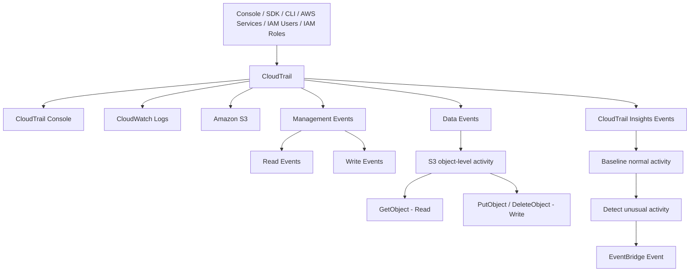

# 281. CloudTrail Overview

## 🎯 Giới thiệu
- **CloudTrail** là dịch vụ dùng để theo dõi **governance, compliance, audit** cho AWS Accounts.
- **CloudTrail enabled by default**.
- Ghi lại lịch sử **events** và **API Calls** được thực hiện từ:
  - **Console**
  - **SDK**
  - **CLI**
  - Các **AWS services**
  - **IAM Users** và **IAM Roles**
- Có thể gửi log từ CloudTrail sang:
  - **CloudWatch Logs**
  - **Amazon S3**
- Có thể tạo **trail** cho:
  - **All regions**
  - Hoặc **single region**

## 1. CloudTrail dùng để làm gì? 🛡️
- Dùng để biết **ai làm gì, khi nào** trong AWS Account.
- Rất hữu ích khi cần điều tra hành động như:
  - Xóa nhầm resource
  - Terminate một **EC2 instance**
- Chỉ cần xem **API Call** tương ứng trong CloudTrail để truy ra người thực hiện.
- Đây là công cụ để **inspect** và **audit** hoạt động trong account.

## 2. Các loại events trong CloudTrail 📋
### Management Events
- Là các thao tác trên resource trong AWS Account.
- Ví dụ:
  - `IAM AttachRolePolicy`
  - Tạo **subnet**
  - Thiết lập logging
- **Mặc định được log** trong trail.
- Chia thành:
  - **Read Events**: không sửa đổi resource  
    - Ví dụ: list users trong **IAM**, list **EC2 instances**
  - **Write Events**: có thể sửa đổi resource  
    - Ví dụ: delete DynamoDB table

### Data Events
- **Không được log mặc định** vì volume rất lớn.
- Gồm:
  - **S3 object-level activity**
  - **AWS Lambda function execution activities**
- Ví dụ với S3:
  - `GetObject` = **Read Event**
  - `PutObject`, `DeleteObject` = **Write Event**
- Với Lambda:
  - `Invoke API` để biết số lần function được invoked

### CloudTrail Insights Events
- Phải **enable** và **trả phí**.
- Dùng để phát hiện **unusual activity** trong account.
- CloudTrail phân tích hành vi bình thường để tạo **baseline**, sau đó kiểm tra các thay đổi bất thường.
- Ví dụ bất thường:
  - Inaccurate resource provisioning
  - Hitting service limits
  - Burst of AWS IAM actions
  - Gaps in periodic maintenance activity
- Khi phát hiện bất thường, sẽ tạo **Insights Event** trong CloudTrail console.
- Có thể phát sinh **EventBridge Event** để tự động hóa, ví dụ gửi email.

## 3. Retention và lưu trữ 🗃️
- Mặc định, events được lưu trong CloudTrail **90 days** rồi bị xóa.
- Nếu cần lưu lâu hơn để audit, cần:
  - Gửi log vào **S3**
  - Sau đó dùng **Athena** để query dữ liệu trong S3
- Các loại event đều có thể đi theo hướng này:
  - **Management Events**
  - **Data Events**
  - **Insights Events**
- Với phân tích dài hạn, **S3 + Athena** là cách làm chính.

## 📊 Bảng tóm tắt
| Tiêu chí | Mô tả |
|----------|------|
| Mục đích | Governance, compliance, audit cho AWS Accounts |
| Trạng thái mặc định | **Enabled by default** |
| Nguồn ghi nhận | Console, SDK, CLI, AWS services, IAM Users, IAM Roles |
| Destination | **CloudWatch Logs**, **Amazon S3** |
| Phạm vi trail | **All regions** hoặc **single region** |
| Management Events | Log mặc định, gồm **Read** và **Write** |
| Data Events | Không log mặc định, gồm S3 object-level và Lambda Invoke |
| CloudTrail Insights | Phát hiện hoạt động bất thường, phải enable và trả phí |
| Retention mặc định | **90 days** |
| Lưu trữ dài hạn | Gửi sang **S3**, phân tích bằng **Athena** |

## 💡 Mẹo ghi nhớ cho kỳ thi AWS
- Nhớ câu: **CloudTrail = who did what and when**.
- **Management Events**: luôn được log mặc định.
- **Data Events**: volume cao nên **không log mặc định**.
- **CloudTrail Insights**: dùng để phát hiện **unusual activity**.
- **90 days** là retention mặc định của CloudTrail.
- Muốn lưu lâu hơn thì dùng **S3 + Athena**.
- Nếu đề bài hỏi truy vết ai đã xóa EC2 hay thay đổi resource, ưu tiên nghĩ đến **CloudTrail**.

## ✅ Kết luận
- **CloudTrail** là dịch vụ cốt lõi để audit và theo dõi hoạt động trong AWS.
- Nó ghi lại **API Calls** từ nhiều nguồn, hỗ trợ điều tra sự cố, và có thể mở rộng với **Insights** để phát hiện bất thường.
- Với nhu cầu lưu trữ dài hạn, hãy nhớ mô hình **CloudTrail -> S3 -> Athena**.
