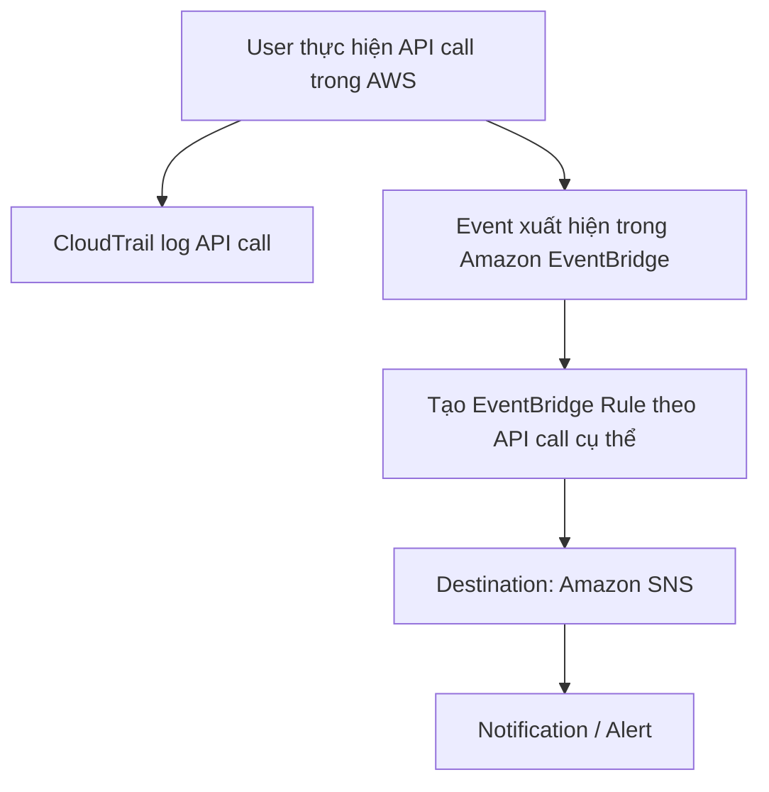

# 283. CloudTrail - EventBridge Integration

## 🎯 Giới thiệu
- **CloudTrail - EventBridge Integration** là một integration rất quan trọng cần nắm khi học AWS.
- Ý chính: mọi **API call** trong AWS sẽ:
  - được **log trong CloudTrail**
  - đồng thời xuất hiện như **event trong Amazon EventBridge**
- Từ đó, có thể tạo **rule** để bắt các API call cụ thể và đẩy sang **SNS** nhằm tạo cảnh báo.

## 1. Cách hoạt động của CloudTrail + EventBridge
- Khi có bất kỳ **API call** nào trong AWS:
  - CloudTrail sẽ ghi lại API call đó.
  - API call này cũng trở thành **event** trong Amazon EventBridge.
- Ta có thể lọc theo một API call rất cụ thể để tạo **rule**.
- Rule sẽ trỏ tới một **destination**, ví dụ **Amazon SNS**.
- Kết quả: có thể nhận **alerts/notifications** gần như ngay khi hành động xảy ra.

## 2. Các ví dụ trong transcript
- **DeleteTable** trên **DynamoDB**
  - Khi user dùng **DeleteTable API Call** để xóa table, CloudTrail log lại.
  - EventBridge có thể bắt event này.
  - Rule gửi thông báo tới **SNS**.

- **AssumeRole** trên **IAM**
  - Khi user thực hiện **AssumeRole**, đây là một API trong **IAM**.
  - CloudTrail ghi nhận.
  - EventBridge có thể trigger message vào **SNS topic**.

- **AuthorizeSecurityGroupIngress** trên **EC2**
  - Đây là API call dùng để thay đổi **Security Group inbound rules**.
  - CloudTrail log lại.
  - EventBridge bắt event và kích hoạt thông báo qua **SNS**.

## 3. Ý nghĩa thực tế khi ôn thi AWS
- Mẫu tư duy cần nhớ:
  - **API call -> CloudTrail log -> EventBridge event -> Rule -> SNS notification**
- Đây là cách dùng để **intercept API calls** và tạo cảnh báo theo hành động cụ thể.
- Các ví dụ trong transcript đều xoay quanh việc phát hiện những thao tác quan trọng như:
  - xóa **DynamoDB table**
  - **AssumeRole** trong **IAM**
  - sửa **Security Group inbound rules** bằng **EC2 API**

## 📊 Bảng tóm tắt
| Tiêu chí | Mô tả |
|----------|------|
| Dịch vụ chính | **CloudTrail**, **EventBridge**, **SNS** |
| Dữ liệu đầu vào | **API calls** trong AWS |
| Vai trò của CloudTrail | Log lại mọi API call |
| Vai trò của EventBridge | Nhận API call dưới dạng **events** và match theo **rule** |
| Mục tiêu | Tạo **notification/alert** cho các hành động cụ thể |
| Ví dụ API | **DeleteTable**, **AssumeRole**, **AuthorizeSecurityGroupIngress** |
| Dịch vụ liên quan | **DynamoDB**, **IAM**, **EC2** |

## 💡 Mẹo ghi nhớ cho kỳ thi AWS
- Nhớ chuỗi sau: **CloudTrail ghi log, EventBridge bắt event, SNS gửi alert** 📩
- Nếu đề bài hỏi về:
  - theo dõi một **API call** cụ thể
  - và gửi cảnh báo khi hành động đó xảy ra
- Thì hãy nghĩ ngay đến:
  - **CloudTrail + EventBridge + SNS**
- Ghi nhớ các ví dụ:
  - **DeleteTable** -> **DynamoDB**
  - **AssumeRole** -> **IAM**
  - **AuthorizeSecurityGroupIngress** -> **EC2**

## ✅ Kết luận
- Integration giữa **CloudTrail** và **EventBridge** cho phép theo dõi các **API call** trong AWS theo hướng **event-driven**.
- CloudTrail ghi nhận hoạt động, EventBridge xử lý event theo **rule**, và **SNS** có thể dùng để gửi cảnh báo.
- Đây là pattern rất quan trọng để hiểu cách giám sát và phản ứng với các hành động trong AWS.
