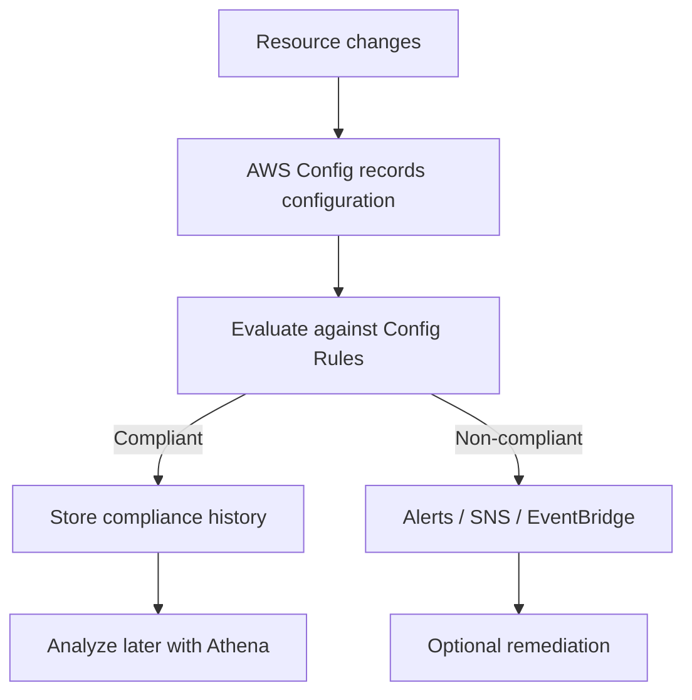

# 284. AWS Config - Overview

## 🎯 Giới thiệu
AWS Config là dịch vụ dùng để:
- **Auditing** và **record compliance** của resources trong AWS
- Theo dõi **Configuration** và **changes over time**
- Giúp nhanh chóng:
  - rollback khi cần
  - truy vết “điều gì đã xảy ra” trong infrastructure

AWS Config giúp trả lời các câu hỏi như:
- Security Group có **unrestricted SSH access** không?
- S3 bucket có **public access** không?
- ALB configuration có thay đổi theo thời gian không?

## 1. Cách AWS Config hoạt động
- Dựa trên các **rules** mà bạn thiết lập để đánh giá resource có **compliant** hay không
- Có thể tạo **alerts** hoặc **SNS notifications** khi có thay đổi
- Là dịch vụ **per region**
  - cần cấu hình riêng cho từng region nếu muốn theo dõi toàn bộ
- Có thể **aggregate data across regions and accounts** về một nơi tập trung
- Có thể lưu configuration của resources để phân tích sau này bằng công cụ serverless query như **Athena**

### Mermaid - Flow đánh giá và ghi nhận

## 2. Config Rules
AWS Config hỗ trợ 2 loại rules:

| Loại rule | Mô tả |
|----------|------|
| **AWS managed config rules** | Có sẵn, transcript nói có hơn **75 rules** |
| **Custom config rules** | Tự định nghĩa rule, thường dùng **Lambda function** |

Ví dụ rule có thể kiểm tra:
- EBS disk có phải loại `gp2` không
- EC2 instance trong development account có phải `t2.micro` không

### Cách evaluation
- **Triggered on configuration change**
  - đánh giá ngay khi configuration thay đổi
- **Periodic evaluation**
  - đánh giá theo lịch, ví dụ mỗi **2 hours**

### Điểm quan trọng
- Config Rules chỉ dùng để **compliance**
- **Không ngăn chặn action**
- **Không thay thế security mechanisms** như IAM

## 3. Remediation, Notifications và Chi phí
### Remediation
Khi resource **non-compliant**, AWS Config có thể kích hoạt remediation bằng:
- **SSM Automation Documents**
- **AWS-Managed Documents**
- Tự tạo **automation documents** riêng
- Có thể viết document để gọi **Lambda function**

Ví dụ trong transcript:
- Kiểm tra **IAM access keys** đã quá 90 ngày chưa
- Nếu quá hạn, đánh dấu non-compliant
- Dùng document như `RevokeUnusedIAMUserCredentials` để **deactivate IAM access keys**

### Retry
- Remediation có thể retry
- Ví dụ retry đến **5 lần** nếu resource vẫn non-compliant

### Notifications
- Dùng **EventBridge** để trigger notification khi resource không compliant
- Dùng **SNS** để nhận:
  - mọi thay đổi
  - hoặc chỉ một phần thay đổi nhờ **SNS filtering**
- Có thể gửi đến:
  - admin email
  - slack channel
  - hoặc nơi tập trung khác

### Chi phí
- Có thể khá tốn nhanh
- Transcript nêu:
  - `0.003 cents` per configuration item recorded per region
  - `0.001 cents` per config rule evaluation per region

## 📊 Bảng tóm tắt
| Tiêu chí | Mô tả |
|----------|------|
| Mục đích | Auditing, record compliance, theo dõi configuration changes |
| Phạm vi | **Per region**, có thể aggregate cross-region và cross-account |
| Rule types | **AWS managed config rules** và **custom config rules** |
| Cách trigger | Khi configuration thay đổi hoặc theo chu kỳ |
| Vai trò | Chỉ đánh giá compliance, không chặn action |
| Remediation | Dùng **SSM Automation Documents** hoặc **Lambda** |
| Notifications | **EventBridge**, **SNS**, có thể filter |
| Phân tích lịch sử | Lưu configuration để phân tích sau, ví dụ bằng **Athena** |
| Chi phí | Có thể tăng nhanh theo số configuration items và rule evaluations |

## 💡 Mẹo ghi nhớ cho kỳ thi AWS
- **Config = nhìn lại và kiểm tra compliance**, không phải công cụ chặn truy cập
- Nhớ 3 ý chính:
  - **Record** configuration
  - **Evaluate** compliance bằng rules
  - **Remediate / Notify** khi non-compliant
- `AWS Config` thường đi cùng:
  - **CloudTrail** để xem API calls
  - **SSM Automation** để remediation
  - **EventBridge / SNS** để notifications
- Nếu đề bài hỏi về:
  - “resource changed over time”
  - “who changed it”
  - “compliance history”
  - “alert on non-compliance”
  thì nghĩ ngay đến **AWS Config**
- Phân biệt quan trọng:
  - **Config Rules**: đánh giá compliance
  - **IAM**: kiểm soát quyền truy cập
  - Config **không thay thế IAM**

## ✅ Kết luận
AWS Config là dịch vụ giúp bạn **ghi nhận cấu hình**, **đánh giá compliance**, và **theo dõi thay đổi** của AWS resources theo thời gian. Nó rất hữu ích cho audit và troubleshooting, nhưng chỉ mang tính **quan sát và kiểm tra**, không thay thế cơ chế bảo mật như **IAM**. Khi phát hiện non-compliant resources, bạn có thể kết hợp **SSM Automation Documents**, **EventBridge**, và **SNS** để remediation và notification hiệu quả.
